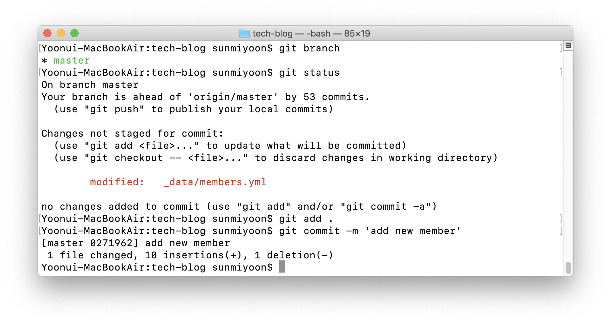

*앗차의 순간*

### 질문을 읽고 상황에 맞는 솔루션을 찾아 해결해보세요.

**Q. commit 을 한 번이라도 만들었나요?**  
**YES** → 아래 가이드를 읽고 따라하세요.  
**NO** → 늦지 않았어요. 브랜치를 만드세요. `git checkout -b {branch name}`

&nbsp;

*commit 했다면, 아마도 이런 상태*&nbsp;

&nbsp;

Master branch에 commit을 해버렸다면 아래 단계를 차근히 따라오세요. 상황에 따라 더 간단한 해법이 존재할 수 있지만, 여러명이 동시에 작업하는 프로젝트라는 것을 전제하고 충돌에 안전한 방법으로 가이드합니다.

앞으로 브랜치 이름은 add-member 로 예시를 들겠습니다. 글을 보고 따라하는 분들은 진행하는 테스크에 맞는 브랜치 이름을 사용하시면 됩니다.

&nbsp;

1. 브랜치를 만드세요. `git checkout -b add-member`  
이렇게 되면, 같은 commit 위에 master 브랜치와 add-member 브랜치가 동시에 있게 됩니다. 브랜치는 특정 commit을 가리키는 포인터에 불과합니다.

2. 이제 master 브랜치를 원래 있어야 할 commit으로 돌려줍시다. `git log` 명령어를 이용해 돌아가고 싶은 위치를 확인하고, 그 위치를 복사하세요. upstream/master 가 있는 위치로 돌아가야 나중에 `git pull upstream master`를 할 때 깔끔하겠죠?

    

3. 이제 `git branch -f master {commit log}` 명령어로 master 브랜치를 원하는 커밋 위치로 강제 이동시켜줍니다. `{commit log}` 에는 2번에서 복사한 커밋 주소를 적어주세요.

4. `git branch -f {branch name} {commit log}` 명령어는 `{branch name}`의 위치를 강제로 `{commit log}`로 바꿔주기 때문에 아래와 같이 master 브랜치의 위치가 바뀌게 됩니다.

    

5. add-member 브랜치에서 하던 작업을 계속 진행하세요.

&nbsp;

언뜻 보기에는 복잡해 보이지만, commit한 위치에서 add-member라는 브랜치를 만들고 master 브랜치를 한 칸 앞으로 이동시켜 준겁니다. 

이 과정에서 `git log` 명령어로 지난 commit 들의 주소를 확인했고, `git branch -f {branch name} {commit log}` 명령어로 master 브랜치를 특정 커밋 위치로 변경해주었죠. 

브랜치가 특정 commit을 가리키는 포인터에 불과하다는 것을 이해하셨다면 commit을 중심으로 자유자재로 브랜치를 이동하며 비슷한 문제들을 앞으로 차근차근 해결해나가실 수 있을겁니다.

