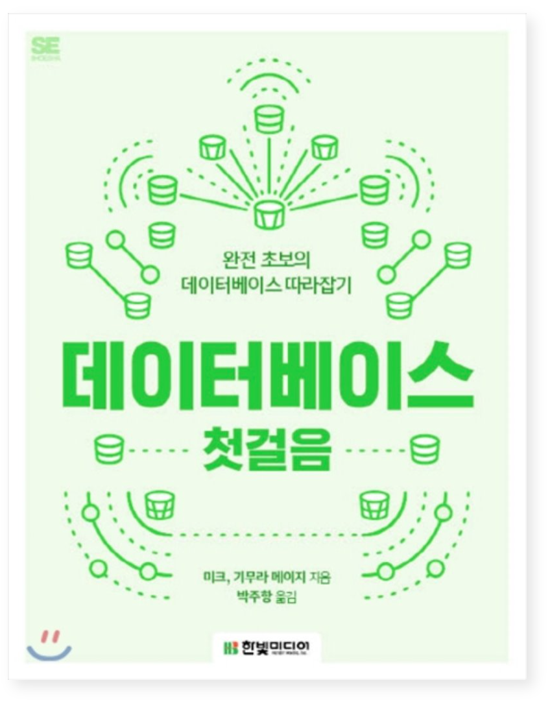
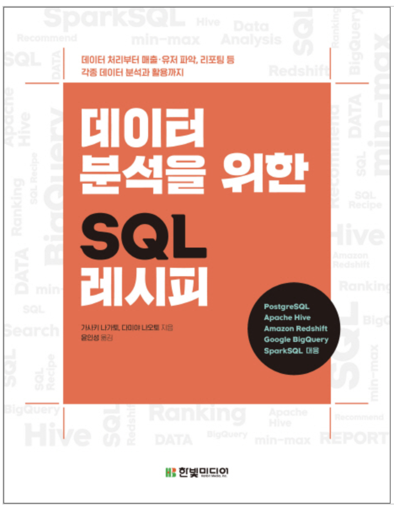
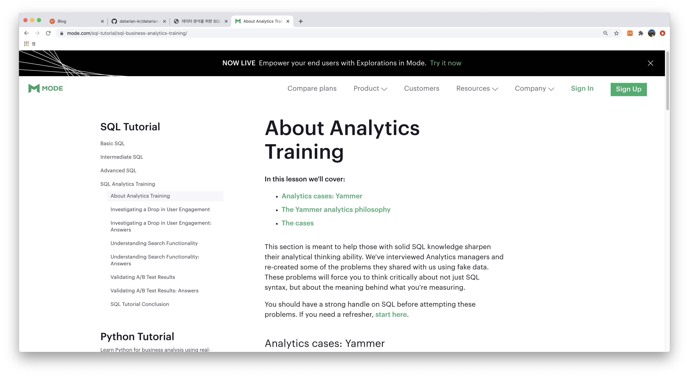

안녕하세요! 아마 이 포스트를 보시는 분들의 대부분은 데이터리안의 SQL 강의를 수강하신 분들이겠지요? 아직 강의 수강 전이시라면 [여기](https://www.inflearn.com/roadmaps/334)를 참고해주세요. 데이터를 분석하는 직군이 쓸 만한 SQL 기능들을 정리해 기초, 중급, 고급의 단계별로 강의를 구성했습니다.

&nbsp;

&nbsp;

2019년부터 데이터 분석을 시작하려는 분들에게 온/오프라인으로 SQL 교육을 했는데요. 강의가 끝나고 항상 받는 질문 중에 하나가 "강의 이후에 볼 만한 책을 추천해주세요" 인 것 같습니다. 인프런 강의를 통해서도 꾸준히 받았던 질문이고요.

그래서 강의를 끝내신 분들이 이후에 보기 좋은 자료들을 데이터리안 팀원들과 함께 정리해봤습니다.

# 무슨 책을 볼까?

### SQL 첫걸음

&nbsp;

&nbsp;

처음 회사에 입사해서 저에게 SQL을 가르쳐주신 사수님이 추천한 책입니다. 설명과 예제가 친절하고 꼼꼼하게 나와있는 편이라서 SQL 공부를 이제 막 시작하는 분들이 보기 좋고요. 백문이불여일타 SQL 시리즈를 들으신 분들이라면 공부한 것을 정리하는 기분으로 재밌게 읽으실 수 있을거라고 생각합니다. 책이 작아서 들고다니면서 보기에도 좋았습니다.

### 데이터베이스 첫걸음

&nbsp;

&nbsp;

백문이불여일타 SQL 시리즈에서는 데이터베이스에 대해서 많이 이야기하지 않았습니다. 데이터 분석을 위해 SQL 공부를 시작하시려는 분들을 타겟으로 하는 강의이기 때문에 데이터는 이미 다 테이블 형태로 저장이 되어있다고 간주하고 그것을 어떻게 원하는 형태로 가공해서 가져올 것인가에 집중했기 때문인데요. 

데이터베이스는 아주 간단하게 얘기하자면 데이터를 담고 있는 그릇, 또는 데이터를 관리하기 위해 있는 시스템이라고 얘기할 수 있습니다. 대표적인 데이터베이스로는 우리가 수업시간에 다뤘던 MySQL이 있구요. 이외에 Oracle, PostgreSQL 등 다양한 데이터베이스 상품들이 있고, 우리가 마트에서 사는 상품들의 품질과 가격이 다르듯이 데이터베이스들도 각각의 특징이 있고 사용하기 위해 지불해야 하는 비용도 다릅니다. 각 데이터베이스마다 SQL도 약간씩 다른데요. Oracle 같은 고가의 데이터베이스는 다른 데이터베이스들보다 상대적으로 많은 기능과 함수를 지원합니다.

이 책은 이름 그대로 데이터베이스에 첫걸음을 떼기 위해 필요한 지식들을 담고 있습니다. 기술서이지만 입문자를 위해 쓰여졌기 때문에 쉬운 언어로 술술 잘 읽히는 편이라서 이제 막 데이터에 입문하셨다면 읽어보시기를 추천합니다.

### 데이터 분석을 위한 SQL 레시피
✅ SQL 고급 기획자 S & SQL 기초, 중급 기획자 Bomin's Pick

&nbsp;

&nbsp;

**Bomin**: 실무에서 바로 써먹을 수 있는 SQL 레시피 입니다. 실제로 업무할 때 참고가 되는 책이구요. 정형화 된 테이블 데이터 뿐만 아니라 회사에서 실제로 마주칠 수 있을만한 로그 데이터를 가공하여 추출하는 방법에 대해서 설명해주고 Google BigQuery, HiveQL, Presto 등 다양한 플랫폼에서 쿼리를 어떤 식으로 만들어야 하는지도 자세하게 나와 있습니다. 실제 현업에서 마주하는 요청사항들과 정말 유사한 예시가 많아서 참고가 되는 책입니다.

**S**: 이 책 저도 전에 Bomin님이 추천해줘서 샀어요. 위의 이유에 더해서, 마지막 장에 분석 리포팅에 대한 이야기도 좋았습니다. 분석만큼이나 리포팅을 잘하는 것도 중요한데 이에 대해서 독자가 생각해볼 수 있게 해줘서 좋더라구요. 추천합니다.
 
# 실제와 비슷한 데이터를 볼 수는 없을까?

### MODE의 SQL Analytics Training

만약 SQL 고급반까지 수강을 마치셨다면 HackerRank, LeetCode 문제는 이제 충분히 풀어보셨습니다. 이제 실제 회사 데이터는 어떻게 생겼는지 궁금하실 것 같아요. 아직 직장에 다니지 않는데 데이터 분석을 공부하려고 하시는 분들이 가장 많이 느끼는 갈증이 실제 현업에서 어떤 데이터를 보게될지 모른다는데서 오는 것 같습니다.

&nbsp;

&nbsp;

현업에서 분석가가 하는 일을 맛보기 할 수 있는 튜토리얼이 있어서 소개해드리려고 합니다. 데이터 관리, 분석 플랫폼을 만드는 MODE라는 회사에서 제공하는 [튜토리얼](https://mode.com/sql-tutorial/sql-business-analytics-training/) 인데요. Daily Active User의 감소 원인을 찾아본다던지, 검색 기능에 대한 사용성 리서치를 한다던지 실제 회사에서도 있을법한 분석 토픽을 가지고 SQL로 데이터를 추출하고 해석하는 경험을 해 볼 수 있습니다. 2020년 데잇걸즈 4기의 SQL 교육에서도 MODE의 자료를 가지고 팀 프로젝트를 진행했어요. 

처음에는 튜토리얼을 이해하는 것에 중점을 두고, 이해가 완벽하게 됐다면 이 분석을 내 동료 분석가가 했다고 생각하고 리뷰를 해보는 것도 좋겠죠. 데잇걸즈 4기의 수업에서도 1차로 MODE 튜토리얼의 분석을 이해하고, 2차로 분석 결과를 비평하는 순서로 프로젝트 발표를 이어갔구요. 겉으로 보기에는 그럴싸 해보이는 분석 리포트에도 언제나 비평할 거리가 있다는 생각을 다시금 하게 하는 시간이었습니다.

&nbsp;

&nbsp;

단, 한가지 주의하셔야 하는 점이 있습니다. "데이터 분석을 위한 고급 SQL"까지는 수강을 하셔야 튜토리얼의 쿼리를 완벽하게 이해하실 수 있을거예요. 만약 중급반까지 수강을 마치셨는데 튜토리얼을 시작해보고 싶은 분이 계시다면, '윈도우 함수', '서브 쿼리' 정도는 따로 공부를 하고 튜토리얼을 시작하시면 좋을 것 같습니다.

# 👋
참고자료가 SQL에 대한 이해를 더욱 풍성하게 하길 바랍니다! 부족한 강의에 애정을 주셔서 항상 감사드립니다.