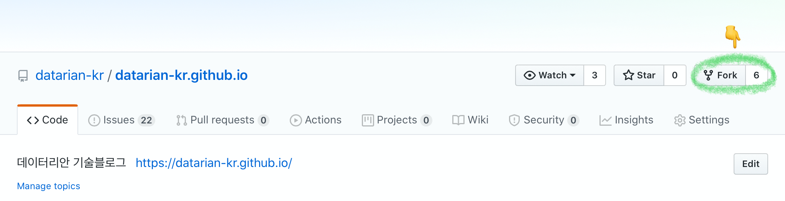
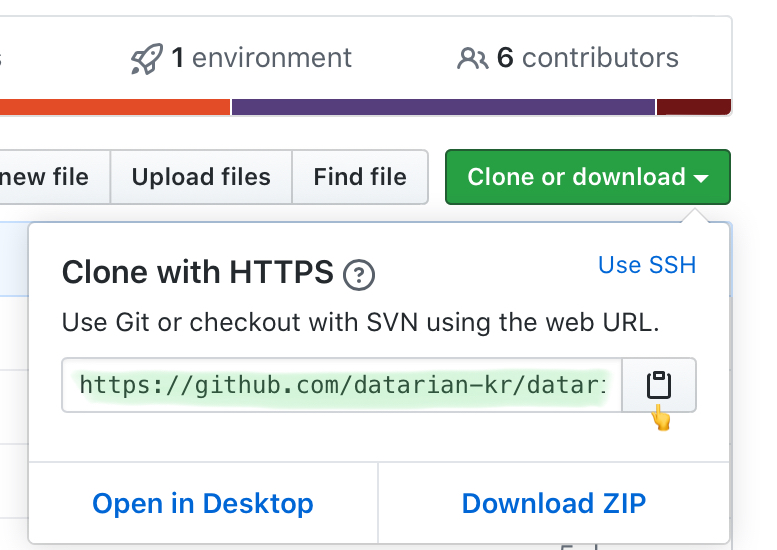
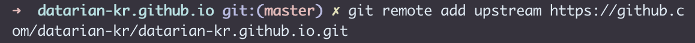
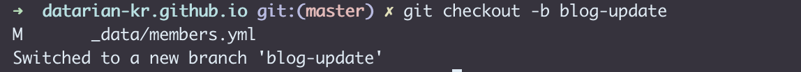
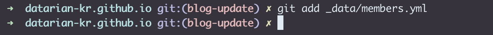
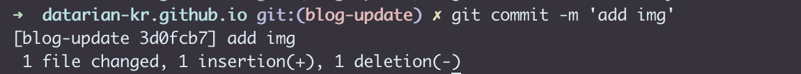

### 작업을 시작하기 전에!!
1. 나의 github 계정으로 데이터리안 블로그 repository를 fork해주세요!
    
    

    &nbsp;

2. 터미널을 켜서 `git clone 주소` 명령으로 fork한 repository를 clone합니다.
    
    

    &nbsp;

3. `git remote add upstream 주소` 명령을 입력해서 upstream을 추가해주세요.

    

    - `git remote -v` 로 upstream이 추가 되었는지 확인합니다.

        

    - `git pull upstream master` 명령으로 최신 상태를 반영합니다.

    &nbsp;

4. `git checkout -b 브랜치이름` 명령으로 새로운 브랜치를 생성합니다.

    

    &nbsp;

### 그럼 이제 Members tab에 나를 추가해볼까요?

1. Visual Studio Code를 열어서 clone해온 repository를 열어줍니다.

    
    
    &nbsp;

2. data 폴더의 members.yml 파일을 열어줍니다.

    

    &nbsp;

3. 나의 정보를 추가한 후 저장합니다.

    
    - 나의 정보를 각 속성에 맞게 추가해줍니다.

    - 이미지 파일은 member 폴더의 img 폴더 안에 이미지 파일을 넣고 파일 경로를 적어주면 됩니다.

    &nbsp;

4. **저장한 후에 내가 의도한 대로 되었는지 확인하기 위해 바로 commit을 하지 마시고 로컬에서 먼저 build를 해봅니다!**

    - 데이터리안 블로그 README.md를 읽어보세요.
    
    &nbsp;

5. 내가 의도한 대로 잘 되었다면 터미널로 가봅시다.

    - `git status` 명령으로 commit할 파일(untracked 파일)을 확인합니다.

        

    - `git add .(또는 파일이름)` 명령으로 untracked 파일을 tracked
    (staged) 상태로 만들어줍니다. -> **commit할 준비가 되었다는 뜻**

        
        별 말 없으면 잘 추가되었다는 뜻입니다.

    - `git commit -m 'commit 메시지'` 명령으로 commit을 합니다. commit 메시지는 다른 멤버들을 위해 자세하지만 간결하게 적어주세요!

        

    - `git push origin 브랜치이름` 명령으로 내가 만든 브랜치를 origin에 push합니다.

        

    - `git checkout master` 명령으로 master 브랜치로 브랜치를 변경합니다.

        

    - **혹쉬 브랜치를 만들지 않고 master 브랜치에서 commit을 했다면 <https://datarian-kr.github.io/blog/commit-at-master/> 로 가서 구원받으세요.**

6. github에 들어가서 pull request를 보냅니다.

    

    

    - pull request를 보내고 슬랙 #blog 채널에서 리뷰를 요청해주세요.

    - 특정 리뷰어를 지정해서 리뷰를 요청할 수도 있습니다.

    

7. **merge가 완료되면** `git branch -D 브랜치이름` 명령으로 내가 만든 브랜치를 삭제합니다.

&nbsp;

### 기억하고 있으면 좋을 것들

1. 브랜치를 생성하기 전에 습관적으로 `git pull upstream master`를 한다.

2. 작업을 시작하기 전에 브랜치를 생성한다.

3. `git add .` 명령을 하기 전에 로컬에서 build를 해본다.
