안녕하세요, 데이터리안입니다.

새해 작심삼일 혹시 벌써 끝나셨나요? SQL 공부는 하고 싶은데 무슨 강의를 들어야할지 모르겠는 여러분들을 위해 데이터리안 강의 가이드를 오픈했습니다. 나는 아직 데이터 분석 공부 계획을 못 세웠다! 하시는 분들에게 이 가이드가 도움이 되길 바래요!

## 0️⃣ [백문이불여일타] SQL 시리즈 공통 가이드

백문이불여일타 SQL 시리즈는 데이터리안의 핵심 교육 철학을 담고 있는 대표 강의 시리즈 입니다. 

영어 문법 공부를 아무리해도 실제로 대화를 하지 않으면 영어 회화 실력이 늘지 않듯이, SQL도 문법 공부만 해서는 제대로 사용할 수 없잖아요. 백문이불여일타 시리즈에서는 **SQL 문법을 이론만 공부하는 것이 아니라 각 문법과 관련된 문제들을 SQL로 직접 해결해보면서 내것으로 만들어가는 방식**으로 강의가 구성되어있어요.

기존에 SQL 문법 공부를 좀 해보신 분이시라면 각 강의의 설명과 목차를 반드시 확인 해보시고 대략적으로 들어봐야할 내용을 가늠해보시길 바랍니다.

### **백문이불여일타 시리즈는 아래 6개 항목으로 구성되어있습니다.**

아주 기초적인 이론부터 끝까지 차근차근 공부하실 계획이 있으시거나, 어쨌거나 당장 SQL을 현업에서 바로 써먹어야 한다는 분들께는 강의들을 한꺼번에 구매하셔서 공부하실 수 있는 로드맵을 추천드립니다.

1. SQL이라는 언어를 아예 처음 공부하시는 왕왕초보를 위한 [[백문이불여일타] 데이터 분석을 위한 기초 SQL](https://www.inflearn.com/course/백문이불여일타-데이터-분석-기초-sql?inst=9de5abd9)
2. SQL과 초면은 아니지만 현업에서 실제로 유의미한 데이터를 가공해서 뽑기는 조금 어려운 분들을 위한 [[백문이불여일타] 데이터 분석을 위한 중급 SQL](https://www.inflearn.com/course/데이터-분석-중급-sql?inst=2fb58a97)
3. 이제 SQL과 낯을 가리진 않지만 좀 더 고급진 스킬을 자유자재로 사용하고 싶다고 생각하시는 분들을 위한 [[백문이불여일타] 데이터 분석을 위한 고급 SQL](https://www.inflearn.com/course/데이터-분석-고급-sql?inst=13a01dad)
4. 중급반과 수강 후 더 많은 예제 문제들을 풀어보고 싶은 분들을 위한 [[백문이불여일타] 데이터 분석을 위한 중급 SQL 문제풀이](https://www.inflearn.com/course/sql-중급-문제풀이?inst=9927fd23)
5. 중급반과 수강 후 더 많은 예제 문제들을 풀어보고 싶은 분들을 위한 [[백문이불여일타] 데이터 분석을 위한 고급 SQL 문제풀이](https://www.inflearn.com/course/sql-고급-문제풀이?inst=c6e400e1)
6. [위 5가지 강의를 한꺼번에 수강할 수 있는 완전판 로드맵](https://www.inflearn.com/roadmaps/334)
7. [SQL 이론, 액기스만 공부할 수 있는 이론편 로드맵](https://www.inflearn.com/roadmaps/400)  

### **백문이불여일타 SQL 시리즈는 어떤 사람이 들으면 좋을까요?**

- SQL을 무작정 시작해보고 싶은 누구나
- 데이터 분석 공부를 시작해보고 싶은 누구나
- 데이터 분석가로의 커리어를 희망하는 분
- SQL 코딩 테스트를 준비해야 하는 구직자
- SQL 자격증은 있는데 실제로 쿼리는 잘 못짜시는 분
- 당장 내일 회사에서 SQL을 써먹어야 하시는 분
- 현업에서 사내 데이터 추출을 직접 해야하는 분 or 그렇게 하고 싶은 분  

### **지식적인 부분 이외에 이 강의 시리즈에서 더 얻어갈 수 있는 것이 있을까요?**

백문이불여일타 SQL 기초반, 중급반, 고급반을 완강하시면 SQL 문법의 핵심만 골라 한장에 차곡차곡 모아 담은 **치트시트**를 다운 받으실 수 있고, **강의 수료증**을 발급 받으실 수 있어요. 

첫 번째, 치트시트는 복습하실 때 유용하게 사용하실 수 있을 거에요. 치트시트 다운로드는 **각 강의 목록의 마지막 장에서 직접** 하실 수 있도록 준비해두었습니다. 기초반과 중급반의 치트시트는 내용이 동일하니까 참고부탁드려요.

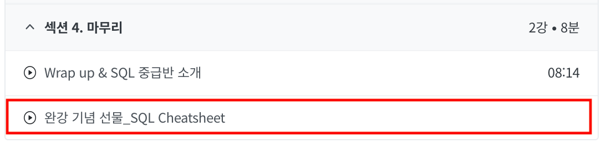  
   

두 번째, 수료증은 강의 대시보드에서 **내 학습상황**이라는 섹션을 찾아보시면 강의 이수 상태에 따라서 발급이 가능합니다. 수료증을 발급받아 링크드인, 이력서 등에 걸어둔다면 SQL 스킬에 대한 근거를 보여줄 수 있겠죠?

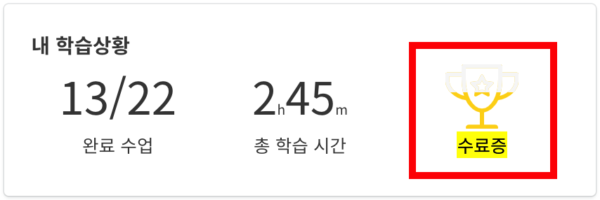  
   

세 번째, 강의를 듣다가 궁금한 것이 생기실 경우 우선 질문 답변 페이지를 참고해주세요. 백문이불여일타 시리즈는 각 강의 별로 질문 답변 페이지가 활성화 되어있어 여러가지 질문들에 대한 답변이 이미 달려있어요. 혹시 질문 답변 페이지를 살펴 보셨는데도 이해가 안가는 부분이나 에러가 있다면 그땐 바로 질문을 올려주세요. 저희가 살펴보고 답변을 드리도록 할게요. 데이터리안의 모든 구성원은 현업에서 열심히 일하고 있는 분석가들이기에 답변이 달리기까지 시간이 조금 걸릴 수 있는 점 미리 양해 부탁드립니다.

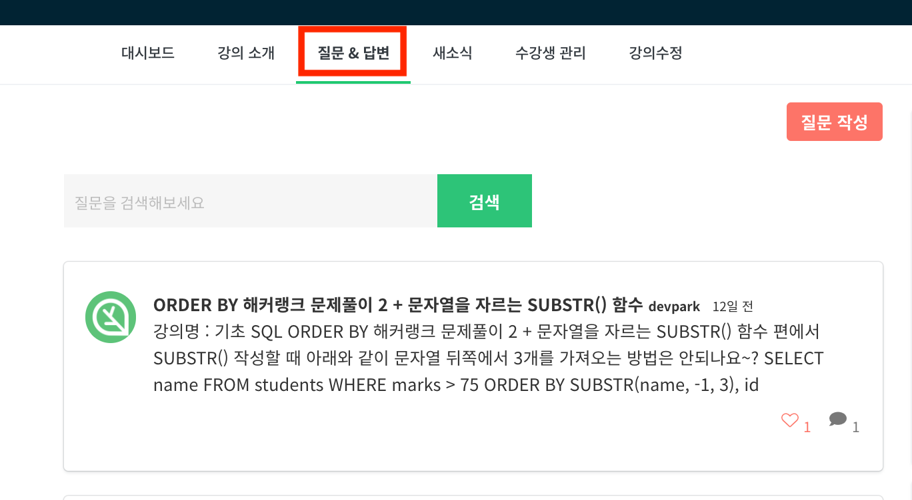  
   

마지막으로 강의를 듣고 충분히 마음에 드셨다면 수강평으로 강의에 대한 여러분의 의견을 남겨주세요.  수강생 여러분들의 애정어린 피드백들은 다음 강의 기획과 운영에 많은 참고가 된답니다. 물론 여러분의 수강평 하나하나 읽어보면서 기획자들은 큰 힘을 얻기도 해요. 이 메세지는 저희 강의 질문 답변페이지에서 수강생분께서 대댓글로 남겨주신 기쁜 소식인데요. 이런 멋진 소식은 수강평에도 마구마구 올려주시면 정말 기쁠 것 같아요.

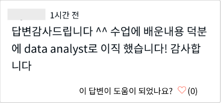  
   

---

   
  
## 1️⃣ [백문이불여일타] 데이터 분석을 위한 기초 SQL 가이드

[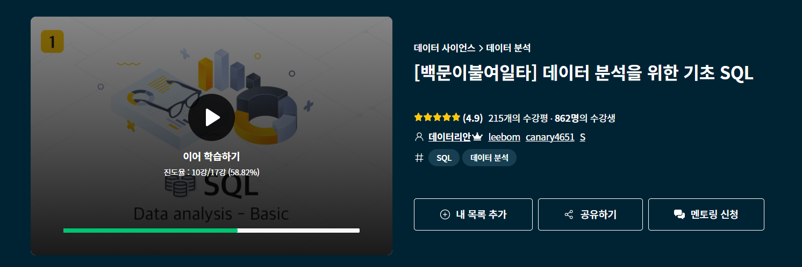](https://www.inflearn.com/course/백문이불여일타-데이터-분석-기초-sql?inst=9de5abd9)

### **이 강의는 어떤 사람이 들으면 좋을까요?**

- 데이터 분석 공부를 하고는 싶은데 어디서 뭐부터 시작해야할지 막막하신 분.
- 현업에서는 SQL을 사용한다길래, 배워보고는 싶지만 프로그래밍 잘 모르겠고.. 자꾸만 이 길은 내 길이 아닌 것 같다는 생각이 드시는 분.
- SQL이 아무튼 필요한 건 알겠는데 그래도 여전히 혼자 공부하는 것은 낯설고 어려우신 입문자 분.

### **어떤 것들을 배우게 되나요?**

아주 기본적인 SQL 문법의 뼈대 구조를 배웁니다. 
하나의 데이터 테이블에서 간단한 조건을 걸어 데이터를 추출 해보고, 데이터의 순서를 조작하여 추출 해볼 수 있어요.

기업들이 SQL 코딩테스트 플랫폼으로 사용하기도 하는 HackerRank에서도 직접 문제를 풀어 보시게 될거에요.

### **제가 또 알아야 할 것이 있을까요?**

🗺️치트시트와 🏆수료증은 꼭 챙기세요! 치트시트는 기초반 커리큘럼 맨 마지막 페이지에서 직접 다운로드가 가능합니다.

기초반과 중급반의 경우 비교적 쉬운 내용의 문법 강의가 진행되기 때문에 수강생분들이 정해진 기간내에 집중해서 들으셨으면 좋겠다고 생각했어요. 때문에 수강 기간을 💥3개월💥로 제한해두고 있는 점 꼭 확인해주시길 바랍니다.

### **수강생들은 강의 내용에 만족하나요?**

백문이불여일타 SQL 기초반의 수강평은 무려 207개! 평균 평점 4.9점이 빛나는 강의입니다.

수강생분들의 후기를 직접 읽어보시면 대략 어떤 강의인지 알 수 있을 거에요.

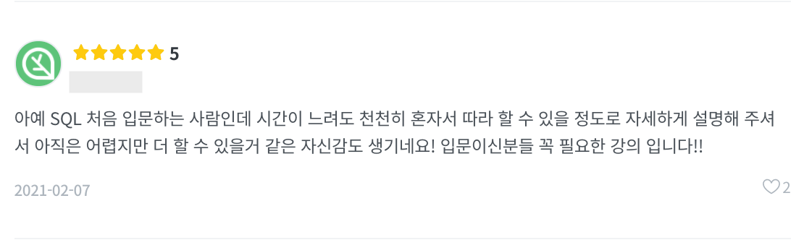
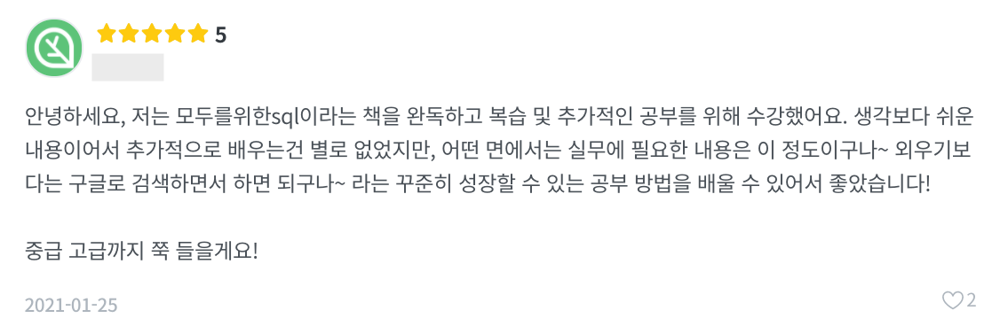
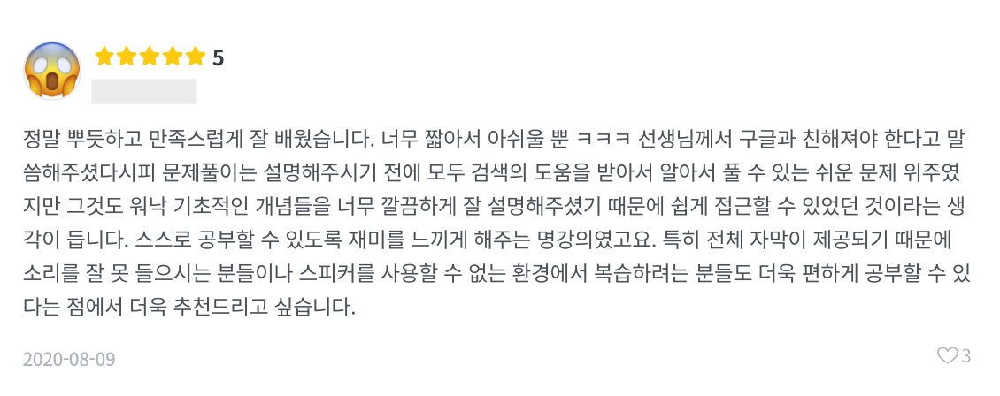
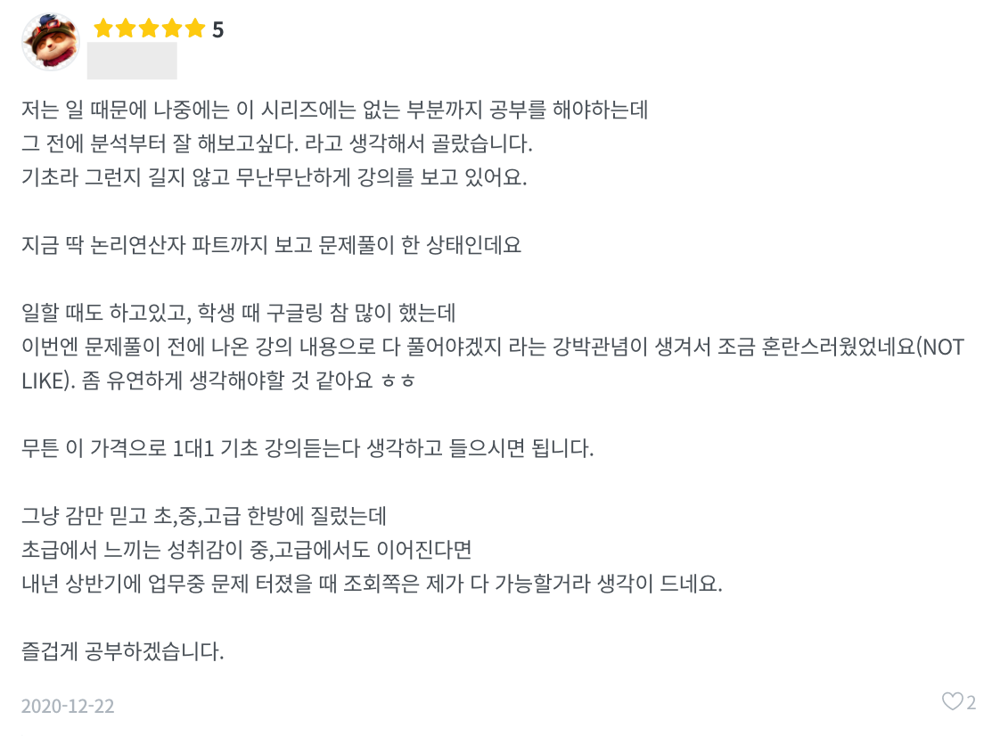
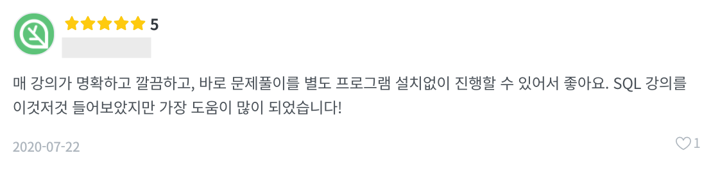

---  
   

## 2️⃣ [백문이불여일타] 데이터 분석을 위한 중급 SQL 가이드

### **이 강의는 어떤 사람이 들으면 좋을까요?**

- SQL 이론은 배웠지만, 실습이 부족하다고 느끼는 분.
- SQL의 기본 뼈대는 이제 대충 알겠는데 그래서 내가 뽑고 싶은 여러 데이터를 자유롭게 그룹지어 요약하고, 서로 연결하여 추출하려면 뭘 더 알아야 하는지 궁금한 분.
- 실제 업무에 간단히 적용해서 사용해볼 수 있을 만한 수준의 SQL 스킬을 원하는 기획자 또는 마케터.  

### **어떤 것들을 배우게 되나요?**

SQL을 이용해 데이터들을 그룹핑하여 수치를 요약하고, 여러개의 테이블을 연결시키는 등의 명령어들에 대해 알아봅니다.

마찬가지로 기업들이 SQL 코딩테스트 플랫폼으로 사용하는 Leetcode와 HackerRank 사이트를 사용하여 문제를 풀어봅니다.  

### **제가 또 알아야 할 것이 있을까요?**

🏆수료증 꼭 챙기세요!

치트시트는 **기초반의 내용과 동일**하기 때문에 중복으로 다운로드 받지 않으셔도 됩니다. 만약 다운받고 싶으시다면 중급반 커리큘럼 맨 마지막 페이지에서 직접 다운로드 가능합니다.

기초반과 중급반의 경우 비교적 쉬운 내용의 문법 강의가 진행되기 때문에 수강생분들이 정해진 기간내에 집중해서 들으셨으면 좋겠다고 생각했어요. 때문에 수강 기간을 💥3개월💥로 제한해두고 있는 점 꼭 확인해주시길 바랍니다.  

### **수강생들은 강의 내용에 만족하나요?**

백문이불여일타 SQL 중급반의 수강평은 총 163개! 마찬가지로 평균 평점 4.9점이 빛나는 강의입니다.

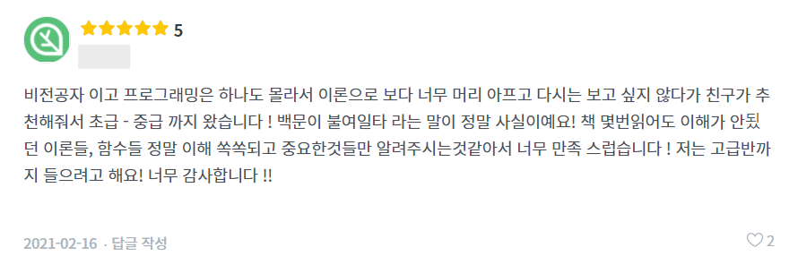
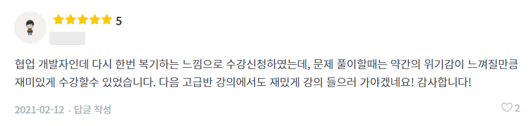
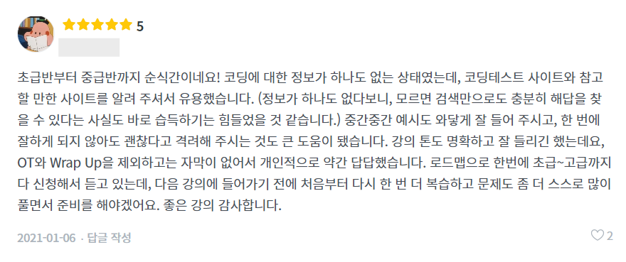
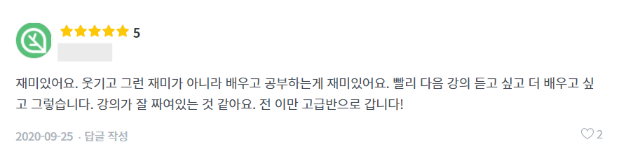
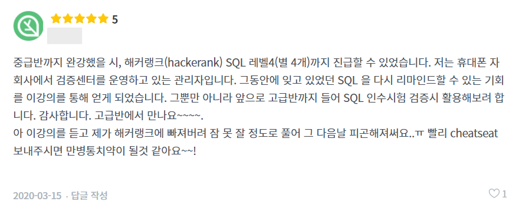
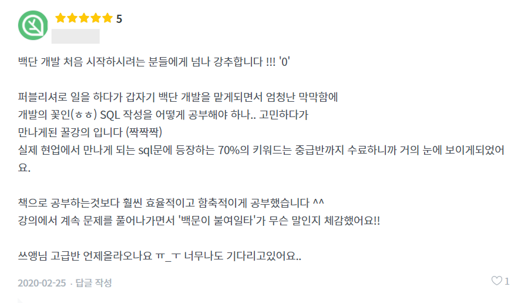

---  
   

## 3️⃣ [백문이불여일타] 데이터 분석을 위한 고급 SQL 가이드

[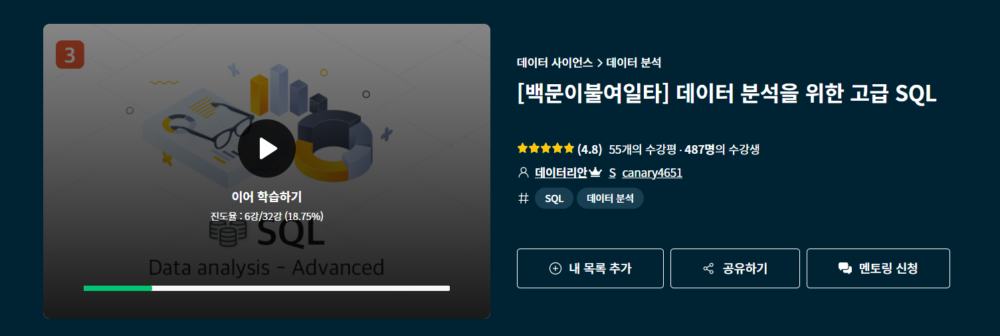](https://www.inflearn.com/course/데이터-분석-고급-sql?inst=13a01dad)

### **이 강의는 어떤 사람이 들으면 좋을까요?**

- 백문이불여일타 SQL 기초, 중급반을 모두 수강했는데 뭔가 조금 더 배워보고 싶은 아쉬움이 남으시는 분.
- 현업에서 데이터 분석 업무를 곧바로 진행하셔야하는 분.
- 적당히 배우는 건 못하겠고 SQL 문법의 모든 것을 알고 싶은 분.

### **어떤 것들을 배우게 되나요?**

저장된 데이터를 수정, 삽입, 삭제하는 명령어에 대해서 알아봅니다.

데이터 테이블과 테이블 사이의 관계를 도식화 하는 방법에 대해서 알아봅니다.

쿼리 안에 쿼리를 넣어 사용하는 방법을 알아보고, 윈도우 함수를 이용하여 이전에는 할 수 없었던 여러가지 조건으로 데이터를 추출하는 방법에 대해서 알아봅니다.

마찬가지로 기업들이 SQL 코딩테스트 플랫폼으로 사용하는 Leetcode와 HackerRank 사이트를 사용하여 문제를 풀어봅니다.

### **제가 또 알아야 할 것이 있을까요?**

🗺️치트시트와 🏆수료증은 꼭 챙기세요! 고급반 치트시트는 기초반 치트시트와 별개입니다. 고급반 커리큘럼 맨 마지막 페이지에서 직접 다운로드 가능합니다.

고급반의 경우 수강 기간은 무제한입니다.

### **수강생들은 강의 내용에 만족하나요?**

백문이불여일타 SQL 고급반의 수강평은 총 55개! 평균 평점은 4.8점 입니다.

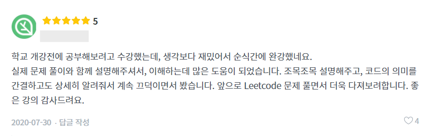
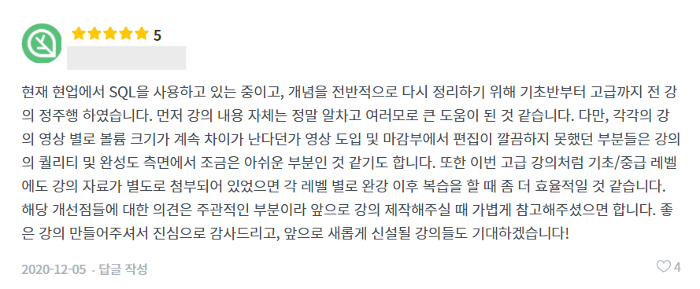
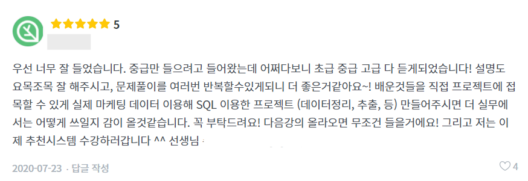
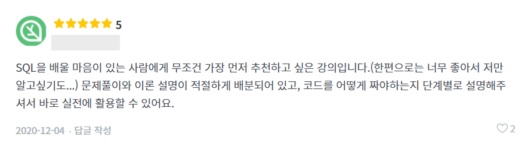

---  
   

## 4️⃣ [백문이불여일타] 데이터 분석을 위한 중급 SQL 문제풀이 가이드

[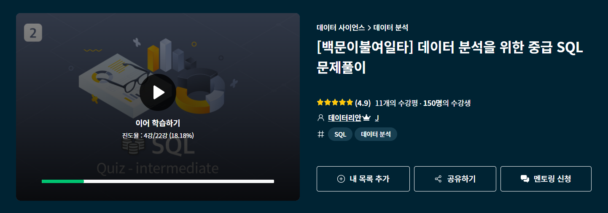](https://www.inflearn.com/course/sql-중급-문제풀이?inst=9927fd23)

### **이 강의는 어떤 사람이 들으면 좋을까요?**

- 백문이불여일타 SQL 기초, 중급반을 다 듣고 문제풀이를 더 해보고 싶은 분.
- GROUP BY, JOIN 정도는 SQL로 자유롭게 쓸 수 있는데 내 실력을 문제를 풀면서 한 번 점검해보고 싶은 분.
- SQL 이론은 배웠지만, 실습이 부족하다고 느끼는 분.
- SQL 코딩 테스트를 준비하는 분.

### **어떤 것들을 배우게 되나요?**

백문이불여일타 SQL 기초, 중급반 커리큘럼에서 배웠던 이론적인 부분에 대한 추가적인 문제 풀이를 진행합니다.

마찬가지로 코딩 테스트 플랫폼인 Leetcode와 HackerRank를 이용합니다.

### **제가 또 알아야 할 것이 있을까요?**

문제풀이 중급반은 💥3개월💥 수강 제한이 있는 강의 입니다. 

수강 전 반드시 수강기간에 대해서 숙지해주시길 바랍니다.

### **수강생들은 강의 내용에 만족하나요?**

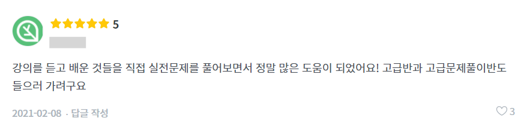
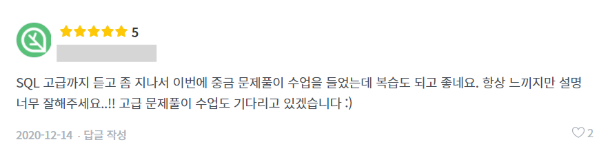
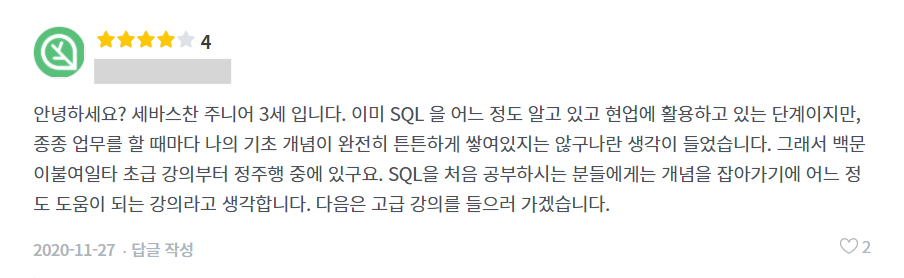
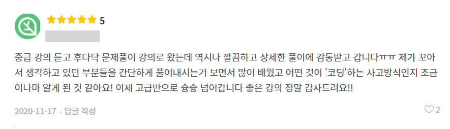

---  

   

## 5️⃣ [백문이불여일타] 데이터 분석을 위한 고급 SQL 문제풀이 가이드

[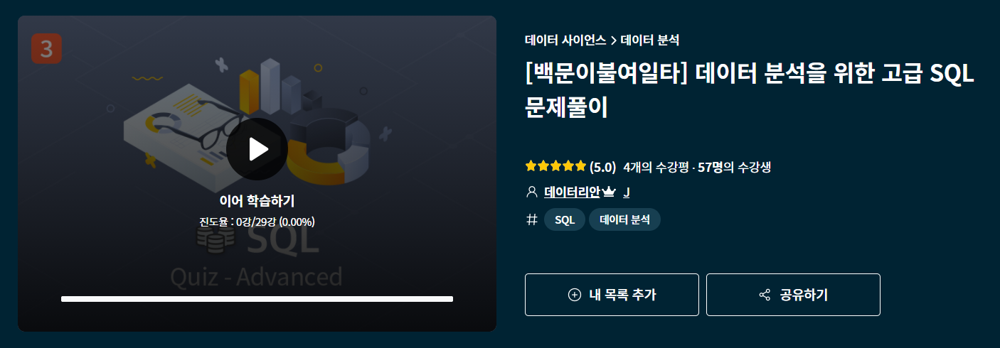](https://www.inflearn.com/course/sql-고급-문제풀이?inst=c6e400e1)

### **이 강의는 어떤 사람이 들으면 좋을까요?**

- 백문이불여일타 SQL 기초, 중급, 고급반을 다 듣고 문제풀이를 더 해보고 싶은 분.
- GROUP BY, JOIN은 물론 윈도우 펑션이나 기타 함수들과 정규표현식까지도 SQL로 자유롭게 쓸 수 있는데 내 실력을 문제를 풀면서 한 번 점검해보고 싶은 분.
- SQL 이론은 배웠지만, 실습이 부족하다고 느끼는 분.
- SQL 코딩 테스트를 준비하는 분.

### **어떤 것들을 배우게 되나요?**

백문이불여일타 SQL 고급반 커리큘럼에서 배웠던 이론적인 부분에 대한 추가적인 문제 풀이를 진행합니다.

마찬가지로 코딩 테스트 플랫폼인 Leetcode와 HackerRank를 이용합니다.

### **제가 또 알아야 할 것이 있을까요?**

문제풀이 고급반은 💥3개월💥 수강 제한이 있는 강의 입니다. 

수강 전 반드시 수강기간에 대해서 숙지해주시길 바랍니다.

### **수강생들은 강의 내용에 만족하나요?**

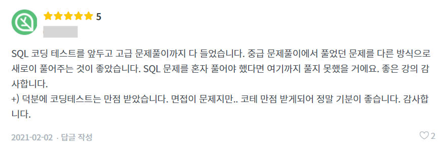

   

여기까지 데이터리안의 SQL 강의 가이드 였습니다. 강의 내용 잘 확인해보시고 나에게 맞는 강의 잘 선택해보시길 바랄게요. 앞으로도 좋은강의로 찾아뵙겠습니다!