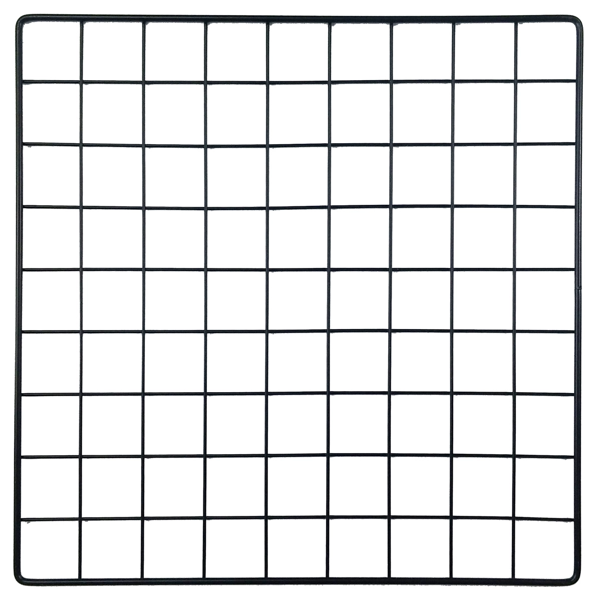

이 글을 보시는 분들은 아마 데이터리안의 추천 시스템 강의인 [개념부터 실습까지] 추천 시스템 입문편을 수강하시는 분들일 것 같습니다. 아직 강의를 보지 않으셨다면 [여기](https://www.inflearn.com/course/%EC%B6%94%EC%B2%9C-%EC%8B%9C%EC%8A%A4%ED%85%9C-%EC%9E%85%EB%AC%B8%ED%8E%B8)를 참고해주세요. 

&nbsp;


Bergstra, James, and Yoshua Bengio. "Random search for hyper-parameter optimization." 
The Journal of Machine Learning Research 13.1 (2012): 281-305.

&nbsp;

Grid Search, Random Search 모두 최고의 퍼포먼스를 내는 모델을 만들기 위해 하이퍼파라미터를 최적화하는 방법론입니다. 그렇다면 하이퍼파라미터란 무엇인가요?

## 하이퍼파라미터

위키피디아의 [하이퍼파라미터](https://en.wikipedia.org/wiki/Hyperparameter_(machine_learning)) 설명을 함께 봅시다. 

> In machine learning, a hyperparameter is a parameter whose value is used to control the learning process. By contrast, the values of other parameters (typically node weights) are derived via training. (...) Different model training algorithms require different hyperparameters, some simple algorithms (such as ordinary least squares regression) require none. Given these hyperparameters, the training algorithm learns the parameters from the data. For instance, LASSO is an algorithm that adds a regularization hyperparameter to ordinary least squares regression, which has to be set before estimating the parameters through the training algorithm.

> 머신러닝에서, 하이퍼파라미터는 주로 학습 과정에 관여하는 인자를 말한다. 반대로, 하이퍼파라미터가 아닌 다른 파라미터들은 모델 학습의 결과로 정해지게 된다. (...) 학습 알고리즘들은 각각 다른 하이퍼파라미터를 가지게 되는데, OLS와 같은 간단한 모델은 하이퍼파라미터를 가지지 않기도 한다. 모델은 주어진 하이퍼파라미터를 가지고 데이터를 학습하게 된다. 예를 들어 LASSO 알고리즘은 정규화를 위한 하이퍼파라미터를 OSL에 추가하며 이 과정은 모델이 데이터를 학습해 파라미터를 추정하기 전에 이루어진다.

머신러닝 모델은 데이터 학습을 통해 파라미터를 찾아냅니다. 수업에서 실습해봤던 선형 회귀 모델에서 절편(intercept)과 계수(coefficient)가 바로 모델이 학습을 통해 찾아낸 파라미터들이었죠. 

여기에 오버피팅 문제를 해결하기 위해 정규화 계수를 추가한 모델이 LASSO 모델이었고요. 정규화 계수는 LASSO라는 모델이 데이터를 학습하기 전에 고정해주어야 하는 값이었습니다. 정규화 계수 α(또는 λ로 표현하기도 합니다)의 크기가 커질수록 회귀 모델의 계수(coefficient)가 작은 곳에서 모델 학습이 이루어지는 이론적 배경에 대해서도 설명을 잠깐 했습니다. → **인프런 [추천 시스템 입문편] 섹션 Content-Based Recommendation 2 참고**

## Manual Search

그러면 하이퍼파라미터의 적정값은 어떻게 찾아줄 수 있을까요? 다행이도 LASSO 모델은 주요 하이퍼파라미터가 정규화 계수 하나밖에 없습니다. 이럴때에 우리는 간단하게 접근해 볼 수 있을 것 같습니다. 하나씩 넣어서 모델을 학습시켜 보는거죠. 정규화 계수로 0.1을 넣어서 모델 학습을 시켜보고 이 모델 이름을 model_v1 라고 합시다.

&nbsp;
```python
import numpy as np
from sklearn.linear_model import Lasso
from sklearn.metrics import mean_squared_error

# 정규화 계수를 0.1로 하는 Lasso 모델 만들기
model_v1 = Lasso(alpha=0.1, random_state=42)

# 모델 학습
model_v1.fit(X_train, y_train)

# 학습 결과 확인
print(model_v1.coef_)
print(model_v1.intercept_)

# 학습된 모델로 테스트 데이터 예측
y_predict = model_v1.predict(X_test)

# 테스트 데이터의 정답셋과 모델 model_v1의 예측을 비교하여 모델의 예측 정확도 측정, 출력
mse = mean_squared_error(y_predict, y_test)
rmse = np.sqrt(mse)
print(rmse)
```
&nbsp;

예를 들어 위의 model_v1의 예측 정확도(여기에서 정확도는 RMSE로 측정)가 1.5라고 합시다. 영화의 평점은 최대 5점이고 최소 0.5점 이었으니까 평균적인 에러가 1.5점이라는 건 꽤 큰 숫자인 것 같습니다. 정규화 계수의 값을 0.05로 하고 다시 모델을 학습시켜봅니다.

&nbsp;
```python
import numpy as np
from sklearn.linear_model import Lasso
from sklearn.metrics import mean_squared_error

# 정규화 계수를 0.1로 하는 Lasso 모델 만들기
model_v2 = Lasso(alpha=0.5, random_state=42)

(중간 코드 생략)

# 테스트 데이터의 정답셋과 모델 model_v1의 예측을 비교하여 모델의 예측 정확도 측정, 출력
mse = mean_squared_error(y_predict, y_test)
rmse = np.sqrt(mse)
print(rmse)
```
&nbsp;

만약에 model_v2의 RMSE가 model_v1보다 낮아져서 0.8이 됐다고 해봅시다. 신이 납니다. 정규화 계수를 바꿔서 몇 개 더 시도해볼 수 있겠습니다. 자, 이런 과정을 우리는 Manual Search라고 합니다. 영어로 써놓으니 그럴듯 해보이지만, based on your intuition, 직감으로 몇 개 넣어보는 겁니다. 하이퍼파라미터가 한 개 밖에 없을때에는 괜찮은 선택지일지도 모릅니다.

## Grid Search

Grid Search는 Manual Search에서 한 발만 나아가면 됩니다. 아래와 같은 격자를 Grid라고 하는데요. 본격적인 탐색을 시작하기 전에, 일정한 간격을 두고 시도해볼 하이퍼파라미터들을 미리 만든다는 점에서 Manual Search 보다는 조금 더 체계적이라고 볼 수 있겠습니다. 일정한 간격을 두고 실험할 하이퍼파라미터들을 2차원으로 그려보면 모양이 마치 격자와 같다고 해서 이름이 Grid Search 입니다.

&nbsp;



&nbsp;

LASSO의 알파를 예로 들면 0.05를 간격으로 하고 0.05 부터 0.5까지 시도해보겠다는 계획을 세울 수 있겠고요. 그러면 총 10개의 알파를 순차적으로 넣고 실험을 해보는거죠. 어떤 알파를 사용했느냐에 따라 모델 성능이 달라질테고, 성능이 가장 좋은 모델을 만들어낸 알파를 최종적으로 선택하면 되겠습니다. 

이 과정을 직접 구현할 수도 있겠지만, 다행히도 Scikit-learn 라이브러리가 `GridSearchCV`라는 함수를 제공해서 우리가 어떤 알파를 사용할 것인지만 알려주면 `GridSearchCV`가 알아서 가장 성능이 좋은 알파를 찾아줄겁니다. 함수 이름이 익숙하죠? `GridSearch`는 우리가 지금까지 얘기한 방법론을 함수 이름에 써넣은 것이구요. `CV`는 Cross Validation의 약자로 train 데이터와 test 데이터를 어떻게 나누어서 모델 평가를 할 것인가에 대한 이야기인데 우리 장의 주제는 아니니까 넘어가도록 하겠습니다. 궁금하신 분들은 Cross Validation 또는 교차검증이라고 검색해보시면 자료를 찾을 수 있을겁니다.

&nbsp;
```python
import numpy as np
from sklearn.linear_model import Lasso
from sklearn.model_selection import GridSearchCV

# Lasso 모델 만들기
model = Lasso(random_state=42)

# 0.05 간격으로 alpha grid 만들기
param_grid = {'alpha': [0.05, 0.1, 0.15, 0.2, 0,25, 0.3, 0.35, 0.4, 0.45, 0.5]}

# GridSearchCV 실행
grid_search = GridSearchCV(model, param_grid=param_grid, random_state=42)
grid_search.fit(X, y)

# Best 모델의 알파, 절편, 계수 출력
print(grid_search.best_estimator_.alpha)
print(grid_search.best_estimator_.intercept_)
print(grid_search.best_estimator_.coef_)
```
&nbsp;

알고보면 별거 아니죠? 코드도 매우 간단합니다.

## Random Search
Random Search는 주어진 구간 안에서 랜덤으로 숫자를 뽑아서 실험을 합니다. Grid Search에서 실험할 하이퍼파라미터들을 명시적으로 정해줘야 한다면, Random Search는 하이퍼파라미터로 시도할 숫자의 구간과, 횟수를 정해줍니다. 

예를 들어 0과 1사이에서 랜덤으로 숫자를 뽑아서 그 숫자를 정규화 계수로 하는 모델을 만들되, 그런 실험을 50번 반복해라 같은 식이죠. 코드로 보면 아래와 같습니다. 마찬가지로 Scikit-learn의 `RandomSearchCV`라는 함수를 활용하면 짧은 코드로도 Random Search를 구현할 수 있습니다.

&nbsp;
```python
import numpy as np
from scipy.stats import uniform as sp_rand
from sklearn.linear_model import Lasso
from sklearn.model_selection import RandomSearchCV

# Lasso 모델 만들기
model = Lasso(random_state=42)

# 0과 1사이에서 모든 숫자를 동일한 확률로 뽑을 수 있도록 uniform distribution을 만듦
param_dist = {alpha: sp_rand()}

# RandomSearchCV 함수는 Uniform distribution에서 랜덤으로 뽑은 숫자를 알파로 하는 Lasso 모델을 만드는 작업을 50번 수행함
rand_search = RandomSearchCV(model, n_iter=50, param_distribution=param_grid, random_state=42))
rand_search.fit(X, y)

# 위 작업에서 가장 성능이 좋았던 알파를 정규화 계수로 하는 모델을 best_estimator_에 저장해 줌
print(rand_search.best_estimator_.alpha)
print(rand_search.best_estimator_.intercept_)
print(rand_search.best_estimator_.coef_)
```
&nbsp;

Grid Search와 비교해 어떤 장점이 있을 수 있을까요? 만약에 우리가 Grid를 0.1 간격으로 만들어서 0.1, 0.2, 0.3, 0.4, 0.5, 0.6, 0.7, 0.8, 0.9, 이렇게 아홉개 알파를 실험해보고 최종적으로 0.3를 골랐다고 가정해봅시다. 이 알파를 가지고 만든 모델이 최고의 성능을 내는 모델이라고 얘기할 수 있나요? 최고의 성능을 내는 알파가 혹시 0.178은 아니었을까요?

아래 그림을 함께 봅시다. 왼쪽은 Grid Search를 간단하게 그림으로 표현했고, 오른쪽은 Random Search를 표현했네요. 각각의 박스 위에 그려진 곡선은 모델의 성능을 나타내며, 빨간 점은 시도해본 하이퍼파라미터 입니다. 그림의 요지는 이겁니다. Grid를 만들어서 하이퍼파라미터를 찾는 것보다, 랜덤으로 숫자를 뽑아서 그걸 하이퍼파라미터로 시도해보는 것이 더 좋은 성능의 모델을 찾는 확률을 높이는 길이라는거죠. 

&nbsp;

[source](https://srdas.github.io/DLBook/DL_images/HPO1.png)
&nbsp;

Grid를 더 촘촘하게 만들면 되지 않을까? 생각할수도 있습니다. 좋은 접근 방법입니다! 우리가 계속 예로 들고 있는 Lasso 모델의 경우에는 하이퍼파라미터가 정규화 계수 하나밖에 없기 때문에 grid를 더 촘촘하게 만들어서 시도해보는 것도 나쁘지 않을 것 같습니다. 하지만 찾아야 하는 하이퍼파라미터가 여러개라고 생각하면 이야기가 좀 달라집니다. 하이퍼파라미터 하나 당 그리드를 10개만 만든다고 하여도 실험해야 하는 하이퍼파라미터가 2개라면 시도해보아야 하는 경우의 수는 10의 제곱개니까 100개, 실험해야 하는 하이퍼파라미터가 3개라면 1000개, 10000개, 이렇게 기하급수적으로 경우의 수가 늘어납니다. 여기에 그리드를 더 촘촘하게 만든다면요? 정말 어마어마한 경우의 수를 연산해야 할겁니다. 모델 하나 튜닝하자고 몇 년을 써야 하는 상황이 올 수도 있겠네요. 이런 상황에서 Random Search는 더 빛을 발합니다.

Random Search와 Grid Search의 장단점에 대해서 더 알고 싶다면 'why random search is better than grid search?', 'random search vs grid search', 'comparison of grid search and random search' 등으로 검색해보시면 좋을 것 같습니다.

## 이외

Grid Search와 Random Search에 대해서 긴 이야기를 해봤는데요. 김빠지는 이야기일 수도 있겠지만, 이 둘 이외에도 다른 하이퍼파라미터 서치 방법들이 많습니다. 상식적으로 생각해보면 Random Search는 솔직히 좀 비효율적입니다. 예를 들어 Lasso 모델의 알파로 0.1과 0.5를 시도해봤는데 알파를 0.1로 하는 모델의 성능이 0.5를 알파로 하는 모델에 비해 월등하게 좋았다고 해봅시다. 그러면 그 다음에 시도해 볼 숫자는 0.5보다는 0.1에 가까운 숫자여야 하지 않을까요? Random Search는 이렇게 실험 중간의 결과들을 반영해서 실험을 진행하는게 아니라, 단순히 정해준 구간 안에서 랜덤으로 숫자를 뽑아 기계적으로 실험을 진행하는데요. 실험 중간 결과물들을 다음 실험에 반영하는 Bayesian optimization 같은 또 다른 방법론들도 있습니다.

## 👋

오늘은 대표적인 하이퍼파라미터 서치 방법론인 Grid Search, Random Search에 대해서 자세하게 글을 써봤습니다. 막연하게 어렵게 느끼시는 분들이 많은 주제인 것 같아서 하이퍼파라미터 튜닝에 대한 느낌을 많이 전달하려고 했는데 공부하시는 분들이 도움을 받으셨으면 좋겠네요. 인프런에 추천 시스템 입문편도 많이 사랑해주세요.

## References
* [Comparing randomized search and grid search for hyperparameter estimation](https://scikit-learn.org/stable/auto_examples/model_selection/plot_randomized_search.html#sphx-glr-auto-examples-model-selection-plot-randomized-search-py)