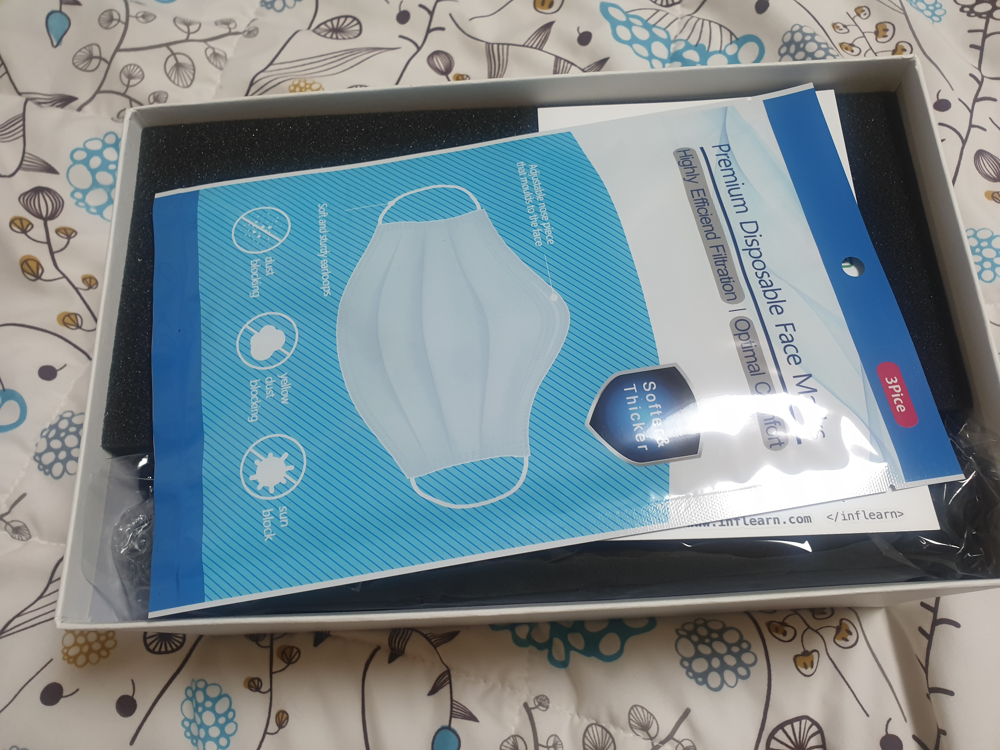
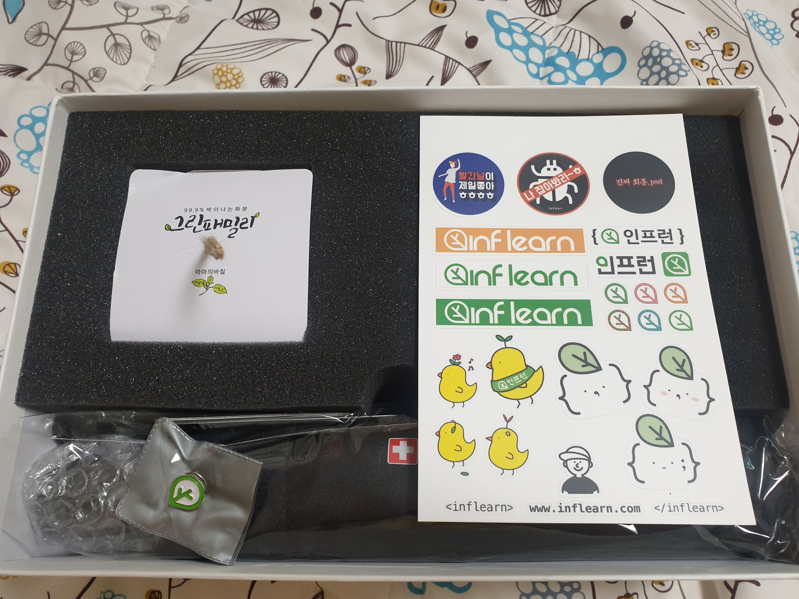
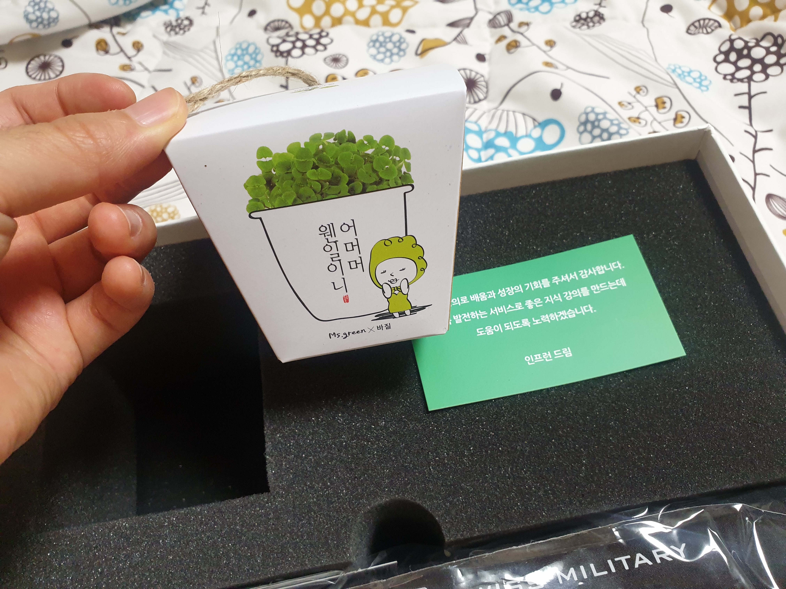

## 아니 강의를 올렸더니 선물을 준다고?
데이터리안은 여성 데이터 분석가들의 커뮤니티이면서 동시에 데이터 분석과 관련된 지식을 꾸준히 습득하고 공유하려고 노력하는 커뮤니티입니다.
그러한 활동의 일환으로 데이터리안은 2020년 1월부터 인프런이라는 플랫폼을 통해 분석과 깊은 연관성이 있는 [SQL강의와 추천시스템 강의 등](https://www.inflearn.com/instructors/42815/courses)을 배포하였는데요.
2020년 6월 16일 기준 563명의 소중한 수강생 분들을 만날 수 있게 해준 인프런(강의 플랫폼)에서 위와 같은 메일을 받았습니다.

저희는 개인 작업자가 아닌 팀이라서 모든 팀 멤버분들께 각각 하나씩 선물이 돌아갔으면 좋았겠지만, 그렇게 할 수는 없는 것 같아 제비뽑기를하고 제가 대표로 선물을 받게 되었습니다.
주소를 넘겨드리고 슬슬 선물의 존재가 잊혀질 때 즈음 인프런에서 보내주신 선물이 도착했습니다.

인프런의 초록색 로고가 박혀있는 의문의 하얀 박스.

과연 뭐가 들었을까요? 바로 언박싱에 돌입해보겠습니다.

가장 먼저 눈에 들어온 것은 마스크!

코로나 때문에 마스크가 꼭 필요한데 센스있게 가장 필요한 걸 보내주셨네요. 지식공유자들의 건강도 신경써주는 인프런, 선물 고르는 센스가 남다르네요.

그리고 마스크 뒤로도 뭐가 많이 있습니다. 가장 먼저 보이는 건 스티커. 인프런의 로고와 병아리, 새싹 캐릭터가 귀여운 스티커 한장이 들어있습니다.

왼쪽에 있는 네모난 건 뭘까요?

바로 손쉽게 키울 수 있는 바질 씨앗 키트입니다. 전혀 예상하지 못한 선물이지만 바질을 원래 너무 좋아하는 터라 기분이 정말 좋았습니다.

스티커를 치워보니 인프런의 로고가 세련되게 박힌 뱃지와 운영진의 감사 메세지가 보입니다.

그리고 마지막으로 선물 박스를 묵직하게 만들었던 장본인, 우산입니다.

플랫폼 입장에서 이렇게 개개인에게 감사 표시를 하는 게 쉬운일은 아닐 것 같은데 큰 선물은 아니더라도 마음이 따뜻해지는 것 같네요. 인프런이라는 플랫폼을 알게 된 덕분에 저희 팀도 새로운 도전을 하며 배움과 성장을 할 수 있었던 것 같습니다 :D 

지치고 어려울 때도 분명히 있었지만 그래도 함께 공부하고 나누며 좋은 강의들을 만들기 위해 노력해준 데이터리안 팀 멤버들에게 고맙습니다. 항상 좋은 리뷰와 질문 남겨주시고 저희가 기획한 의도보다 더 저희 컨텐츠를 통해 잘 배워나가시는 똑똑하고 성실한 모든 수강생분들도 항상 감사드립니다.

앞으로도 많은 분들께 좋은 지식 전달하기 위해서 노력하겠습니다!

이상 데이터리안 지식공유자 대표 인프런 선물 언박싱 후기였습니다.