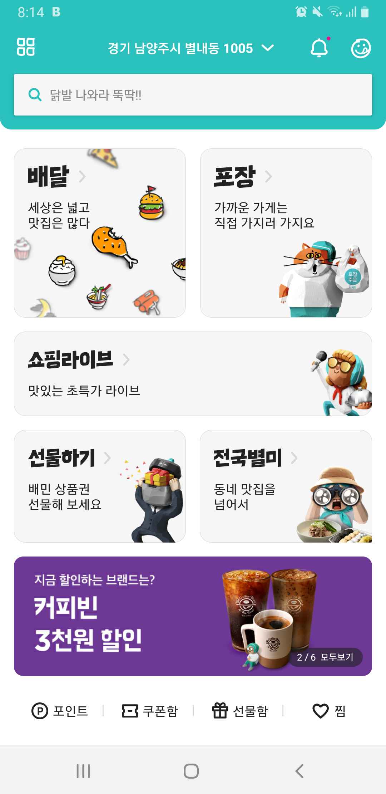
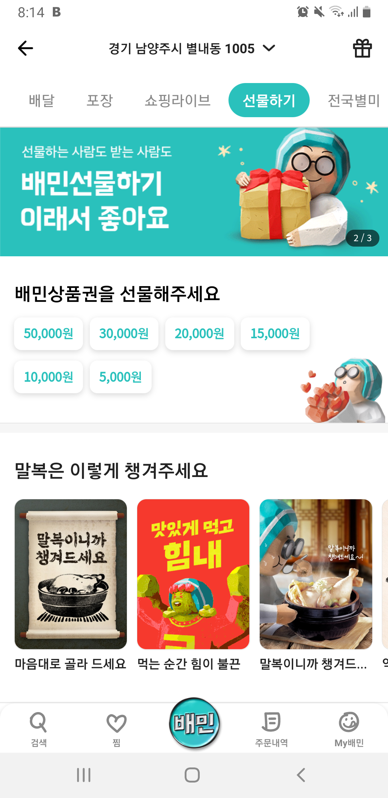
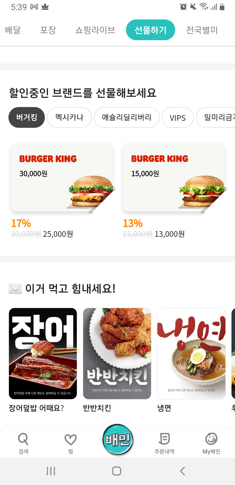
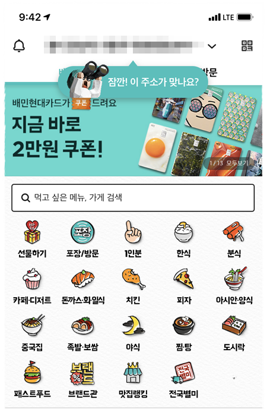

이전 글에서 기존에는 선물하기 기능을 제공하지 않던 이커머스 서비스들은 선물하기 기능을 앞다투어 도입하고 있다고 했었죠. 이번엔 배달의 민족 앱으로 가봅시다!  

.  

혹시 이전 글이 궁금하신 분들은 아래 링크를 통해 보러가시면 됩니다.  
[⬅️ '우리도 선물하기 서비스 할래요! _ 쿠팡' 보러가기](./gift_services_coupang)    

.  

## 배달의 민족

선물을 꼭 상품으로만 해야하는 것은 아니잖아요. 가끔은 용돈을 직접 전달하기도하고, 상품으로 선물을 하기보다 차라리 밥을 한끼 사고 싶을 때가 있기도 합니다.

데이터리안 멤버중에서는 셰어하우스를 운영하셨던 분이 계신데요. 관리하고 있던 셰어하우스 지점에 배달 시켜줄 생길 때가 종종 있었는데 그 때 배민의 상품권 서비스가 있었더라면, 직접 메뉴를 받아서 각 지점에 시켜주는 번거로운 일을 하지 않을 수도 있었겠다는 이야기를 해주시기도 했습니다.

카카오톡 선물하기에서도 가장 자주 선물하게 되는 것이 결국 스타벅스 기프티콘이고, 신흥 강자로 떠오르는 항목이 치킨이라는 점에서도 음식과 선물하기의 케미가 정말 잘 맞겠다는 생각이 드네요.
   

### 앱 둘러보기
배달의 민족에서는 앱 메인에서 바로 선물하기 진입구간을 만날 수 있습니다. 배달의 민족에서 전면으로 내세우고 있는 것은 **상품권**으로 보이네요. 선물하기 영역의 카피에도 상품권이 언급되어있고, 해당 영역을 클릭해서 들어갔을 때에도 가장 먼저 상품권 구매를 유도하는 영역이 눈에 띕니다.  
 
{: width="50%"}  
 
{: width="50%"}
 
쿠팡과 다르게 배달의 민족은 음식점 상세페이지에서는 선물하기 기능이 따로 들어가 있지는 않습니다. 음식 선물의 특성상 <u>선물하는 시간과 식사 시간이 항상 같을 수 없고, 선물 받는 사람의 입맛이나 그때그때의 취향을 맞춰 선물하는 것은 현실적으로 너무 어려운 일이기 때문</u>이겠죠. 단순하게 상품권을 통한 선물을 유도하는 것이 유저에게도 플랫폼 입장에서도 효율적인 방식일 것 같습니다.

하지만 어디서든 접근성이 좋은 주요 **프랜차이즈 브랜드의 상품권**들은 별도 영역을 통해 판매를 하고 있는데요. 카톡 선물하기에서 최다 판매를 차지하고 있는 스타벅스 상품권과 비슷한 맥락인 것 같습니다. 아무래도 이 부분은 **B2B 세일즈**와 관련된 영역일 것으로 추측 됩니다.  
 
{: width="50%"}
 
추가적으로 배민의 상품권 구성을 보다보니 왜 최대 가격이 5만원권일까 궁금해졌는데요. 지금은 코로나 때문에 회식을 하거나 친구들끼리 모여서 배달을 시켜먹는 일이 드물지도 모르겠지만, 사실 3명~4명만 모여서 배달을 시켜도 5만원은 가볍게 넘을 수 있다는 의견이 있었습니다. 쿠팡의 경우 최대 50만원 권까지 판매를 하고 있는 것에 비해서 굉장히 작은 금액처럼 느껴져서 어떤 데이터를 기준으로 해당 금액이 책정되었는지 궁금하네요.    
   

### 여러분의 서비스에도 선물하기 도입을 생각하고 계시나요?

배민에서도 같은 질문을 던져보겠습니다. 이번에는 배민과 같은 배달 서비스에서 어떤 데이터를 통해 기능 도입을 검토할 수 있을지를 생각해 볼텐데요. 만약 제가 배민의 분석가였다면, 아래 두가지 항목을 기준으로 데이터를 보았을 것 같아요.    
   
> 1. 디바이스의 위치와 전혀 다른 위치에 배달을 시키는 경우는 얼마나 되는지
> 2. 동일한 시간에 여러군데로 배달을 시키는 경우가 얼마나 되는지
> 3. 위의 유저들이 주문하는 금액이 총 매출에서 얼마나 차지하고 있는지

   
{: width="50%"}
   

먼저 배민을 사용하는 고객들 중 타인을 위해 주문을 하는 경우가 얼마나 있는지 확인을 해볼까요. 유저의 로그를 확인해서 **디바이스의 위치와 전혀 다른 위치에 배달을 시키는 경우**가 얼마나 되는지를 확인해볼 수 있을 것 같아요.

위 가설을 통해 데이터를 확인해보기 위해서는 <u>디바이스의 위치 정보</u>를 확인할 수 있어야 하고, 쿠팡처럼 받는 사람을 지정하는 것이 아니기 때문에 <u>어떤 경우에 타인에게 배달을 시켜준다라고 정의할지</u>를 고민을 해봐야하는데요.

예를 들면 서울에 살고 있는 누나가 김포에 살고 있는 동생에게 치킨을 시켜준다고 하면, 디바이스 위치는 서울이고 배달 위치는 김포로 찍힐 수가 있겠죠. 이런 경우에는 디바이스 주소와 배달 주소가 다르고 타인에게 전달하는 게 맞습니다.  

그런데 제가 만약 서울에서 의정부로 퇴근을 하면서 미리 배달을 시켜놓는다고 할 때에는 데이터로 볼 때는 비슷한 상황으로 집계될 수 있겠으나, 실제로는 타인을 위해 시킨 것은 아니라고 생각해야겠죠. 이 경우에는 추가로 해당 계정에서 의정부 주소로 <u>평소에 자주 배달이 되었는지</u> 여부를 파악하여 판단을 해볼 수 있을 것 같아요.

그 외에도 **동일한 시간에 여러 장소로 배달을 시키는 경우**에는 한 사람이 동시에 여러 군데에서 밥을 먹을 수는 없으니 타인을 위해 배달을 시켰다고 판단해볼 수도 있겠습니다.

위 두 가지 데이터를 통해 타인을 위해 배달을 시키는 유저들이 있다는 것을 확인했다면, 쿠팡에서 생각해봤던 것과 동일하게 **해당 유저들이 얼마나 매출에 기여를 하고 있는지**를 파악해보고 해당 기능을 도입하는 비지니스적인 이유를 제시할 수 있을 것 같습니다.  
   

### 해당 기능의 효용을 알기 위해서 어떤 지표를 측정해볼 수 있을까요?

선물하기 기능이 도입된 후 기대하는 효과들이 무엇이 있는지를 알아야 어떤 지표를 어떤 데이터로 볼 수 있을지 생각해볼 수 있을텐데요. 배민에서는 아래 항목들을 통해 기능이 잘 도입된 것인지를 확인할 수 있을 것 같아요.    
   
> 1. 휴면 유저의 재활성 효과
> 2. 상품권을 통한 신규유저 인입량
> 3. 상품권을 선물받은 고객들의 상품권 금액 소진 이후 추가 결제 유무
> 4. 상품권 구매자들의 상품권 재구매 유무

   
첫 번째, 한동안 배민 앱에서 배달을 시켜먹지 않았던 유저가 <u>상품권을 선물 받고 재활성유저가 될 수 있습니다.</u> 앱을 잘 사용하던 유저들이 휴면 유저가 되는 데에는 여러가지가 있을 테지만, 서비스 입장에서 휴면 유저는 정말 아까운 유저군입니다. 굳이 이 어플을 찾아서 다운로드 받고 가입까지 완료한 유저들이니까요. 심지어 번거롭게 결제 수단을 등록하고 주문에 결제까지 해본 유저들도 있을 겁니다. 이런 유저들을 다시 서비스로 불러와서 좋은 인상을 준다면 다시 고객들과 좋은 사이가 될 수도 있겠죠? 

이런 효과를 측정하기 위해서는 일정 기간동안 접속이 없었던 유저 중에서 상품권을 선물받은 이후에 돌아오는 비율을 확인하여 휴면 유저의 비율이 줄어드는지를 확인해보면 좋겠습니다.

두 번째, 상품권을 선물받은 유저가 배민을 사용하던 유저가 아니라면 <u>신규 가입을 유도할 수도 있겠죠.</u> 상품권을 통한 신규유저 인입량을 확인해본 후 선물을 받지 않고 신규 가입을 한 유저들과 이후 구매량, 금액의 차이를 파악해보면 해당 기능의 바이럴 효과를 측정할 수 있겠네요. 가입후 첫 구매가 선물받은 상품권을 통해 이뤄진다면, 해당 유저들은 배민에서 첫구매를 무료로 하는 것과 같은 경험을 하게되겠죠. 마켓 컬리에서 자주 사용하는 첫구매 990원 마케팅을 배민에서는 유저들이 직접 해주는 것 같은 느낌입니다.

이렇게 선물하기를 통해 신규 유저의 유입이 발생하고 있는지를 확인하기 위해서는 선물받은 유저의 신규 가입 유무를 트래킹을 할 수 있도록 추적 코드를 심거나, 트래킹이 여의치 않다면 신규 가입 후 바로 상품권을 등록하는 유저들의 수를 확인해보는 것이 좋을 것 같습니다. 

세 번째는 재활성 유저든, 기존에 있던 유저든, 신규로 가입을 한 유저든 <u>선물받은 상품권을 소진하는 것에서 그치지 않고 추가적인 결제가 일어나는 지</u>를 모니터링 해봐야 합니다. 추가 결제가 이루어지지 않고 이탈하는 유저들이 많다면 어떤 유저군에서 이탈이 많이 있는지를 확인한 후 추가적인 전략 구상이 필요할 것 같아요. 특히 신규 유저의 경우 아직 서비스에 대한 이해가 낮고, 충성도가 낮기 때문에 상품권 사용 후 추가 구매 유무를 반드시 확인해보는 게 좋을 것 같습니다.

지금까지는 주로 선물을 받은 유저들에 대한 효과 측정을 이야기 해보았는데요. 마지막으로는 구매자 쪽의 데이터도 한가지 눈여겨보면 좋을 것 같아요. <u>상품권을 한 번 구매한 사람들이 이후에도 계속해서 상품권을 선물하는지</u>를 확인해보면 상품권 구매자들의 만족도가 얼마나 높았는지도 간접적으로 측정 해볼 수 있겠습니다.   

.  
.  
.  

[➡️ '우리도 선물하기 서비스 할래요! _ 마무리'에서 이어집니다.](./gift_services_fin)  

.  
 # 이 글은 데이터리안 프로덕트 스터디 중 일부를 정리한 내용입니다.  

.  