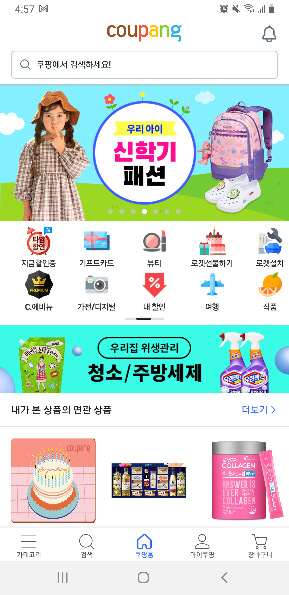
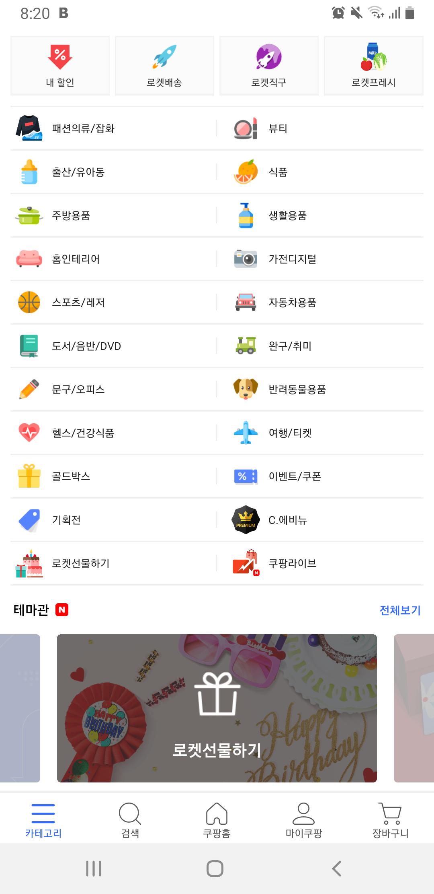
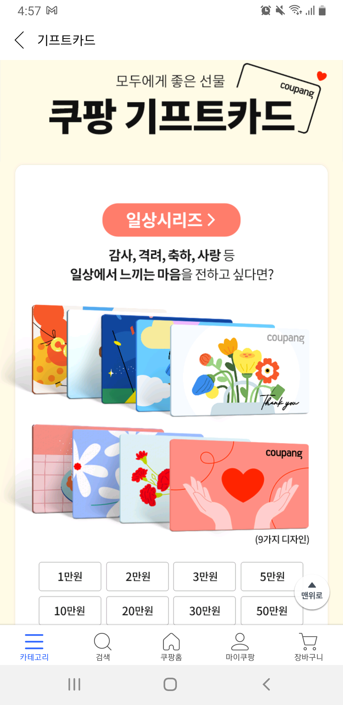
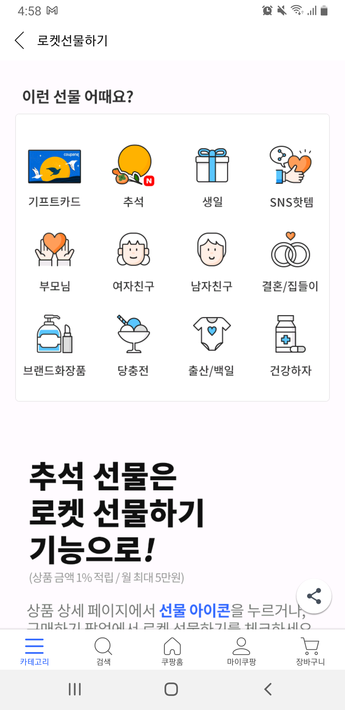
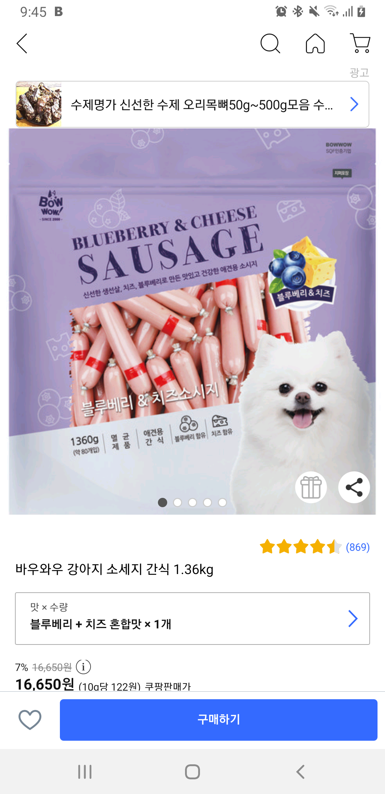
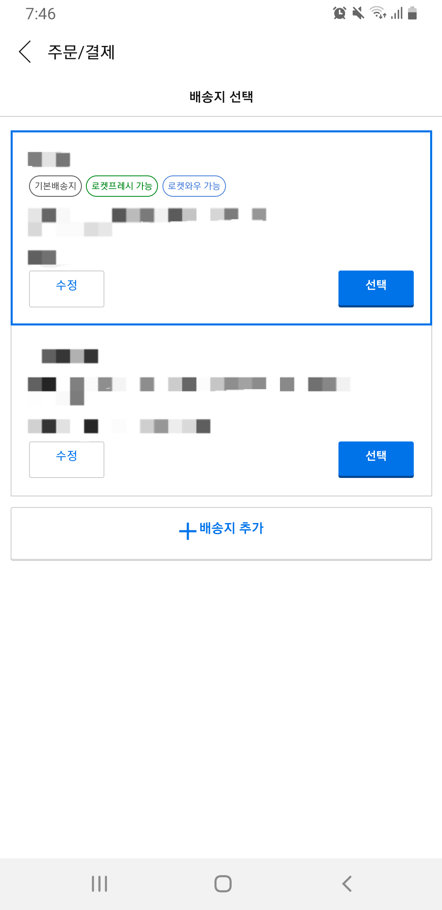

데이터리안 프로덕트 스터디에서 카카오톡 선물하기를 분석 해본 것이 엊그제 같은데요.(["내가 만약 카톡 선물하기의 분석가라면"](https://datarian-kr.github.io/blog/product-study/kakaotalk-gift) 참고) 그 사이 이커머스 산업군에서도 여러가지 변화들이 많이 있었습니다.

카카오톡 선물하기로 독보적인 영역의 1인자를 하고 있는 카카오는 이제 패션 플랫폼 지그재그를 인수하여 본격적인 패션 커머스 산업에 뛰어들었습니다. <u>기존에는 선물하기 기능을 제공하지 않던 이커머스 서비스들은 선물하기 기능을 앞다투어 도입</u>하는 모습들이 보입니다. 커머스 산업군 내 지각변동이 이곳저곳에서 활발하게 이루어 지는 느낌인데요. 이런 재미있는 현상을 그냥 보고만 있을 수는 없죠.  

이번 글에서는 **쿠팡(쿠팡이츠 X)과 배달의 민족에 도입된 선물하기 서비스**의 특징들을 기획적인 관점, 데이터 적인 관점에서 생각해보도록 하겠습니다. 쿠팡, 배민 둘 다 안드로이드 앱(2021년 8월) 기준 입니다.  
.  

## 쿠팡

간편하고 빠르게 생필품을 구매할 수 있는 커머스 서비스 중 하나인 쿠팡입니다. 다양하고 폭 넓은 카테고리의 상품들이 구비되어 있고 로켓 배송이라는 빠른 물류시스템을 갖추고 있는 점이 굉장한 강점인 서비스입니다. 쿠팡에서 새롭게 도입한 선물 관련 기능은 아래 두가지 기능인데요. 먼저 앱에서 해당 기능들이 어떻게 노출되어있는지 알아본 후 데이터 이야기를 조금 더 해보도록 하겠습니다.    
   

> 1. 쿠팡 내에서 사용할 수 있는 금액권을 선물할 수 있는 '기프트카드'.
> 2. 쿠팡 내에서 구매 가능한 물품 자체를 '선물' 할 수 있는 기능.    

   

### 앱 둘러보기

현재 안드로이드 버전 쿠팡 앱을 기준으로 메인화면 중앙에 있는 카테고리 영역에서 '기프트카드'와 '로켓선물하기'라는 영역을 노출하고 있습니다. 하단 네비게이션의 카테고리 탭을 눌러도 같은 카테고리들을 볼 수가 있네요. 화면 하단에는 선물하기 배너도 보입니다.  
 
{: width="50%"}
   
{: width="50%"}
 
'기프트카드' 영역과 '로켓선물하기' 영역을 클릭하여 진입하면 아래와 같은 화면을 볼 수가 있는데요. 추석 명절 시즌을 노려 추석 테마를 추가한 것이 눈에 띕니다.
   
{: width="50%"}
 
{: width="50%"}
 
메인은 살펴보았으니 다른 구간에서는 어떻게 노출이 되고 있는지 알아보겠습니다.  
유저들이 상품을 선택하여 상세페이지에 진입했을 경우 선물하기 기능을 한번 더 만날 수 있는데요. 상품 대표 이미지 우측 하단에 공유하기 버튼과 함께 선물하기 버튼이 노출되고 있습니다.
   
{: width="50%"}
   
메인페이지에서부터 선물하기 기능을 노출하는 것과 상품 페이지에서 선물하기 기능을 노출하는 것은 유저에게 접근하는 방식이 서로 다릅니다. 유저들의 구매 프로세스가 다르기 때문인데요. 첫 번째 시나리오는 유저가 <u>이미 선물을 해야할 사람이 있어서 뭘 선물을 해야할까 고민하고 있는 상태</u>일 때 입니다. 이 상태에서 앱을 켰다면 메인 페이지에 보이는 선물하기, 기프트카드 기능에 눈이 가겠죠? 두 번째 시나리오는 선물할 사람이 있지는 않은데 <u>쇼핑하다보니 이 물건을 선물해주면 좋을 것 같은 사람이 떠올랐을 때</u> 입니다. 이 상태의 유저가 앱을 보고 있다면 상품 상세 페이지에서 선물하기를 눌러보겠죠? 쿠팡은 두가지 케이스 모두 놓치고 싶지 않은 것으로 보이네요.  

특히 쿠팡의 현 상세 페이지에서는 구매 버튼 근처가 아니라 공유하기 버튼의 바로 옆에 선물하기 기능이 노출되고 있는데요. 쿠팡에서 선물하기를 구매보다는 상품 공유와 비슷한 레벨 또는 연관된 기능으로 보고 있다고 추측 해봅니다.    
   

### 여러분의 서비스에도 선물하기 도입을 생각하고 계시나요?

조금 더 데이터 중심으로 생각을 해보겠습니다. 쿠팡에서는 선물하기 기능을 도입하기 전에 과연 **어떤 데이터를 보고 기능을 만들어야겠다고 생각을 했을까요?**    
 
{: width="50%"}
 
실제 쿠팡을 자주 사용하는 데이터리안 구성원 중 한 명은 선물하기 기능이 도입되기 훨씬 전부터 가족들에게 생필품을 구매하여 보내주기 위해 본인의 계정에 가족들의 주소를 모두 등록해두었다는 이야기를 하기도 했는데요.  

만약 제가 쿠팡과 비슷한 커머스 서비스에서 선물하기 도입을 고려하고 있다면, 아래 두가지 항목을 기준으로 유저들의 니즈를 분석해볼 것 같습니다.    
 
> 1. 여러개의 서로 다른 주소(연락처와 받는사람이 모두 다른)가 등록되어 있는 계정의 비율
> 2. 서로 다른 주소를 등록하여 사용하는 유저들의 지출이 전체 매출에서 차지하는 비율  

 
위의 두 가지 데이터를 확인 했을때 **하나 이상의 주소에 상품 구매를 해서 전달하는 유저들이 많고 해당 유저들의 지출이 앱 전체 매출에서 차지하는 비율이 높다면,** 선물하기 기능을 도입할 근거가 될 수 있겠죠. <u>하지만 이 방법이 100% 유저들의 니즈를 반영한다고 하기는 어렵습니다.</u>     

위에서 언급했던 예시처럼 가족에게 생필품을 정기적으로 보내주는 것과 선물하기는 느낌이 많이 다릅니다. 또한 여러개의 사업장을 운영하고 있는 자영업자 분들의 경우에도 데이터로는 선물을 여기저기 하는 사람들과 비슷하게 보일 수 있습니다. 그러나 이러한 케이스는 사실 선물이라기보다는 여러군데 배송을 하는 것이기 때문에 선물하기 기능을 도입한다고 하더라도 해당 유저들이 선물하기 기능을 잘 사용하게 될지는 알 수 없습니다.    
   

### 해당 기능의 효용을 알기 위해서 어떤 지표를 측정해볼 수 있을까요?

그렇다면 기능을 본격적으로 런칭한 이후에는 어떤 지표들을 볼 수 있을까요?    

> 1. 메인페이지 노출 항목들 대비 '기프트카드', '로켓선물하기' 항목의 클릭율
> 2. 이전에는 한 번도 다른 주소로 배송을 시키지 않았던 고객들의 선물하기 서비스 사용 유무  

 
우선 <u>고객들이 정말로 쿠팡에서 출시된 선물하기 기능, 기프트카드 기능에 관심이 있는지</u> 확인해봐야겠죠. 앱 메인에서는 다른 카테고리 클릭율에 대비하여 '기프트카드', '로켓선물하기' 항목의  클릭율이 얼마나 높은지를 확인 해볼 수 있을 것 같습니다. 그리고 각 상품 페이지 상세에서는 공유하기 클릭율, 구매 전환율에 비해서 선물하기 버튼을 눌러보는 유저의 비율이 얼마나 되는지를 비교해볼 수도 있겠습니다.

또 기존에 없던 기능이 추가된 것이기 때문에 기능 출시를 통해 고객들로 하여금 <u>'쿠팡에서 선물을 할 수 있다'는 개념을 심어주었는지</u>가 궁금할 수도 있겠죠. 기능 출시 후 선물하기 기능을 사용하는 고객들 중에서 이전에는 한 번도 다른 주소로 배송을 시키지 않았던 고객들을 나누어서 그 숫자를 확인 해볼 수 있을 것 같아요. 이렇게 유저군을 나누어 확인을 해보면 기존에 본인의 상품만 구매하러 쿠팡에 들어왔던 유저들에게 선물하기 기능이 영향을 미쳤는가 하는 부분에 대해 근거가 될 수 있을 것 같습니다.  

.  
.  
.  

[➡️ '우리도 선물하기 서비스 할래요! _ 배달의 민족'에서 이어집니다.](./gift_services_baemin)  

.  
 # 이 글은 데이터리안 프로덕트 스터디 중 일부를 정리한 내용입니다.  

.  