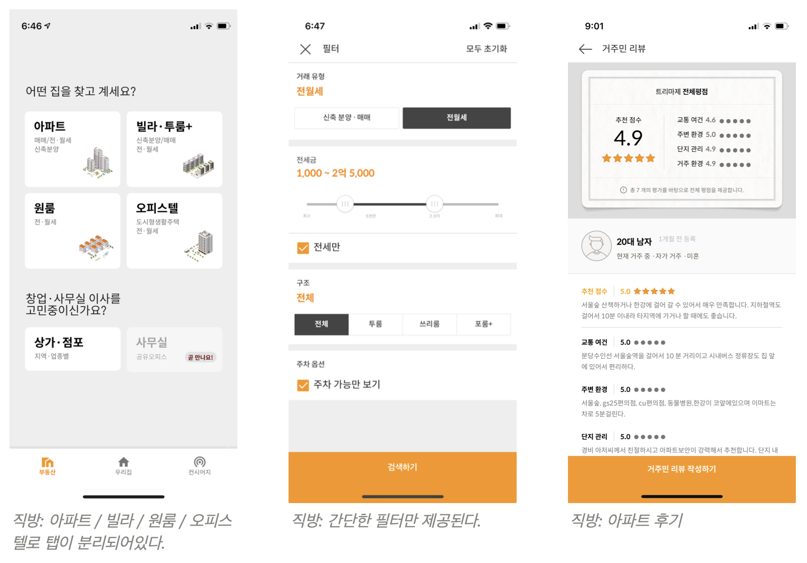
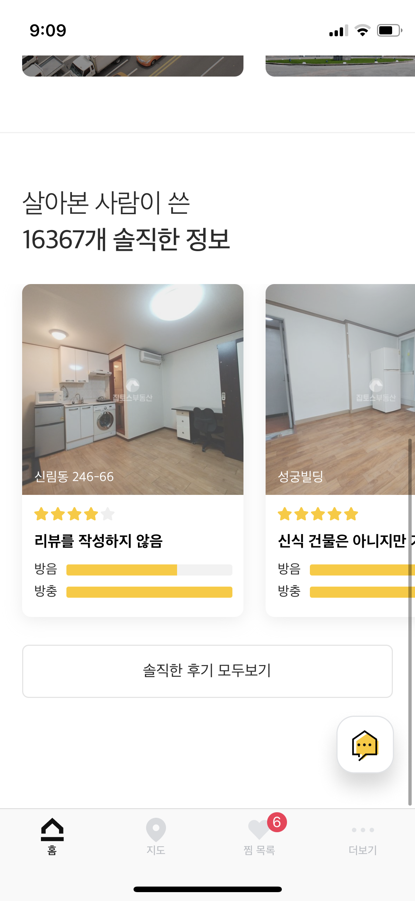
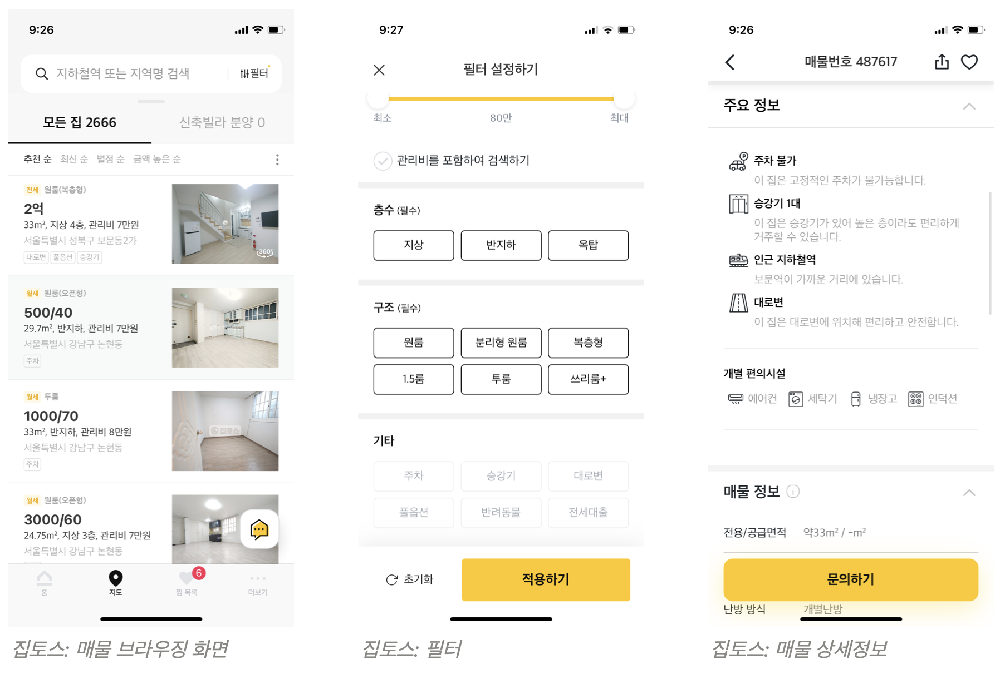
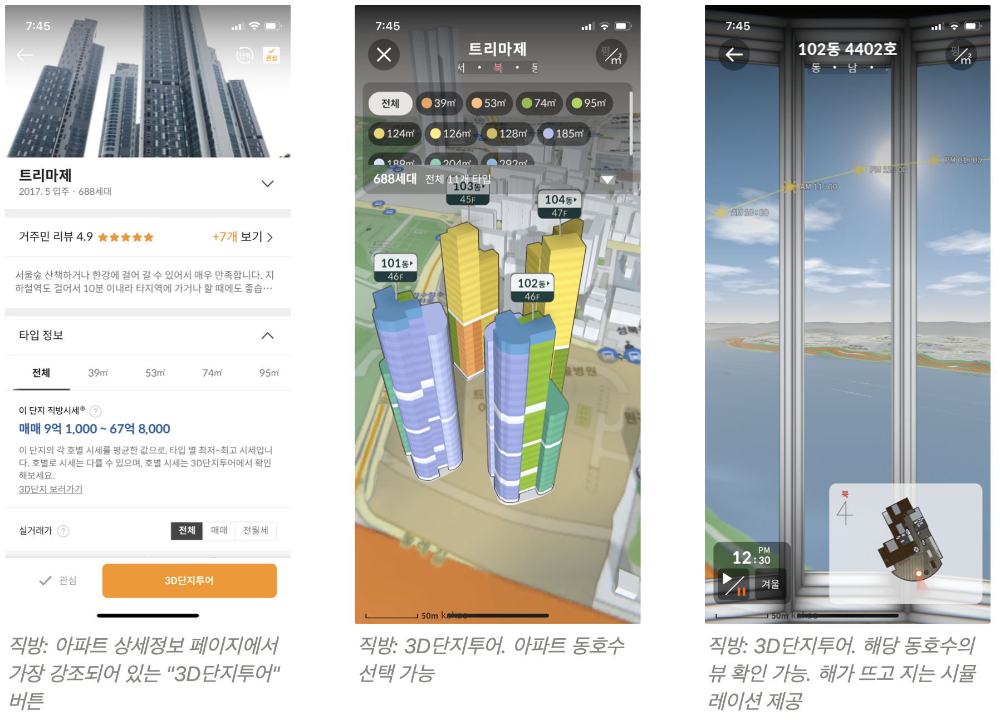

안녕하세요 데이터리안의 민주입니다.

요즘 플랫폼 비즈니스들이 핫한데요. 지그재그, 오늘의집 같이 큰 규모의 투자를 받은 곳들도 있고, 코로나19 상황과 맞물려 많은 활동을 온라인, 비대면으로 대체하게 되면서 많은 플랫폼 비즈니스가 주목을 받고 있습니다.

여러분은 집을 구할 때 어떤 서비스를 이용하시나요? 부동산에 방문해 매물을 보고 계약을 하는 게 전통적인 방식인데요. 부동산 시장에도 **직방, 다방, 네이버부동산, 집토스** 같은 서비스가 있어서 **직접 부동산에 방문하지 않고도** 어떤 지역의 시세가 얼마인지, 내가 원하는 조건의 매물이 있는지 확인해볼 수 있습니다.

데이터 분석가가 되기 전에, 저는 셰어하우스, 고시원 같은 공유주거 서비스를 운영했던 경험이 있는데요. 프롭테크 산업 내에 있는 서비스를 운영하면서 부동산 중개 서비스들에도 관심을 가지고 있었습니다. 최근 4년만에 이사를 하면서 이 서비스들이 제가 알던 모습이 더 이상 아니란 걸 알게 되었습니다. 각기 다른 방향으로 나아가고 있는 부동산 중개 서비스들에 대해 데이터리안 프로덕트 스터디에서 이야기한 내용을 정리해보았습니다.

## **프롭테크 산업이란?**
프롭테크... 어디서 들어는 봤는데 도대체 뭘까요?
> "프롭테크는 ‘부동산(property)’과 ‘기술(technology)’을 합성한 말로 정보기술(IT)을 활용해 다양한 서비스를 개발하는 산업을 말한다."

> "직방이나 다방으로 대표되는, B2C 중개·임대는 아주 기본적인 영역이고 이 외에 부동산 관리나 프로젝트 개발, 투자와 자금조달 관리 같은 모든 것이 프롭테크의 영역 안으로 포괄된다. 예컨대 부동산 중개 외에도 건축을 위한 돈을 빌리거나, 건물을 짓고 판매하는 시행, 인테리어, 집에 살 사람을 구하는 모든 과정 등에 프롭테크가 들어갈 자리가 있다. 이 때문에, 예상보다 많은 스타트업이 프롭테크를 사업 모델로 삼았다."

### **그렇다면 어떤 비즈니스가 프롭테크 비즈니스일까요?**

나름 프롭테크 비즈니스에 종사했음에도 어디까지가 프롭테크 기업인지 잘 모르겠어서 국내 프롭테크 기업 맵을 찾아보았습니다. 저는 오늘 저희가 다룰 직방, 다방, 네이버 부동산 같은 중개 서비스만 생각했는데요.

건물을 처음 지을 때부터 (시공사, 투자사) 분양, 임대하고 관리하는 임대관리업, 중개업, 직접 주거공간을 만들고 운영하는 우주 같은 셰어하우스 업체 뿐만 아니라, 가구, ioT 가전, 오늘의 집 같은 인테리어 관련 비즈니스, 그리고 위워크, 모두의 주차장 같은 비주거형 부동산 중개 / 관리에 이르기 까지 그 범위가 아주 넓고 다양했습니다. 

[국내 프롭테크 기업 맵](https://www.venturesquare.net/798877)

## **부동산 중개 서비스 사용 후기**

몇 년전부터 직방, 다방 같은 서비스가 TV광고를 하면서 많이 친숙해졌는데요. 저도 최근 2-3번 정도는 집을 구할 때 이런 서비스들을 이용했습니다. 최근, 4년 간 살던 전셋집을 나오게 되면서 아주 오랜만에 집을 구하게 되었는데요. 그 동안 제가 모르는 서비스들도 많이 생겨있고, 알고 있던 서비스들도 모습이 많이 바뀌었더라고요. 집을 구하는 동안 열심히 이 서비스들을 써보면서 느낀 점들을 공유하면서 시작해보겠습니다.

**저는 이번에 서울 내 전세금 2.5억 정도의 빌라, 오피스텔 위주로 알아봤습니다. 사용후기는 이 점을 참고해서 봐주세요.*

### 1. **직방**

집을 구하기로 하고 예산이나 지역도 정하기 전에 제일 먼저 켜봤던 건 직방 앱이었습니다.

직방이 아직까지 부동산 중개서비스의 대표주자로 생각되었는데요. 막상 켜보니까 4년전에 봤던 직방과 아주 다른 서비스가 되어있었습니다. **아파트 위주로 서비스 자체가 개편**이 되어있어서, 아파트 매매는 커녕 전세 월세도 어려운 제 입장에서는 효용이 없었습니다. 빌라나 다세대 주택등의 매물도 있기는 했지만, 다른 서비스들에 비해 불편했습니다.

**아파트 / 빌라 / 원룸 / 오피스텔 탭으로 나누어 매매 수요에 대응**하려는 것 같았습니다. 매매를 할 때는 주택 종류가 중요하겠지만, 세입자 입장에서는 주택 종류별로 나눠서 보기보다 어떤 동네인지, 금액대가 맞는지가 훨씬 중요한데 이렇게 나눠져 있으니, 똑같은 필터로 3번씩 검색해야하는 불편이 있었습니다. 필터도 **방 갯수, 주차가능여부, 금액** 정도 밖에 없고, 집을 구할 때는 **전세대출 가능여부, 주차가능 여부** 같은 꼭 필터링해서 봐야하는 중요한 조건들이 있는데, 이런 필터가 없으니까 하나하나 매물에 들어가서 확인해야했습니다. 이게 아니라도 이사날짜나 매물 상태 등 세부정보만 확인하기에도 바빴는데 말이죠. 대신 아파트 후기, 학군 정보 같은 정보를 추가하여 역시나 매매 수요에 대응하고 있는 것으로 보였습니다.

직방에서는 결국 지역의 시세 정도만 확인할 수 있었습니다. 

### 2. **다방**

직방에서 매물 찾기가 어려워서 그 다음으로 켠 게 다방이었습니다.

직방을 보다가 다방을 봤더니... 마치 11번가로 물건을 사다가 쿠팡으로 물건을 사본 느낌? 4년전에 집을 구했을 때 당시에는 UI, UX 모두 직방이 낫다고 느꼈는데요. 이번에는 다방이 훨씬 편했습니다.

직방의 투박한 필터로 매물을 보다가 다방의 필터를 써보니 속이 다 시원했는데요. **층수, 창문방향, 엘리베이터 유무, 전세자금대출 여부** 등 **주요 정보가 인포그래픽으로 제공**되어서 한눈에 잘 들어왔습니다.

예전에는 직방에 밀려 2인자 느낌이 강했는데 이제 직방이 완전 아파트 매매 타겟으로 가고나니 **다방이 훨씬 전월세 세입자 입장에서 최적화**되어 있는 것 같았습니다.

### 3. **네이버 부동산**

다방에서 매물을 찾다가 나와있는 금액대가 맞는 전세매물을 모두 본 다음 찾은 게 네이버 부동산이었습니다.

일단 네이버 부동산은 **매물이 정말 많습니다**. 모든 매물이 다 들어와있는 느낌. 하지만 동일 매물을 여러 중개사가 올리기 때문에 겹치는 것도 많고, 하나하나 정보의 퀄리티는 떨어지는 편입니다. 사진이 없는 것도 많고요. 

이커머스 비유를 이어가자면 네이버 부동산은 네이버 쇼핑이라고 할까요.

**필터가 가장 상세합니다**. 매물유형, 창문 방향도 다른 곳은 3-4가지인데 네이버 부동산은 10가지 정도로 세분화되어있습니다. 

네이버지도가 연동되니까 **로드뷰를 바로 볼 수 있다**는 점도 큰 장점이었습니다.

집을 구해보신 분들이라면 공감하시겠지만, 부동산에 가서 집을 구하는 과정에서 가장 허탈하고 현타오는 지점은, 괜찮은 내부에, 가격도 맞고, 이사시기도 맞고, 대출도 되고... 이 모든걸 다 확인하고 시간 잡아서 방문했는데 막상 가보니까 입구부터 '아 여기는 못살겠다' 싶을 때 일텐데요. 집을 구하다보면 '이렇게 다양한 종류의 집이 있구나' 새삼 실감하게 되고는 합니다.

이렇게 집을 구할 때는 집 내부 뿐 아니라 여러가지 주변상황도 중요한데, 대부분의 부동산 중개 서비스에 이런 정보는 없기 때문에 저는 방문 전 로드뷰를 꼭 따로 확인했습니다.

네이버 부동산에서는 **로드뷰도 볼 수 있고 역에서 거리도 잴 수 있고, 한번에 많은 걸 할 수 있습니다.** 기능이 많다보니 모바일보다는 PC 사용경험이 더 좋았고요.

사용하면서 제일 불편했던 점은 **오픈그래프가 세팅 안되어 있다**는 것이었습니다. 여러개의 서비스를 한꺼번에 사용해서 보다보니 카톡으로 공유해놓고 한번에 살펴보았는데, 오픈그래프 세팅이 없다보니 가격, 지역, 조건 등 매물특징을 직접 기록해야하는 번거로움이 컸습니다. 

### **4. 집토스**

여러분은 집토스에 대해서 들어보셨나요? 세입자에게 중개수수료를 받지 않는다고해서 유명세를 탔던 서비스입니다. 원룸일 때는 중개수수료가 크지 않은데, 구하는 집의 사이즈가 커지고 보증금이 커지니 중개수수료도 덩달아 커졌습니다. 중개수수료라도 아끼면 땡큐니까 **'중개수수료 0원'**이라던 집토스가 떠올라 찾아보았습니다. (현재는 0원은 아니고 시세보다는 저렴하게 받고 있었습니다.

살아본 집의 후기를 남길 수도 있는데, 이사를 준비할 때 들어가기 때문에 자연스럽게 후기를 남기게 되었습니다.  [집토스 거주후기 페이지](https://ziptoss.com/review)에 접속하시면 세입자들의 솔직한 후기를 볼 수 있습니다. 

직방, 다방처럼 매물이 올라와있고 찾고 찜하고 여기까지는 비슷합니다. 다른 점은 **집토스에 올라온 모든 매물은 집토스 직영부동산에서 관리한다**는 점입니다. 직방, 다방에 올라온 매물은 각각 다른 공인중개사가 올린 매물이고, 연락하면 각각의 부동산과 따로 약속을 잡아서 보게 되는데요. **집토스**의 경우에는 마음에 드는 매물을 찜하고, 원하는 집에 대한 설명을 작성해 신청하면 **담당매니저가 배정되고 직접 매물을 소개해줍니다**. 

집토스에 신청해 투어도 여러번 했는데 **중개사 분이 정말 친절했습니다**. 집 구할 때 생기는 대부분의 스트레스가 중개소의 불친절함과 관련이 있는데 세상 친절하고, 잘해주셔서 여기서 집을 결국 못구해서 미안한 마음이 들 정도였습니다.

앱도 다방과 비슷한 인터페이스에 사용하기도 편했습니다. 집토스는 실제 주소까지 노출해주기 때문에 방문 전 어떤 곳인지 미리 확인해볼 수 있었습니다.

직접 관리하니까 **허위매물이 없다**는 게 장점이고, 단점은 **매물이 적습니다**. 아무래도 집토스 직영 부동산(다래부동산)에서 취급하는 물건만 올라오다보니 네이버 부동산이나 다방 보다는 적을 수 밖에 없었습니다. 

## **부동산 중개 서비스 비교**

이제 제가 집을 구하면서 봤던 중개 서비스들의 **비즈니스 모델**과 어떤 **지표**를 볼 수 있는지 살펴볼게요.

**세입자와 부동산 중개사 (집주인) 쌍방을 고객으로 하는 양면 플랫폼**이라는 점은 모든 서비스의 공통점이었습니다. 집을 구하는 입장에서 사용했을 때는 비슷한 서비스 같아보였는데, **직접 들여다보니 비즈니스 모델이 완전히 달랐습니다.** 분석가 입장에서 보아야하는 지표도 아주 다를 것 같았고요.

### 비즈니스 모델과 타겟유저

 *직방, 다방, 네이버 부동산, 집토스의 비즈니스 모델과 타겟 유저* 

### 수익모델과 주요 지표

**직방**과 **다방**은 중개사가 매물을 올릴 때 내는 **광고 수익이 주요 수익원**입니다. **앱 자체가 커다란 광고판인 셈입니다.** 어떤식으로 광고 수익을 지불하는지 알아보니 매물을 하나라도 올리려면 월 결제를 해야하기 때문에 가지고 있는 매물 중 일부만 선별적으로 올리게 되고 상대적으로 허위매물이 발생할 가능성도 높아 보였습니다. 

**직방, 다방**은 광고 수익이 전부이기 때문에 **실제로 거래가 성사되었는지 여부는 핵심지표가 아니었습니다.** 광고수익을 늘리기 위해서는 많은 사용자를 끌어모으고, 그 사용자 수가 플랫폼 파워가 되어 중개사들이 플랫폼 내에서 광고를 하도록 끌어들이는 구조이므로 **유저 트래픽 자체가 중요한 지표가 될 것 같습니다.**

**네이버 부동산**의 경우 기존에는 직방, 다방과 동일한 수익모델로 운영해오다가 2014년 이후 부동산119 등의 다른 플랫폼에서 매물 정보를 수급받는 형태로 바뀌면서 네이버 **부동산 서비스 자체로는 수익을 내고 있지 않다**고 합니다. 현재는 **트래픽 유치**가 목적인 것으로 보입니다.

**집토스**의 경우 유일하게 **거래가 성사되었을 때의 중개수수료**가 수익원입니다. 4개의 중개 서비스 중 **거래 성사 여부가 주요 지표**인 유일한 서비스입니다.

### 수익모델 다각화

직방과 다방의 **광고비 과금**에 대해서는 논란이 있는데요. 배민에서 비슷한 논란이 있었던 것처럼, 플랫폼이 시장 지배력을 가지게 되면서 자영업자들이 광고비가 올라도 울며 겨자먹기로 광고를 할 수 밖에 없다는 얘기가 나오고 있습니다. 이것 때문인지는 몰라도 직방과 다방 모두 **수익모델 다각화**를 진행하고 있는 것으로 보입니다.

수익모델을 다각화 하는 방향은 두 서비스가 다른데요. 우선 직방은 호갱노노부터 시작해 셰어하우스 우주, 네모(비주거용 부동산 전문 플랫폼) 인수합병을 하면서 사업 분야를 다각화하고 있습니다. 

특히 아파트 실거래가 정보를 가지고 있는 호갱노노와 합병하고나서 아파트 쪽으로 완전히 타겟을 가져가는 것으로 보입니다. 현재 직방 앱 첫 화면에 노출된 서비스를 보면 모두 아파트 중심의 서비스입니다. **부동산 /** **우리집 / 컨시어지** 3개의 탭이 있는데 이 중 **우리집**은 유저가 살고 있는 아파트 관리사무소 공지사항, 고지서 내역 등을 확인할 수 있는 서비스이고, **컨시어지는** 아파트 커뮤니티 서비스입니다. 

그리고 **아파트에 한해 온라인 투어가 가능한 시스템(3D단지투어)를 구축**했는데요. 아파트, 특히 매매의 경우에는 자산의 성격이 더 크기 때문에 직접 가보지 않고도 계약하는 경우가 많다고 알고 있는데, 이것만 봐도 아파트에 집중하려고 하는 것으로 보입니다. 동호수 별로 해가 뜨고 지는 것, 창밖뷰 시뮬레이션까지 모두 구현되어 있습니다.

**다방**의 경우에는 부동산 중개사들이 온라인으로 계약 관리 등을 할 수 있는 **다방 프로,** 집주인들이 방 정보를 등록해놓고 월세관리, 공실관리를 할 수 있게 해주는 임대관리 서비스인 **다방허브** 등의 B2B 서비스를 통해 수익모델의 다각화를 꿰하고 있습니다.

## 집토스 서비스 퍼널과 양면 플랫폼 비즈니스

### 집토스 서비스 퍼널 살펴보기

다른 서비스들에 비해 집토스는 **"계약 성사"**라는 비교적 명확한 목표가 있었는데요. 

**매물 검색 > 마음에 드는 매물을 찜하기 > 매물 문의하기 > (오프라인)집토스 중개사와 연락 > 직접 방문(투어) > 계약 성사**

계약 성사까지 이어지는 서비스 퍼널은 위와 같이 나올 것 같습니다. 찜하기를 몇 번 하고나서 문의로 이어지는지, 혹은 방문 몇 번만에 계약이 성사되는지를 보면서 각 단계의 전환율을 개선할 수 있을 것 같습니다.

계약 성사의 경우에는 전환율 개선이 좀 더 복잡할 것 같았는데요. 집이란 1:1 거래의 성격이 크기 때문에 단순히 퀄리티 컨트롤의 문제로 보기보다는 고객이 원하는 매물을 집토스에서 가지고 있지 않았다거나, 고객의 사정에 의해 달라지는 부분이 많을 것 같아서 보다 많은 변수가 고려되어야 할 것 같습니다.

### 집토스 서비스 퍼널에 부쳐

집토스의 서비스 퍼널을 그려보자 제가 운영했던 공유주거 서비스들과 퍼널이 아주 비슷하다는 걸 깨달았습니다. 거기에서도 고객이 **검색 > 투어 신청 > 투어일정 정하기 > 투어 > 계약 성사** 로 이어지는 퍼널이었는데요.

그 퍼널중에 가장 전환이 어려움을 겪었던 부분이 바로, **투어에서 계약으로 넘어가는 단계**였습니다. 그 단계에서 **시간과 노동이 가장 많이 들기 때문에** 계약전환이 되지 않으면 리소스 낭비가 아주 컸습니다. 이런 문제를 줄이기 위해 투어 오기 전 미리 전화통화를 하며 이런 단점이 있다고 자세히 안내해서 기대치를 조정하거나, 투어를 동시에 진행해서 리소스를 줄이는 등 여러가지 방법을 시도해본 기억이 있습니다.

한번은 KPI 차원에서 계약 전환율을 관리해야했던 적이 있었습니다. 계약으로 연결된 투어와 연결되지 않은 투어의 차이점이 있었는지 확인해봤는데, 사실상 차이가 없었습니다.

**집을 계약한다는 건** 소비재 구매와 달리 **시기와 개인의 조건과 상황이 모두 반영되어야하는 아주 까다로운 일**인데요. 이런 시장의 특성상, 당장 살 곳이 필요해서 집을 구하려고 마음 먹고 오는 사람은 큰 설명이나 할인 없이도 계약을 하고, '그냥 한번 봐야지' 하고 오는 사람은 아무리 할인을 많이 해준다 한들 계약으로 넘어가기가 무척 어려웠습니다.

집토스의 경우에도 서비스 퍼널 내 이탈률을 확인할 때 계약까지 넘어오지 않은 사람들이 있다고 해서 무조건 투어과정, 혹은 서비스 품질의 문제로 보기는 힘들기 때문에 고객이 정작 급하지 않았다든지, 앞서 언급한 매물 숫자가 적기 때문에 일어나는 문제라든지, 여러가지 이유가 있을 수 있기 때문입니다. 이런 다양한 변수들을 어떻게 통제하고 전환율을 측정할지는 고민이 필요한 지점일 것 같습니다.

### 양면 플랫폼 비즈니스

부동산 중개 서비스들의 각기 다른 비즈니스 모델을 살펴보니, **채용플랫폼**과도 비슷하다는 인상을 받았는데요. 채용플랫폼도 부동산 중개 서비스와 마찬가지로 구직자와 기업을 이어주는 양면 플랫폼이기도 합니다.

직방, 다방처럼 광고가 주요 수익모델인 **알바몬, 인크루트** 같은 서비스가 있고, 집토스처럼 거래가 성사되었을 때 받는 수수료가 주요 수익원인 **원티드**가 있습니다. 

판매자와 구매자를 이어주는 이커머스 서비스들도 광고판처럼 기능하는 경우도 있고 거래가 성사된 경우 수수료를 받기도 합니다. 이렇게 보면 **광고 기반 수익모델**과 **수수료 기반 수익모델**로 나뉘는 건 양면 플랫폼 비즈니스의 특징이라고도 볼 수 있을 것 같습니다.

 
 
 # 이 글은 데이터리안 프로덕트 스터디 중 일부를 정리한 내용입니다.  

## 참고 자료

[프롭테크가 뭔가요?](https://byline.network/2019/04/5-35/) 
[코로나에 주목받는 프롭테크 기업들, "깜짝 실적에 사업확장 속도"](https://biz.chosun.com/site/data/html_dir/2020/11/17/2020111702681.html) 
[[Startup’s Story #377] ‘복비 제로’ 원룸 중개 서비스는 성공할 수 있을까?](https://platum.kr/archives/91283) 
[좋은 집 구하는 기술, 직방: 원룸 배너 상품 소개](https://www.zigbang.com/agent/product/oneroom) 
[[머니S리포트] 직방, 공짜로 유인 후 광고비 폭리… "꼼짝없이 냈다"](https://moneys.mt.co.kr/news/mwView.php?no=2020061109438063824) 
[직방 광고비 3배 인상? "부동산 중개업자 오해"](https://www.consumuch.com/news/articleView.html?idxno=43327) 
[집 구하기 플랫폼이 흔들린다](https://brunch.co.kr/@andysik/61) 
[원룸으로 큰 다방이 B2B 시장에 나서는 이유](https://byline.network/2020/07/10-116/) 