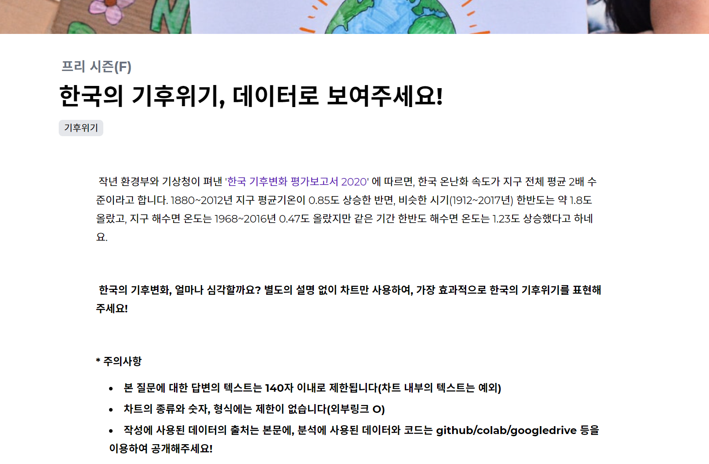
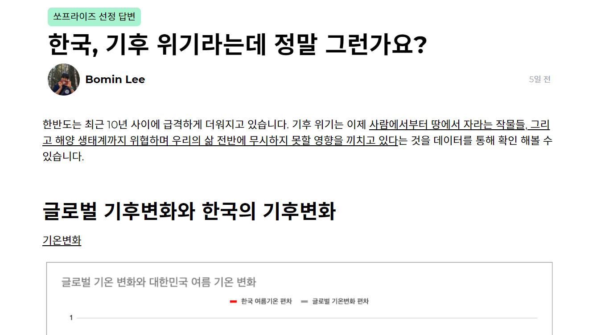

안녕하세요 데이터리안의 봄입니다.  
오늘은 데이터로 글을 쓰고 제대로 보상받는 재미있는 플랫폼 쏘프라이즈에 참여한 후기를 공유하러 왔어요. 이 글을 읽으시는 분중에 쏘프라이즈가 뭔지 잘 모르시는 분들도 많을 것 같아요.  

   

## 쏘프라이즈란?  

쏘프라이즈에 대해 설명하기 전에 우선 이것부터 생각을 해볼까요?  
데이터와 글쓰기 하면 어떤 것들이 떠오르시나요? 데이터를 통해서 우리는 얼마나 많은 이야기를 나눌 수 있을까요?  
 

> - '문자폭탄'은 정당의 의사결정에 어떻게, 얼마나 영향을 미칠까요?
> - 남녀공학, 정말 성적에 안좋은 영향을 줄까요?
> - 점점 빨라지는 고령화, 우리나라의 요양병원 공급은 충분할까요?
> - 지역별 '채식 친화도' 지수를 만들어볼 수 있을까요?
> - 국회의원의 입법 활동을 평가하는 방법, 데이터로 찾을 수 있을까요?
> - 봄철 꽃가루 알레르기 환자들이 피해야할 동네는 어디일까요?

 

한 번도 생각해보지 못한 질문도 있고, 평소에 궁금했던 질문들도 있는 것 같아요. 쏘프라이즈에서는 이러한 질문들에 대해 데이터로 답할 수 있는 사람들을 찾고 있어요. 쏘프라이즈는 유의미한 질문을 나누고, 데이터를 이용해 글 쓰는 사람들이 늘어나는데 기여하며, 좋은 결과물을 제대로 보상하는 시스템을 만들고 싶은 플랫폼이라고 합니다.  
 
쏘프라이즈에서 질문들을 보기 전까지는 이런 질문까지 데이터를 통해서 바라볼 생각을 해본 적이 없었었는데, 데이터를 이용하면 환경, 정치, 교육, 경제 거의 모든 분야에 대해 얘기를 할 수 있더라구요. 데이터로 글을 쓰고 그 결과물로 보상을 받을 수 있다니 접근 방식이 굉장히 신선하다고 생각했어요. 게다가 질문들도 너무 재미있잖아요! 해보지 않을 이유가 없죠.   

   

## 기후 위기 시각화 챌린지, 미니 해커톤!  

주말에 하루 날을 잡아서 데이터리안의 S님과 함께 미니 해커톤을 열어 호다닥 기획을 하고 답변을 작성하여 제출까지 완료 해보았답니다. 저희가 참여한 주제는 "[한국의 기후위기, 데이터로 보여주세요!](https://soprize.so/question/28)" 였습니다.  
 

 
이 주제는 글자수가 140자로 제한이 있어 시각화를 통해 메세지를 잘 전달 해야만하는 토픽이었는데요. 저희는 반나절 안에 아이디에이션부터 시각화까지 마무리하는 것을 목표로 했기 때문에 현상에 대해 깊게 파고들어 다각적인 인사이트를 고민해봐야 하는 다른 주제들보다는 시각화에 집중하는 이 주제를 선정하게 되었습니다.  

   

## 데이터를 통한 스토리텔링, 그리고 시각화  

주제가 정해진 후에는 어떤 방향으로 스토리텔링을 해야 할지, 어떤 데이터를 찾아야 할지를 명확하게 하는 시간을 가졌고, 그 뒤로는 계속해서 데이터 리서치를 진행했어요.   
 
저희가 데이터를 찾고, 시각화 하면서 집중했던 것은 세 가지였습니다.  
> 1. 한국의 기후 변화가 어떻게 진행됐는지를 보여줄 명확한 지표들을 찾는다.
> 2. 읽는 이로 하여금 한국의 기후 변화를 실질적으로 체감할 수 있는 데이터를 찾는다.
> 3. 하나의 차트에는 하나의 메세지만 담는다.  

 

1번과 2번은 데이터를 찾을 때 고민을 했던 지점이에요. 먼저 한국의 여름 기온변화, 해수면 높이 변화, 수온 변화 데이터를 통해 <u>전체적인 추세가 어떤지 한 눈에 확인할 수 있었으면 좋겠다</u>고 생각했습니다.  
 
그리고 폭염일수, 열대야일수, 온열질환자 발생 현황, 온대성 어종/한대성 어종의 어획량 증감 등을 통해 그것이 <u>얼마나 심각한 일인지 피부로 느낄 수 있었으면 좋겠다</u>고 생각했어요. 단순하게 한국의 여름 기온이 10년 전에 비해 1도 높아졌다, 0.8도가 높아졌다고만 하면, 실질적으로 그것이 내 삶에 어떤 문제로 돌아올 수 있을지 잘 감이 안오니까요.  
 
3번은 시각화를 하며 집중했던 부분입니다. 이 챌린지는 글자수 제한이 있다고 말씀드렸죠. 차트에 대한 부연설명을 구구절절 할 수가 없었어요. 때문에 <u>독자들이 차트의 의미를 한눈에 알 수 없으면 데이터를 전달하는 데 실패할 것</u>이라고 생각했어요. 최대한 하나의 차트에서는 하나의 메세지만 전달될 수 있게끔 차트를 구성하였습니다.  
 
아, 그리고 저희는 해커톤처럼 빠르게 결과물을 만들어내는 것을 목표로 했기 때문에 모든 시각화는 구글 스프레드시트를 통해 만들었어요.  

 
[한국, 기후 위기라는데 정말 그런가요?](https://soprize.so/answer/247)

 

데이터를 찾다보니 생각보다 더 많은 사람이 기후 변화를 계속 모니터링하며 기후 위기에 대처할 방법들에 대해 계속 고민하고 있다는 것을 알게 되었습니다.  
 
이번 여름은 과연 얼마나 더워질까요. 더위 때문에 밤을 지새우는 날이 너무 많지는 않았으면 좋겠습니다. 함께 참여한 S님의 후기를 마지막으로 쏘프라이즈 참여 후기를 마치겠습니다.  

   

> "주말에 해커톤 형식으로 봄님과 함께 진행했었는데, 답변 선정도 되고 상금까지 받아서 기쁘고 뿌듯합니다. 앞으로도 시간이 된다면 종종 참여해보고 싶네요. 내용 정리해주시고 블로그에 글까지 남겨주신 봄님, 감사드려요! 쏘프라이즈를 운영하고 계신 데이터카우 팀에게도 감사드리고, 많은 분들이 데이터를 통해 다양한 생각을 나눌 수 있기를 바라겠습니다 :)"   
>  
> ㅡ 데이터리안 기획자 S  

   

