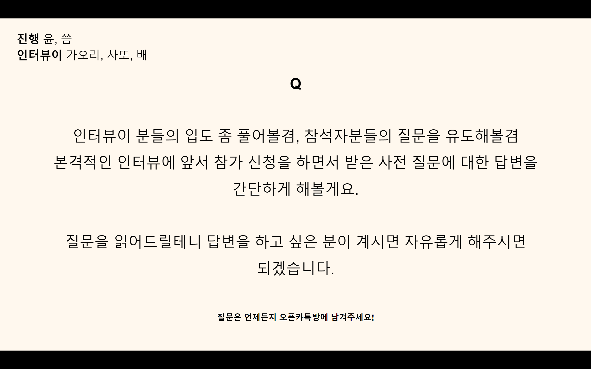
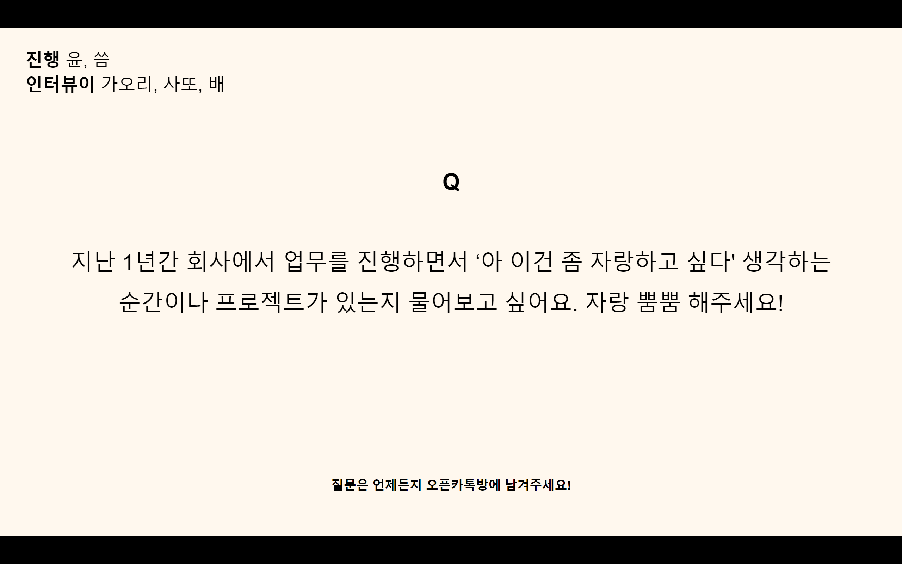
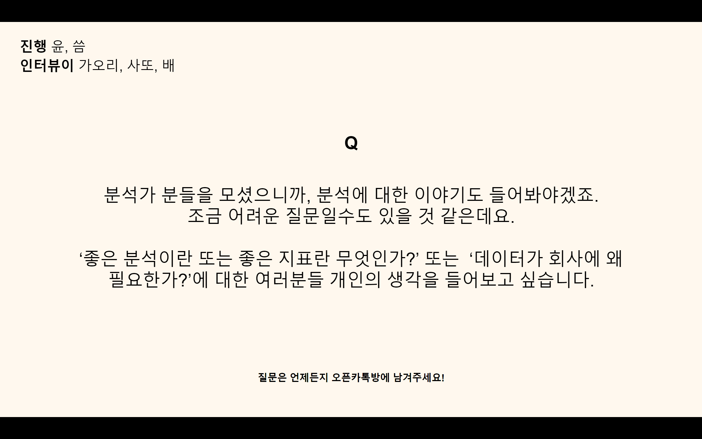

✨ 코로나로 다사다난 했던 2020년, 주니어 분석가들은 어떤 일들을 하면서 한 해를 보내고 있었을까요? 각자의 공간에서 반짝반짝 빛나는 성과들을 만들어가며 커리어를 개척해 나가는 분석가들의 이야기를 들어보아요!  

.    
{: width="100%"}  

{: width="15%"}
네, 잘 들었습니다. 1부 시간이 진짜 잘 가네요.  
뒤에 남은 질문들이 많긴 하지만 이 질문을 안 드릴 수가 없어서 이 질문 하나만 하고 이 섹션을 빠르게 넘어가면 좋을 것 같은데요.  
.  
참가자분께서 사전 질문으로 남겨주신 사연이에요.  

"안녕하세요, 입사한지 100일하고 20일이 막 지난 삐약이 데이터 분석가입니다. 계약직으로 회사에 입사했더니 데이터 추출만 시키네요. 1년 뒤면 쿼리 머신이 되어버릴 듯 합니다. 그런데 회사 입장에서 가성비 측면으로 생각했을 때는 앞으로 1년간 업무에서 큰 변화가 없을 것 같아요. 이런 상황에서 여러분들이라면 어떻게 하실 것 같나요?"  

혹시 대답해주실 분 계신가요? 데이터 추출만 하고 있대요.  

{: width="15%"}
배님이 저번에 저희 한테 해주셨던 얘기가 이 사연이랑 연결이 될 수 있을 것 같은데요. 그.. 제대로 된 분석을 하고 싶으셔서 직접 요청을 하셨었다고 했던 얘기요.  

{: width="15%"}
아, 네. 안그래도 행사 전에 그 질문을 읽어봤는데요. 마지막에 "이 한줄을 어떻게 경력으로 살릴 수 있는지?" 그런 내용이 있었던 것 같은데 맞나요?  

{: width="15%"}
네, 맞아요.  

{: width="15%"} 
일단 제 경우에는 약간 다르기도 하고 비슷하기도 합니다. 저는 회사에서 정말 이것저것 다 해요. 쿼리도 짜고, 분석도 하고, 트래킹 코드 설계도 하고. 기획자이면서 분석가이면서 뭔가 하고 있는게 너무 잡다하게 많거든요.  
.  
요즘 드는 생각은 내가 SQL을 할 수는 있지만 잘한다고 생각은 하지 않고, 내가 코딩을 할 수는 있지만 엄청나게 뛰어나다고 생각이 들지는 않는데요. 이런 상황에서 주위를 둘러봤을 때 하나의 업무 또는 역할로 오래 제대로 하시는 분들이 되게 부럽게 느껴지더라고요.  
.  
제 주위에 있는 분을 예로 말씀드리면, 그분도 분석가로 회사에 입사하셨는데 지금은 거의 데이터 엔지니어 포지션의 업무를 하고 계세요. SQL로 쿼리를 짜서 데이터를 적재하는 일을 하시는데요. 사실 그분도 분석가가 되고 싶어서 들어오긴 했지만, 데이터를 적재하고 SQL 코드를 짜고 그 업무들을 하면서 자기도 모르는 사이에 역량이 엄청 늘어났거든요.  
.  
가끔 그분의 코드를 보는데 이렇게도 코드를 짤 수 있구나 하는 생각이 들기도 해요. 그래서 지금 당장에는 질문주신분도 데이터 분석을 하고 싶은데 쿼리를 너무 많이 짜서 고민이 된다고 하셨지만 그게 나중에는 확실한 강점이 될 것 같거든요. 어딘가에 이력서를 넣을 때도 내가 이거 하나만큼은 제대로 할 줄 안다는 것, 경험이 많이 있다는 것이 어떻게 보면 회사에서 더 뽑고싶은 사람이 되는 것일 수도 있기 때문에 저는 이 경험에 플러스로 분석까지 제대로 하고 싶다라고 하면 그 매력이 더 커질 것 같아요.  
.  
그래서 저는 굉장히 나쁘지 않은 상황이고, 어떻게 보면 더 스페셜리스트가 될 수 있는 상황이지 않을까 하는 생각도 드는 것 같아요.  

{: width="15%"}
네, 일종의 발상의 전환이네요. 기왕 쿼리 머신이 된 김에 제대로 된 머신이 되어봐라.  

{: width="15%"}
네, 장난아니게 쿼리에 대해서 파본다던지..  

{: width="15%"}
그럼 시간관계상 이 질문에 대한 답은 이정도로 하는 걸로 하고요.  

혹시 나는 이 질문에 대해 답을 해보고 싶었다하는 게 있거나 채팅창에 올라오는 질문 중에 답을 하고 싶은게 있다하면 중간에 끼어 들어주시면 되겠습니다. 아니면 어디에 잘 적어놨다가 나중에 시간을 드릴테니 그 때 대답하셔도 좋을 것 같아요.  

.  
{: width="100%"}
{: width="15%"}
그럼 한페이지 넘어가서, 다들 주니어이시고 지난 1년 정도 회사에서 업무를 진행해보셨잖아요? 업무를 진행하면서 나는 이건 좀 자랑 할 수 있을 것 같다 자랑하고 싶다 하는 프로젝트가 있는지 물어보고 싶어요.  
.  
이 질문에 답을 들으면 각자 얼마나 다른 업무를 진행하고 있는지, 내가 잘하는 것, 이 사람이 잘하는 것은 무엇인지 이런 것들을 표현해 볼 수 있을 것 같아서 이 질문을 넣어보았습니다. 혹시 대답해주실 분 계실까요? '나는 이런거 좀 기깔나게 한 것 같다' 이런거?  

{: width="15%"}
사또님이 대답하신지 좀 오래되신 것 같은데  

{: width="15%"}
사또님 한번 대답해주세요.  

{: width="15%"}
음.. 잘했다라고 할게 🤣 사실 제가 처음부터 끝까지 설계하고 진행한 프로젝트는 아직 런칭된지 얼마 안되어서 최적화를 진행하고 있는 단계고 그래서 엄청난 지표 상승이나 그런 결과를 자랑할 수는 없는데요. 그래도 1년 동안의 업무를 돌아보면서 자랑하고 싶은 게 있다면.  
.  
우선, 저희 회사의 경우에는 데이터 엔지니어가 따로 없어요. 그래서 저희는 다른회사에서는 데이터 엔지니어가 해줘야 하는 부분을 개발자랑 분석가가 십시일반 메꾸고 있거든요. 그래서 제가 데이터 하나를 보려면 일단 데이터가 있어야 하는데 개발자분들에게 제가 뭔가 요청을 하지 않으면 데이터를 하나도 못 본답니다.  
.  
입사 전에 부트 캠프 같은 곳에서 데이터 분석을 배울 때는 데이터라는 건 당연히 세상에 존재하는 것이라는 가정 하에 그 데이터를 어떻게 볼거고, 어떻게 분석을 할건지를 배웠었는데. 그래서 입사 초반에는 당연히 회사에서도 그럴 것이라고 생각을 했었었는데. 작은 회사에서는 분석할 수 있는 데이터를 안 가지고 있을 수도 있구나, 내가 해야하는 일이 없는 데이터를 모으는 것부터 시작해야 하는 일일 수도 있겠구나 하는 걸 알게 되었어요. 초반에는 사실 이것 때문에 인지부조화가 왔었는데 생각보다 주변을 둘러보니 작은 회사들은 이런 경우가 많더라구요. 그래서 일단 그렇구나 생각했죠.  
.  
그래도 저는 다행히 사수분이 있어서 사수분이 데이터 심으시는 걸 옆에서 보면서 많이 배울 수 있었어요. 그리고 얼마 안있어서 제가 배정받은 프로덕트 팀에 들어갔고, 드디어 제가 직접 개발자 분들이랑 트래킹 코드 관련해서 의논도 하고 요청도하고 하는 과정을 겪었는데요. 이 때 개발자분들에게 데이터 트래킹이 왜 필요한지 설득하는 과정에 시간을 꽤 많이 들인 것 같아요. 핑퐁을 되게 많이 했어요.  
.  
사실 개발자 분들 입장에서는 데이터 트랙킹 코드를 심는 게 프로덕트 개발해서 일정에 맞추는 것보다 덜 중요해 보이거든요. 어쩌면 그 분들 입장에서는 불필요하게 보일 수도 있구요.  

그리고 상황을 돌이켜봐도 제가 프로덕트 팀에 합류하기 전에는 그 팀 내에 분석가 자체가 없었고 제가 들어오면서 분석가와 처음 일하게 된 상태여서 더 그랬던 것 같기도 해요. 아무튼 그러다보니 데이터 분석 좋다는 건 알겠는데, 그거 하려면 프로젝트 개발이 딜레이가 될 것 같고 그런거 때문에 딜레이 되는게 과연 맞는가?하는 브레이크들이 있었고 그런 문턱을 넘으려고 개발자분들을 설득하기 위해서 초반에는 그렇게 데이터의 필요성에 대해 얘기하는데에 공을 많이 들였던 것 같네요.  
.  
이제는 저희팀 개발자 분들이랑은 데이터의 필요성에 대해서는 어필을 강력하게 해야한다거나 하는 상태는 아닌 것 같아요. 데이터 필요한 건 알겠는데 그게 들어가면 우리가 좀 더 일정을 늘려야할 수도 있는데 조율을 해보자라고 말하는 단계까지는 온 것 같아요.  
.  
제 입장에서는 여기까지 온 것도 되게 잘했다고 생각하거든요. 1년이 안되는 시간이니까. 이렇게 했던 건 물론 제가 업무를 보기 위한 것도 있었지만, 어쩌피 이 회사가 계속해서 데이터를 볼 회사라면 개발자분들도 이런 것들에 대해서 조금은 열린 마인드를 갖고 계셔야 할거라고 생각이 들었었고 그래야 우리가 전체적으로 데이터를 보고 프로덕트를 개발할 수 있을거라는 생각이 들었던 것 같아요. 그래서 질문에 답을 드리자면 이런 필요성들에 대해 제가 초반에 어필을 했던 것이 잘한 일인 것 같다고 생각을 합니다.  

{: width="15%"}
데이터를 보는 문화를 만드셨네요. 이게 주니어가 가서 하기는 굉장히 어려운 작업이고, 시니어 분석가가 들어오거나 비싼 돈을 주고 컨설팅을 받으면서 만들어갈 수 밖에 없는 그런 문화적인 부분인 것 같은데요. 사또님이 그런 문화를 만들고 계셨다니. 오늘부터 출근은 안 하셔도 연봉 값은 하신것 같다는 생각이 갑자기 드네요.
{: width="15%"}
인터뷰를 하면 할 수록 더 빠져드네요. 참여자분이 너무 멋지다고 어떻게 그렇게 그런 강심장을 키우시냐고 채팅창에 올려주셨어요.  
.  
그리고 지금 사또님께서 말씀해 주신 부분이 데이터 분석의 3대천왕 있잖아요. 코딩, 통계, 커뮤니케이션 스킬. 그 중에서 딱 커뮤니케이션 스킬 부분이잖아요. 팀과 나의 인터레스트를 어떻게 맞춰가느냐. "나는 이거 하고 싶고 너희도 이거 하고 싶고 그런데 이거 어떻게 해야 하니. 자원이 없어. 너무 시간도 없고 인력도 없어." 이럴 때 어떻게 맞춰나가는지 하는 이야기죠.  
.  
추후에도 관련된 이야기를 좀 더 말씀해 주시면 다른 분들이 참고해서 회사 내 다른 인력들과 어떻게 일을 해 나가야 할지 전체적인 판에 대해서 다양하게 생각해볼 수 있을 것 같아요.  

.  

👏 👏🏻 👏🏽 👏🏾 👏🏿

.  

{: width="15%"}
좋습니다. 혹시 나 이것도 자랑하고 싶다. 1년간 회사 업무 진행하면서 이건 좀 잘한 것 같다. 생각하는 순간이 있으신 분 또 계실까요.  

{: width="15%"}
배님 기다리시는 것 같은데 얼른 하시죠.  

{: width="15%"}
어떻게 아셨죠? 말하기 1초 전이었는데

{: width="15%"}
준비를 하시는 게 느껴졌어요.

{: width="15%"}
앗 그래요?🤣  

음, 일단. 제 백그라운드 먼저 말씀을 드리면요. 저는 회사에 처음 들어갔을 때 그전에 있던 분이 퇴사를 하시면서 그 자리에 조금 급하게 들어갔었어요.  

제가 처음에 들어갔을 때 인턴으로 들어갔었는데. 회사에서 처음에 저한테 기대했던 건 전임자가 하셔야했던 트래킹 코드 설계 배포를 제대로 잘 수행했으면 하는 것 뿐이었어요. 그래서 초반에는 그걸 어떻게든 배워가면서 진행을 시켰는데요.  
.  
인턴이 거의 한 3분의 2가 끝나갈 때 쯤이 되었는데도 저한테 분석을 제대로 된 걸, 제가 생각하기에 좀 재미있고 프로젝트가 될 만한 걸 주시지 않는 거예요. 그 누구도 저에게 그리고 딱히 저한테 그런 역할을 하기를 그때는 바라지 않는 것 같았어요. 그래서 저는 되게 마음이 급해졌거든요.  
.  
왜냐하면 저는 분석을 하고 싶어서 들어왔는데. 여기에 데이터도 많고 되게 재미있는 거 할 수 있는 부분들이 많을 것 같은데. 회사에서 저한테 기대하는 건 트래킹 코드를 설계하고 그걸 잘 해나가는 것 밖에 없으니까 이러다가 진짜 제대로 된 분석은 못하는 게 아닌가 이런 생각이 들었어요.  
.  
그때가 정규직으로 전환 되기 한 달 전쯤이었는데, 매니저님한테 가서 "저 분석을 하고 싶은데 이런 상황에서 전환이라는 선택을 하면 후회할 것 같다. 뭔가 적어도 나한테 분석할 수 있는 기회가 있어야지 나중에 후회하지 않을 것 같다."고 얘기를 했어요. 그래서 매니저님께 저희가 가지고 있는 데이터 안에서 어떤 분석을 해볼지 그 아이디에이션을 하는 과정이나 아니면 아이디에이션한 것을 통해서 뭔가 제안하기 위해 제 상사한테 찾아가는 그런 과정을 도와달라고 했어요.  
.  
그래서 지금 결과적으로는 그 제안이 성공적으로 받아들여졌구요. 지금은 저 혼자 맡고 있는 프로젝트들도 여러 가지가 있어요. 제가 지금 맡고 있는 데이터가 고객행동 데이터인데요. 이제 회사 내에서 고객행동 데이터 분석하면 저한테 와야 하는 것처럼 인식이 되고 있어서. 저 개인적으로는 그게 되게 뿌듯한 부분인 것 같아요. 직무를 쟁취해낸 느낌?  

{: width="15%"}
너무 멋있네요. 이 얘기는 들을때마다 소름끼치는 것 같아요.  

{: width="15%"}
지금은 재미있게 분석하고 있습니다.  

{: width="15%"}
제가 신입일 때도 제가 하고 있는 업무가 마음에 안 들었던 적이 되게 여러 번 있었던 것 같아요. "이러려면 왜 나 뽑았지. 내가 이거 하려고 들어온 게 아닌 분명히 나한테 원래 얘기해준 게 아니었는데." 이런 생각을 굉장히 많이 하면서 회사를 다녔는데요. 신입일 때는 그것을 누군가에게 얘기를 하고 나는 이 상황을 개선하고 싶다라고 적극적인 포지션을 취하지는 못했었거든요. 근데 배님은 그걸 해결하기 위해서 적극적인 포지션을 취했고 결국에 이 데이터가 필요하다 싶으면 그 사람을 꼭 거쳐가야 하는 그런 중요한 사람이 되었다니. 업무를 쟁취해냈다는 게 참 대단한 포인트인 것 같아요.  

{: width="15%"}
그리고 이게.. 이거 싫어요 다른 거 하고 싶어요라고 말해서 얻어낼 수 있는 성과가 사실 아니잖아요.  

{: width="15%"}
맞아요.  

{: width="15%"}
업무가 돌아가는 사이클을 파악하고 그 사람들이 어떤 일들을 하고 있는 와중에 비어있는 공간을 찾아 들어가서 이렇게 내 역할을 하겠다라고 제안하는 건 정말 주니어도 그렇고 시니어도 그렇고 정말 너무 어려운 일인 것 같아요.  
.  
윤님도 말씀하셨지만 그래서 저도 이 얘기를 들으면 들을 때마다 항상 감탄을 하게 됩니다. 정말 대단한 사람이야.

{: width="15%"}
그러니까요. 많은 사람들이 하지 못하는 일인데 대단한 것 같아요.  
영감이 됩니다 항상. 감사합니다.  

.  

👏 👏🏻 👏🏽 👏🏾 👏🏿

.  

{: width="100%"}  
{: width="15%"}
1부가 한 13분 정도 시간이 남았는데, 이 질문도 빠질 수는 없을 것 같으니까 한 분 정도만 답변을 들어볼게요.  
.  
분석가분들을 모셨으니까 분석에 대한 이야기를 또 안 들어볼 수가 없을 것 같아요. 조금 어렵고 너무 광범위한 질문일 수도 있는데 '좋은 분석이란 무엇인가?' 또는 '데이터가 회사에 왜 필요한가?'에 대해서 개인의 생각을 들어보고 싶어요.  

아니면 개인의 경험이라든지 이런 썰을 조금 풀어주시면 좋을 것 같습니다. 혹시 답변해 주실 분 계신가요?  

{: width="15%"}
가오리님 말씀 안 하신 것 같은데.  
가오리님 한번 얘기 해주실 수 있나요.  

{: width="15%"}
네. 썰은 없는데요. 지금 제가 생각하는 건 좀 정리를 해볼게요.  
.  
일단 데이터가 회사에 왜 필요한가. 이건 확신을 얻기 위해서인 것 같아요.  

제가 앞에 뇌피셜 얘기에서도 회사를 운영하는 데 있어서 모든 결정을 데이터에 기반해서 할 수는 없다고 했지만. 어쨌든 지금 저희 회사는 되게 데이터에 기반해서 모든 걸 하려고 하고 있어요. 제가 전에 일을 했던 환경과 비교를 해보자면 전에는 뇌피셜로 모든 결정을 하고, 결과를 측정하는 것도 체감으로 느낄 수밖에 없잖아요. 그러니까 "그런 것 같아요.", "잘 되고 있는 것 같아요."라고 얘기할 수 밖에 없고 일이 얼마나 잘 되고 있나 이런 걸 사실 정확하게 알기는 어려워요.  
.  
그에 비해 지금 같은 경우는 측정도 되게 정확하게 하려고 노력하고 있고 일단 의사결정을 하는 것부터 데이터를 기반해서 하니까. 이 결정이 어떤 결과를 가지고 올 것이다 하는 것에 대해 강한 확신도 있어요. 그리고 혹시나 그 결정이 기대에 못 미쳤거나 잘못된 결정이었을 때도 어떻게 고쳐야 하는지 이런 것에 대해서 대책이 되게 빨리 세워지는 것 같아요. 그런 면에서 회사는 데이터가 필요하지 않나 하는 생각이 들고요.  
.  
또 좋은 분석이란 뭘까. 이건 저도 참 어려운 부분이라고 생각을 하는데요. 회사 생활을 한 1년 정도 하면서 회사에서 저한테 바랐던 걸 생각을 해보면 단순히 이거 분석해 주세요 했을 때 "2월에는 몇 퍼센트, 3월에 몇 점 몇 퍼센트, 4월 몇 점 몇 퍼센트입니다." 여기까지 해오길 바라는 게 아니라 그렇기 때문에 이게 좋은 상황인지 나쁜 상황인지 아니면 거기서 더 나아가서 그래서 우리는 어떤 액션이 필요한지, 뭘 개선해야 하고, 뭘 개선할 수 있고, 그렇게 되면 어떻게 될지 이런 것까지. 그러니까 인사이트라고 해야 하나. 좀 분석가의 의견을 좀 더 물어보시는 것 같아요. 그래서 뭔가 좋은 분석이라고 하면 "그래서 어떻게 해야 하나"까지가 나오는 걸 바라는 게 아닐까. 그런 생각이듭니다.  

{: width="15%"}
너무 공감이 가네요. 액션 아이템까지 나오는 분석. 이게 가오리님이 말은 되게 쉽게 하셨지만 많은 분석가들이 놓치고 있는 부분인 것 같아요. 보통 보고서를 작성을 하자 그러면 '이번 달에는 몇 명이 접속했고, 저번 달에는 몇 명이 접속했고 이 중에 여성은 몇 퍼센트였고 남성은 몇 퍼센트였고' 그냥 그 정도의 보고서가 많이 나오기 마련인데, 액션 아이템이 나오려면 그것보다 생각을 훨씬 많이 해야 하는 거잖아요. 그래서 되게 공감이 가네요.  
.  
그리고 확신을 얻기 위해서 데이터가 필요한 것 같다. 의사결정을 할 때 데이터를 많이 사용한다 이런 얘기를 많이 해 주셨는데... 마침 관련해서 씀님한테 질문을 하고 싶었는데 씀님이 사라지셨네요.  

{: width="15%"}
질문하세요. 제가 전원을 연결시킨 줄 알았는데 6%가 떠서 잠시 충전하러 갔다 오는 그 사이에 저를 찾으셨네요.🤣  

{: width="15%"}
아니 씀님한테 준비된 질문은 아닐 것 같기는 한데 제가 듣다 보니까. 씀님도 어쨌든 사업 기획을 하시는 분이고 뭔가 항상 의사결정을 하셔야 하는 분이잖아요.  

이럴 때 데이터 분석이 데이터라는 거를 잘 활용을 하고 계시는지 또는 활용을 해야겠다고 생각은 하지만 조금 어려움을 겪고 있다든지 이런 게 좀 있는지 갑자기 궁금해졌어요.  
.  

{: width="15%"}
저 잠깐 울고 와도 되나요.  

제가 작년에 여러분들과 같이 구직을 하면서 느꼈던 지점은 사실 우리나라에 아직 데이터 분석을 할 수 있는 인프라를 깔려있지 않은데, 회사들은 데이터 분석가에게 수정 구슬을 봐달라는 느낌으로 "그래서 우리 할 수 있나요. 3억 정도는 내년 3월까지 상반기까지 벌 수 있나요."를 물어보는 느낌이 들었어요. 사또님도 말씀하셨 듯이 데이터 분석을 하려면 데이터가 있어야 되잖아요.  
.  
제가 지금 담당하고 있는 해외사업의 배경은 동남아 지역이에요. 그리고 그중에서도 일단은 테스트 배드로 필리핀에 진출을 하고 있거든요. 어쨌거나 저희 회사는 이커머스 회사이고 쇼핑몰 호스팅을 하는 회사이기 때문에 쇼핑몰에는 결제수단과 배송 수단이 반드시 있어야 하는데, 그건 저희 회사에서 해줄 수가 없어요. 그래서 그건 그 나라나 지역의 인프라로 제휴를 맺어서 해야 되는 부분이거든요.  
.  
그러니까 물건을 판매할 때 배송사가 어떻게 배송을 하고 그 api를 받아서 분석을 해서 배송 완료까지 몇 분이 걸렸으며 ... 하는 것을 분석하는 것은 사실 저희 회사의 인프라가 잘 한다고 할 수 있는 일은 아니에요. 그쪽의 배송, 물류 써드파티가 잘 해줘야 되는 거거든요.  
.  
그래도 어쨌거나 데이터는 너무나 활용을 해야하죠. 왜냐하면 새로운 마켓에 가는 거니까. 그런데, 그쪽 실상이 어느 수준이냐면요. 필리핀은 섬이 되게 많아요. 한 1천 개 정도 넘는 엄청나게 섬으로 이루어져 있는 나라고 그래서 배송이 너무나 힘들어요. 인터넷도 굉장히 느리고. 그렇기 때문에 이커머스로 주문하려면 한 세월이 걸려요.  
.  
물건이 도착하면 우리는 문자도 보내주고 하잖아요. 그들의 배송이란 주소 체계부터가 잘 안 되어 있어요. 예를들면 주소 배송지가 이런 거예요. 예를 들면 OO동의 파란 집. 그래서 OO동에 파란 집을 찾아서 갔는데 이제 구매자한테, "여기 파란 집이 한 30개가 있어요"라고 배달 기사가 그렇게 물어보면 소비자가 "아니 우리 할머니 때부터 이 파란 집에 살았는데, 왜 우리 파란 집을 못 찾아오는 거야." 이렇게 실랑이를 하고요.  
.  
그리고 물건값을 지불하는 것도 우리나라 예전에 짜장면 배달하던 그 배달 시스템이라서 캐쉬온 딜리버리라고 하는 시스템인데 그 물건을 받아야지만 돈을 줘요. 그래서 이커머스라고는 하지만 온라인상에서 결제가 이루어지지 않고 사회에 전반적으로 이런 종류의 신뢰도는 매우 낮기 때문에 물건을 보기 전까지는 돈을 주지 않아요.  
.  
그래서 이런 상황에서 데이터라는 게 쌓일 수가 있느냐? DB를 설계를 하면 되느냐? 한국에서 생각하는 것과는 전혀 차원이 다른 문제거든요.  

{: width="15%"}
그렇네요.  

{: width="15%"}
네, 그래서 저는 분석이라기 보다는 이런 정도의 데이터 없음을 생각 해야하고요. 이렇기 떄문에 저는 데이터 분석이라는 게 굉장히 그래서 오래 걸리고 공이 많이 드는 일이니까 비즈니스적인 빠른 판단 사실상 리스크 테이킹이 전부다라고 생각을 했고 저는 비즈니스 사이드를 먼저 들어가서 이걸 이해하는 개발자나 데이터 분석가가 되는 게 훨씬 더 커리어 쪽으로도 그렇고 전문성에 대한 만족도도 그렇고 더 났지 않을까 생각했었어요.  
.  
그래서 비즈니스를 먼저 시작하고 데이터 분석가가 되는 길과 데이터 분석을 하다가 비즈니스 쪽으로 가서 의사결정권자가 되는 길 이런 여러 가지 것들을 따져보다가 지금의 선택을 한 건데요. 암튼 그래서 결론은 요즘 너무 데이터 분석하고 싶다. 분석은 차라리 답이 있는 일이다. 확신을 가질 수 있는 일이다.  

그런데 제가 하고 있는 비지니스 영역은 지금 고객이 내 물건을 받아줄지 안 받아줄지도 약간 확신이 없다. 독심술의 영역이라고 할까요?  

{: width="15%"}
여러모로. 굉장히 놀랍네요. 일단은 필리핀 운송업체의 데이터 분석가는 죽었다 깨어나도 하면 안 되겠다는 생각이 들고요. 데이터가 없어서 힘들다 힘들다 하는 회사는 봤지만 이 정도로 힘든 회사는 또 처음이라는 생각이 드네요.

{: width="15%"}
그러니까요. 저도 스타트업에서 데이터 애널리스트를 하면서. 그 당시에 한 25명 정도 매출한 20억 원 정도 규모였었는데 그 정도에서도 데이터는 사실 없었거든요. 그 정도 스테이지는 내일 회사가 망할지 안 망할지 모르는 단계이기 때문이죠. 그럼에도 불구하고. 그때는 데이터 나중에 성장할 때를 대비해서라도 해야지라는 말을 할 수가 있어요.  
.  
그런데 진짜 오퍼레이션만 돌아가는 그런 영역에서는 저는 여전히 좀 의문이에요. 이 데이터를 어떻게 쌓을 것이며.. 그리고 이건 사실 우리 회사 내에서 움직여야 할 게 아니라 국가 단위의 인프라가 움직여야 하는 일인 거잖아요.  

이런 업계도 있다...  

{: width="15%"}
아.. 이런 업계도 있다...🤣  

.  

{: width="100%"}  
{: width="15%"}
일단 저희 3시부터 쉬는 시간을 드리기로 했는데 마지막 질문 일부의 마지막 질문을 하고 쉬는 시간을 가지면서 제가 사회자분한테 마이크를 넘겨드리면 좋을 것 같아요.  
.  
마지막 질문은 왜 이 일을 하게 되셨어요? 입니다.  

혹시 아, 이 일 괜히 시작했나 하고 후회되는 순간은 없었는지 궁금한데요. 어쩌다가 이 길로 들어왔는지에 대해서는 아까 얘기를 했으니까 나의 기대는 무엇이었는지 기대보다 현재가 좋은지 나쁜지 이런 얘기를 해보면 좋을 것 같습니다.  
.  
1부가 끝나기 전에 혹시 여기에 대해서 말씀해 주실 분이 계실까요?  
아마 사또님이 오랫동안 말을 안하셨기 때문에 한번 말씀 해주시면 좋을 것 같네요!  

{: width="15%"}
네, 빠르게 답변하고 쉬는 시간을 드리도록 하겠습니다.  
저는 초반에 말씀드렸던 것처럼 이과, 문과 나누는 것부터 시작해서. 사람들이 왜 이렇게 구분을 많이 지을까 약간 이런 의구심이 있는 사람이에요.  
.  
저는 도전하는 것, 관두더라도 그냥 일단 뭐라도 해보고 관두는 걸 좋아해서. 그래서 대학교에서 시를 쓰게 된 것도 제가 원래 시를 쓰던 사람이라서 시를 쓰게 된 게 아니고 원래 고등학교 때는 이과였었거든요. 근데 대학교에서는 시를 썼고 또 졸업하고 나서는 코딩하고 데이터 분석하고 이런 커리어패스인데요.  
.  
돌이켜보면 저는 후회를 한 적은 별로 없었던 것 같아요. 왜냐하면 뭔가 시작할 때 한 번도 이게 어떻게 될 거다라고 기대를 하고 들어간 적이 없었어서. 저는 완전 가오리님이랑 반대인 게 저는 그 길이라는 게 잘 안 보여요. 그래서 머리로 생각하는 것보다는 일단 해보지 않으면 잘 모르는 사람이고, 사실 사람들이 제 얘기를 듣다가 그런거 하면 너만 힘들어라고 얘기할 때 저는 사람들이 보는 그 힘듦이 안 보이는 사람이에요. 어디가 어떻게 힘든지 밖에서 볼 때는 잘 모르겠어요.  

{: width="15%"}
약간 불나방 스타일이군요.  

{: width="15%"}
네. 그래서 저는 그냥 이 초입은 보이니까. 입구에 제가 재미있어 할 만한 것들이 좀 놓여 있다 하면 그 뒤에 뭐가 있는지는 잘 안 보여도 단순하게 그냥 한번 해보면 되지 하는 생각으로 시작을 하곤 해요. 분석가를 할 때에도 사실 뭔가를 기대했으면 처음에 데이터 없다는 얘기 들었을 때 윤님이나 배님처럼 되게 좌절했을 수도 있을 것 같아요.  
.  
근데 저는 별로 기대가 없었거든요. "오, 여기는 이런 곳이구나." 하고 그냥 저는 거기에서부터 생각을 했었어요. 나는 여기가 이렇게 생겼는지 몰랐으니까 여기가 이렇게 생겼다면 그럼 나는 이렇게 해야겠다 그냥 그 순간에 뭘 해야겠다. 그 생각밖에 없었고 그때그때 뭔가 해야 할 것들에 대해서 생각을 많이 하다 보니까 오히려 뭐가 좋은지 나쁜지 보다는 지금 내가 뭘 하고 있지 그 다음엔 뭘 해야하지 이 생각을 되게 많이 했었던 것 같아요.  

{: width="15%"}
마무리를 감동적으로 잘 해주신 것 같아요.  

자, 그러면 사회자분이 1부를 잘 마무리를 해주시리라고 믿고. 저는 2부에 씀님하고 다시 돌아오도록 하겠습니다.  

.  

{: width="100%"}  
{: width="15%"}
네, 너무 재미있는 얘기들 많이 들었고요.  

1부에는 데이터 분석가의 오늘이라는 주제로 현재 분석가로 일하고 계신 세 분을 인터뷰하면서 세분이 오늘 가지고 있는 생각들과 고민들을 들어봤어요.  
.  
오늘, 지금 이 시간은 눈 깜박할 사이에 과거가 되어버리잖아요. 그래서 지금의 이야기가 과거가 되기 전에 이런 이야기들을 기록해두는 것이 얼마나 중요한 일인지 모르겠습니다. 아마 1년만 지나서 오늘 이야기를 들어보면 깜짝 놀랄 것 같다는 생각이 들어요. 1년만 지나도 다들 엄청나게 성장할 것 같아요.  
.  
잠시 쉬는 시간을 가지고 이후에는 데이터 분석가의 내일이라는 주제로 다시 이야기를 나눠보도록 하겠습니다.  

.  
.  
.  

[➡️ 2020 현업 분석가 3인 선데이 아점 토크 _ 3화  
'좋은 데이터 분석가란? 데이터 분석 교육에 대한 소회'에서 이어집니다.](./3rd_post)