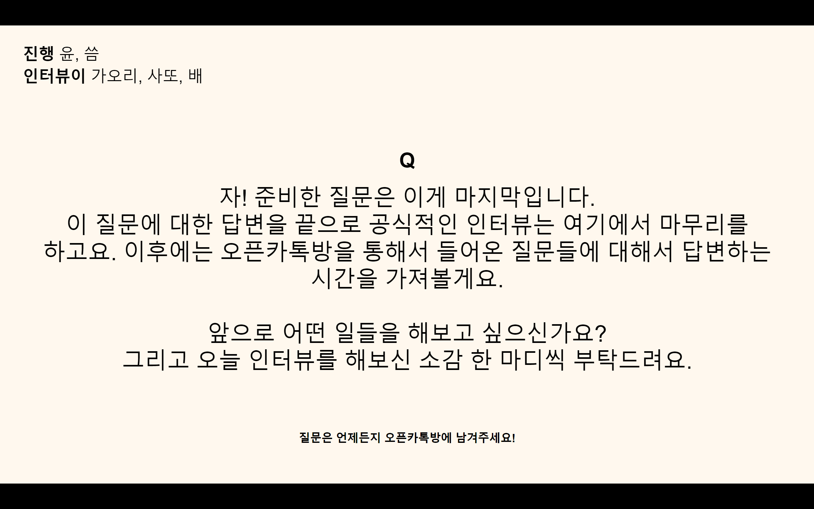
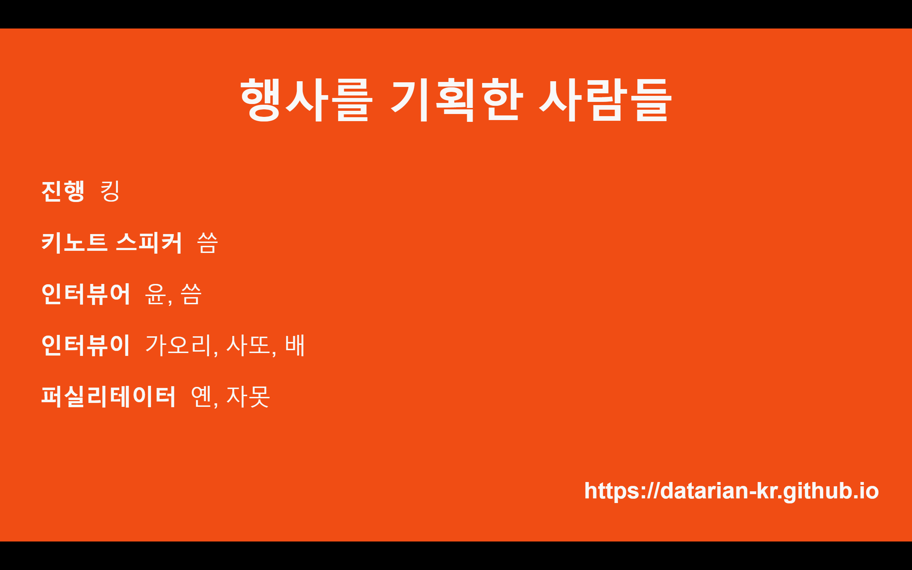

✨ 2020년 분석가들이 어떤 일들을 겪었고 어떤 생각들을 했는지는 충분히 들어본 것 같아요. 그럼 이제부터 이 분석가들은 앞으로 어떤 계획을 가지고 앞으로의 커리어를 꾸려 나가게 될까요? 분명히 재미있는 일들을 많이 하게 될거라는 건 확실합니다. 2020년 데이터 분석가 커뮤니티 데이터리안의 첫 번째 웨비나 그 마지막 이야기를 함께 들어보아요.

.  
{: width="100%"}  
{: width="50%"}
이제 마지막 질문을 한번 해볼게요. 앞으로 인터뷰이 분들은 어떤 일을 해보고 싶은지가 궁금합니다.  

조금불명확한 질문일 것 같기도 한데 그냥 아주 근 미래에 해보고 싶은 일도 될 수 있겠고 먼 미래의 일도 될 수 있을 것 같아요. 또는 회사에서 해보고 싶은 일일 수도 있고 개인적으로 나는 이렇게 성장하고 싶다는 얘기일 수도 있겠죠?  

이 질문에 대한 답변은 인터뷰 세 분에게 모두 다 들어보도록 할게요. 이 질문에 대한 답변을 해 주시고 오늘 인터뷰를 해보신 소감도 한마디씩 해주시면 좋을 것 같습니다.  

가오리, 배, 사또 순으로 들어보겠습니다. 가오리님, 일빠 괜찮으신가요?  

{: width="50%"}
어, 이건 제가 준비가 덜 된 질문인데..  

{: width="50%"}
그러면 가오리님이 준비하실 동안 다른 분 혹시 먼저 해 주실 분 계실까요?

{: width="50%"}
그럼 제가 먼저 할게요.  

{: width="50%"}
그러면 사또, 배, 가오리 순으로 한 번 해보도록 하겠습니다.  

{: width="50%"}
이 질문에 대한 히스토리를 잠깐 말씀드리면 사실 인터뷰어 분들께서 사전 질문을 하실 때 비슷한 내용으로 한번 질문을 하셨었는데요. 예를들면 10년 후 20년 후 커리어도 여쭤보셨었고, 어느정도 연차가 쌓였을 때 훌륭한 매니저가 되고 싶은지 아니면 그냥 분석을 기깔나게 잘하는 사람이 되고 싶은지 그런 것들도 여쭤보셨거든요. 근데 제가 이게 되게 답하기가 어렵다고 말씀을 드렸었어요. 그래서 이 질문이 좀 라이트하게 바뀌면서 약간 모호해진 것 같긴 한데요.  

어쨌거나 제가 그 질문들을 받으면서 들었던 생각은 이런 거였어요. 저는 사실 분석가로서의 앞으로의 10년, 20년이 잘 그려지지가 않았었어요. 왜냐하면 아직 10년, 20년 분석을 하신 분을 잘 만나보지도 못했고 이 섹터에서 10년, 20년을 할 수 있을 잘 모르겠다는 생각도 조금은 있어서요.  

하지만 일단 데이터 분석으로 커리어에 발을 들였으니 어쨌거나 분석이라는 걸 당분간은 하겠죠? 그렇다면 그래도 내가 이거 하나는 목표로 잡고 가볼 수 있겠다하는 생각이 들었던 것이 있었는데요. 데이터 분석이라는 것의 목표는 비즈니스에 임팩트를 주는 것 이잖아요. 쉽게 말하면 회사가 돈을 더 잘 벌게 하는 것이 목표구요.  

그렇다면 저는 제가 앞으로 제가 거쳐갈 회사들의 스테이지나 이런 것들이 어떻게 될지 모르겠지만 제가 분석을 통해 제시한 전략으로 큰 비지니스 임팩트가 성취되는 걸 직접보고 싶어요. 몇년이 지나도 내가 이 회사에는 이 정도 매출 성장에 기여를 했다고 할 수 있다 라던지 그런 걸 한 번 근시일내로 경험 해보고 싶습니다. 한 번쯤 그런 경험이 있으면 저는 그 이후에도 비슷하게 재미있는 일들을 꾸리면서 잘 지낼 수 있을 것 같다는 생각을 했습니다.  
.  
그리고 오늘 인터뷰 해본 소감은요.  

저는 원래 제가 이렇게 자랑을 하는 거나 누군가 자랑하는 걸 듣는 걸 되게 좋아해요. 사실 그래서 제가 이 판을 깔았거든요. 제가 판도 깔고 직접 올라가서 이렇게 북치고 장구치고 있는 건데.  

저는 되게 인터뷰하는 동안에도 그렇고 이 웨비나 준비를 하면서도 우리 커뮤니티, 데이터리안분들의 따뜻한 마음과 온정들을 되게 많이 느꼈어요. 이렇게 같이 재미있는 일을 같이 벌이고 일과 관련한 얘기도 삶과 관련한 얘기도 함꼐 나눌 수 있는 사람들이 있어서 참 좋구나라는 생각이 들었구요.  

그리고 오늘 많은 인원이 참여를 하지는 않았지만 저는 이 정도면 참여해주신 분들이 제가 기대했던 것 보다는 많다라고 생각이 들어요. 사실 아무도 안 보러오면 어쩌지 했었거든요. 한분이라도 저희가 수다떠는 걸 보러 와주시고 이렇게 끝까지 남아서 귀기울여 주셔서 정말 감사했습니다. 여러분 덕분에 우리의 이야기도 이렇게 누군가에게 전달 될 가치가 있구나라는 생각이 들어서 그 부분이 참 기분이 좋았습니다. 감사해요!

.  

👏 👏🏻 👏🏽 👏🏾 👏🏿
  
.  

{: width="50%"}
다음으로 배님.  

{: width="50%"}
앞으로 어떤 일을 해보고 싶냐면요. 저는 6개월~1년 사이의 계획이랑 10년 안에 나눠서 말씀을 드려볼게요. 일단 6개월 안에는 데이터 분석한 인사이트를 CEO분에게 한 번 공유를 해보고 싶어요. 그렇게 CEO 분에게 뭔가 공유하는 자리에 가는 분들이 종종 있는 걸 봤었어요. 중요한 게 있으면 CEO분꼐 공유를 드리는 것 같은데. 저도 한 번 해보고 싶다는 생각이 들었어서 그걸 한번 해보고 싶고요.  

{: width="50%"}
야망있다. 멋있다.  

{: width="50%"}
저도 모르는 야망이 있더라고요.  

그리고 10년이 아닐 수도 있고 좀 더 오래걸릴 수도 있겠지만, 한 10년 쯤 안에는 제 팀을 이루고 그 안에서 좀 매니징을 해보고 싶은데요. 그 매니징이라는 게 사람에 대한 매니징일 수도 있고, 아니면 테크니컬한 매니징일 수도 있거든요. 그래서 두가지를 다 해내는 사람이 되고 싶고요.  

또 하나의 목표를 가진 사람들. 그러니까 우리는 어떤 걸 하는 팀이니까 우리는 그 목표를 향해서 달려가야 해라는 것에 대해 동의하는 사람들과 함께 한 번 달려보고 싶다라는 생각도 들었어요. 그게 회사의 매출이 될지 아니면 다른 어떤 인사이트를 위한 분석이 될지 그건 정확히 지금은 모르겠지만. 그런 팀을 한번 이끌어보고 싶다 하는 생각이 있어요. 매니징 쪽으로 커리어를 쌓아가고 싶다는 생각이 드는 것 같아요.  

.  

오늘 인터뷰 소감은 저도 가오리 님이 여기서 다른 분들의 이야기를 들을 수 있어서 너무 좋았다고 하셨었는데. 저도 진짜 그렇거든요. 왜냐하면 저는 지금 회사 안에서 거의 저 혼자 일하고 있고, 프로젝트 분석가분들이 이야기를 들을 일이 거의 없어요.  

그런데 정말 신기하게도 이 멤버들 안에는 프로젝트 분석가분도 계시고 하니까. 그런 분들의 이야기를 들을 수 있어서 너무 좋았고요. 그리고 개인적으로는 이 커뮤니티에 있는 분들을 제가 너무 좋아하기 때문에 같이 뭔가 시간을 보내고 이 시간에 함께 참여할 수 있었다는 것만으로도 너무 좋았습니다.  

.  

👏 👏🏻 👏🏽 👏🏾 👏🏿
  
.  

{: width="50%"}
네 알겠습니다.  
가오리님 지금 이모티콘 쓰실 때가 아닌 것 같은데. 준비가 끝나셨나요.

{: width="50%"}
네. 제가 앞으로 해보고 싶은 일은요.
저도 사또님이랑 조금 비슷한데요. 저도 막 그렇게 먼 미래의 이유까지 생각하고 사는 사람은 아니고, 분석을 언제까지 계속할지 그런 계획은 아직은 없어서. 일단 제가 생각하고 있는 건.  

저는 언제가 될지는 모르겠지만 언젠가는 제 사업을 다시 하게 될 것 같아요.
이게 저희 사전 인터뷰 했을 때 씀님이 저한테 물어보셨던 거기도 한데요. 제가 창업을 해서 일을 하다가 뭔가 제가 부족한 점을 메꾸기 위해서 데이터를 배웠다고 말씀드렸었는데. 그럼 그 배운 데이터 분석을 가지고 다른 제 사업을 할 수도 있지 않느냐 왜 취업을 선택을 하셨냐고 물어보셨었어요.  

제가 그때는 잘 대답을 못했던 것 같은데 끝나고 나서 생각을 좀 해보니까
기억이 났습니다. 제가 그때 취업을 했던 이유는요. 우선 제가 일했던 스타트업들이 다 엄청 작았어요. 지금 회사는 30명 정도 규모라서 지금 회사도 다른 분들이 보기에는 작은 회사지만, 제가 창업했던 팀은 4명이었고 나중에 합병이 되었던 회사도 전체가 20명 규모 이 정도였거든요.  

그러니까 계속 4명이서만 일을 하는 엄청 작은 조직에서 일을 했었던거죠. 제가 되게 그때도 계속 느꼈던 게. 엄청 빨리 성장하는 그 스타트업을 흔히 로켓이라고 표현을 하는데 저는 로켓 같은 경험을 해보지 못했던 것 같아요. 물로켓 정도? 그래서 지금 로켓처럼 크게 성장하는 회사에서 그런 성장하는 경험을 같이 해보고 싶다는 생각이 있었고요. 그런 회사를 만드는 사람들은 어떻게 생각하고 어떻게 일을 할까가 궁금했었어요.  

뭔가 되게 배울 점이 있을 것 같잖아요. 뭔지 모르겠지만 일단 뭔가 배우고 싶다. 그런 생각이 되게 컸고요. 그래서 제가 이번에 회사를 선택할 때
제일 크게 봤었던 게 대표가 배우고 싶은 사람인가 하는 거였어요.

그리고 지금 회사를 선택한 이유가 한가지가 더 있는데요. 규모가 작다 보니까 제가 지금 맡고 있는 포지션에서는 대표님이랑 긴밀하게 일을 하게 되거든요. 근데 좀 더 큰 100명 규모 50명만 하더라도 이런 곳에서는 사실 대표님이랑 일을 할 기회가 잘 없잖아요.  

그래서 큰 규모의 회사를 가면 제가 대표님이 아무리 좋아도 뭔가를 더 배울 기회는 없을 것 같은데 지금 회사는 대표님이랑 계속 일을 하면서 제가 이 사람한테 되게 많이 배울 수 있겠다는 생각이 들어서 이 회사를 선택했었습니다.  

저는 이걸 거의 1년간 사실 잊고 살았었는데 씀님 덕분에 다시 생각을 해볼 수 있었구요. 저는 생각했던 대로 잘 배우고 있는 것 같아요. 어떻게 하는 회사가 성장하는 회사인지. 이 안에서는 사람들이 어떻게 생각을 하고 무슨 생각을 하고 또 어떻게 일을 하는지 되게 잘 배우고 있고요. 이걸 언젠가 써먹게 되기를 바라고 있습니다.  

.  

그리고 오늘의 소감은 일단 저는 너무 즐거웠고요. 뭔가 늘 하고 있던 생각들인데 이런 걸 좀 정리할 수 있는 기회가 됐던 것 같아서 저한테 되게
뜻깊은 시간이었던 것 같습니다. 저희의 어쩌면 개인적인 얘기들을 열심히 들어주셔서 정말 감사합니다.  

.  

👏 👏🏻 👏🏽 👏🏾 👏🏿
  
.  

{: width="50%"}
이렇게 인터뷰 소감까지 다 듣고 나니까 정말 오늘 행사가 마무리되고 있구나 싶네요. 제가 간단히 소감을 얘기하고 씀님이 간단히 얘기하고 그다음에 사회자분이 QNA를 진행해 주시면 될 것 같아요.

먼저 짧게 웨비나를 프로젝트를 용감하게 리딩 해주신 사또님하고 킹님한테 감사드리고요. 이렇게 작은 웨비나를 준비하는 데도 참 많은 사람들의 에너지와 노력이 들어가는구나 이런 생각을 하게 됐었어요.  

그리고 저희가 이 웨비나를 기록을 하는 이유가 인터뷰 콘텐츠를 정리를 해서 다른 분들도 많이 보실 수 있게 배포를 할 예정이기 때문이거든요. 그래서 웨비나가 끝나가긴 하지만 또 다른 일이 이제 시작되는구나라는 생각이 들어가지고 갈 길이 멀다 이런 생각이 드는데요. 어쨌거나 오늘 한 매듭을 지을 수 있게 되어서 되게 기쁘고요. 들어주셔서 감사합니다.  

.  

👏 👏🏻 👏🏽 👏🏾 👏🏿
  
.  

{: width="50%"}
씀님도 얘기해 주세요.  

{: width="50%"}
저는 키노트 때도 말씀드렸듯이 제가 가보지 않은 길에 대한 이야기를 들을 수 있어서 너무 좋았고요. 그거를 제가 좋아하는 동료분들의 안부로 들을 수 있어서 더더욱 좋았고.
그리고 저도 요즘 제가 고전을 하고 있는 부분들에 대한 해답을 뾰족히 못 찾고있는 찰나인데요. 웨비나를 통해서 다른 분들은 어떻게 지내시는 지 이야기를 들으면서 아 나도 이렇게 해봐야겠다 하는 생각들을 할 수 있어서 너무 좋았습니다.  

그리고 요즘 저는 에너지 레벨이 굉장히 낮아지고 있어서 웬만하면 이런 사이드 프로젝트들을 다 안 하고 있었거든요. 그런데 이렇게 제 머리채를 잡고 여기까지 끌어와주셔서 너무 감사하다는 말씀을 드리고 싶어요. 여러분이 아니었으면 끝까지 참여 못했을 것 같아요.  

.  

👏 👏🏻 👏🏽 👏🏾 👏🏿
  
.  

{: width="100%"}
{: width="50%"}
사회자님 QNA를 시작해 주세요.  

{: width="50%"}
네! 저희 이제 QNA를 해볼 건데요. 3분밖에 안 남았지만 조금 더 시간 들여서 한 번 질문 답변 해볼게요.  

참가자 분들 중에 혹시 질문 있으신분 계신가요? 인터뷰어든 인터뷰이든 저한테든 한 명을 골라서 질문 해주셔도 괜찮습니다. 질문 있으신 분 계시면 이제 음소거를 끄고 한 번 질문을 해봐주시면 감사드리겠습니다. 혹시 얘기해보고 싶으신 분이 있으신가요?  

음, 사실 저는 오늘 질문 많이 주시고 피드백도 많이 해주신 참가자분 이야기도
궁금한데요. 이렇게 지목드리면 안되나 싶긴 하지만 혹시 간단하게 어떤 일을 하고 계신지 또는 어떤 거에 관심이 있는지 조금 얘기해 주시거나 소감을 좀 얘기 해주실 수 있을까요? 그럼 저희가 다음 피드백을 받아서 다음 행사를 기획할 수 있고 같이 다른 커뮤니티에도 확산 시킬 때 참고가 될 것 같아요. 혹시 말씀해주실 수 있을까요?

{: width="50%"}
네, 음소거 풀었어요.

{: width="20%"}
우와 반갑습니다.  
(데이터리안 멤버들과 함께 데잇걸즈를 했던 분의 목소리가 들려서 반가움의 환호)

{: width="50%"}
너무 반가운 목소리들이네요.  

아까 제 질문에서도 살짝 언급이 되었지만 저는 지금 데이터가 되게 많은 회사에 계약직으로 일을 하고 있고요. 데이터 블록 직군이고 추출 및 분석 직문로 들어왔는데 추출만 시켜서 추출만 하고 있어요.

저는 사실 요즘은 고민이 조금 되었던 게 커뮤니케이션 부분이에요.
그래서 저 씀님께 단독 질문을 드리고 싶어요.

.  

제가 며칠 전에 팀에 있는 마케터분이랑 밥을 먹었는데 그분이 본인이 있었던 일을 얘길 하시더라구요. 그분이 하시는 말이 "아니 이러이러해서 재고가 나오면 안 되는 상황이니까 이걸 데이터 분석가들한테 예측을 좀 해달라고 부탁을 했더니 예측을 못하겠다는 거야." 라고 하시면서 "아니 막말로 이것도 못하면.." 이렇게 말씀을 흐리시더라고요.  

"그래 보고서 쓸 때는 좋아. 그런데 그러는 거 보면 분석가가 많이 필요하진 않은 것 같아." 이러시는 거예요.  

{: width="50%"}
그분 연락처를 저한테 좀..  

{: width="50%"}
제가 그 이야기를 들었을 때 저는 분석가 입장이니까 '아, 예측 변수 설정 자체가 불가능하니까 그 분들도 어렵겠다고 말씀하셨겠구나.'하고 당연하게 이해를 했습니다만 또 마케터 입장에서는 당연히 그럴 수 없을 것 같기도 한 거예요.  

그 때 이 얘기를 들으면서 이게 바로 앞으로 내가 앞으로 겪게 될 고충일 것 같다는 생각을 했었거든요.

{: width="50%"}
답변을 드려보자면. 지금 계신 회사도 되게 큰 조직인데 큰 조직 안에서 데이터 분석가 1인이 어디까지 할 수 있다라고하는 합의가 이루어지기가 굉장히 어렵잖아요. 아마도 그들이 생각하는 데이터 분석가는 정말 수정 구슬을 보는 사람일 수도 있어요. "아 제가 수정 구슬로 봤더니 재고가 이번 달은 안 남아요." 이렇게 하기를 원하시는 것 같은데.  

사실 그게 지금 같이 코로나라던가 특별한 이슈가 있으면 과거의 데이터로 미래를 정확하게 예측한다는 것 자체가 어렵잖아요. 이게 어려운 일인지에 대한 얘기를 아마존이나 다른 재고 시스템이 있는 회사들의 수치를 빌려와서 해야하지 않을까 싶어요. 예를 들면 "내가 하는 예측이 80%만 맞아도 우리는 아마존을 이긴 것이다. 그런데 그게 가능하게끔 하는 자원들을 나한테 줬느냐. 안 줬는데도 내가 이만큼 하고 있다. 혹은 저 팀이 저렇게 하고 있다." 이런 것들을 사내에서 말고 외적인 곳에서 레퍼런스를 가져와야 할 것 같아요. 물론 그분이 들어주실 마음이 있다는 전제하에 가능한거겠죠?

{: width="50%"}
답변 감사합니다.

.  

👏 👏🏻 👏🏽 👏🏾 👏🏿
  
.  

.  
{: width="100%"}  
{: width="50%"}
이 행사를 온라인으로 할 수 밖에 없다는 게 너무 아쉽네요. 저희뿐만 아니라 데이터 분석가들이 커뮤니케이션 할 수 있는 채널이 좀 있었으면 좋겠다는 생각이 들어요.

{: width="50%"}
맞아요. 항상 필요한 것 같아요.  

우리가 이 웨비나 기획을 하면서도 그 생각을 하긴 했는데 쫄보들이라서 마케팅을 대대적으로 못 했어요.

{: width="50%"}
저는 사실 홍보 하고 싶었는데 저희가 일부러 홍보 안 하기로 한 줄 알고 페이스북에 안 올렸었거든요. 저는 사실 페이스북에 제 아이덴티티가 70% 있어서 실제 씀이라는 사람보다 페이스북에 존재하는 씀이라는 사람이 훨씬 더 활발한 사람이라 너무 홍보하고 싶었는데..  

{: width="50%"}
자, 일단 행사 마무리하고 저희끼리 회고하면서 얘기합시다.

{: width="50%"}
지금 시간이 4시가 넘어버렸는데요. 끝까지 함께 해주셔서 너무 감사하고요. 행사를 기획하고 참여한 사람들은 슬라이드에 보이는 사람들과 같습니다.  
.  
저희가 회사를 밝히기가 어렵고 익명성이 필요한 부분이 있어서 이렇게 닉네임을 쓰기는 했는데요. 저희가 조금 더 궁금하다면 저희 블로그([https://datarian-kr.github.io/](https://datarian-kr.github.io/))로 들어가서 내용을 좀 더 봐주시면 좋을 것 같고요.  

웨비나 혹은 커뮤니티 활동에 대한 피드백이 있으시다면 [datarian2020@gmail.com](mailto:datarian2020@gmail.com)로 보내주시면 좋을 것 같습니다.  
.  
오늘 끝까지 들어주셔서 감사하고 수고 많으셨습니다.
감사합니다.

.  

[⬅️ 2020 현업 분석가 3인 선데이 아점 토크 _ 3화 다시 보러가기](./3rd_post)