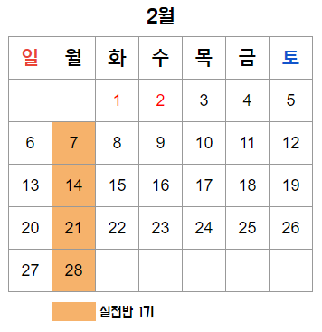

<!--post 베이스로 레이아웃 새로 만들기-->
<iframe width="100%" height="400" src="https://www.youtube.com/embed/l4_axJ8KKos?autoplay=1&mute=1" title="YouTube video player" frameborder="0" allow="accelerometer; autoplay; clipboard-write; encrypted-media; gyroscope; picture-in-picture" allowfullscreen></iframe>

백문이불여일타 SQL 캠프 입문반 오리엔테이션 일부를 미리 보여드립니다

 

<strong><a href="#intro" style="color:gray;">⛺ 캠프소개</a></strong>
 
<strong><a href="#teacher" style="color:gray;">🎤 강사소개</a></strong>
 
<strong><a href="#curriculum" style="color:gray;">📃 커리큘럼</a></strong>
 
<strong><a href="#review" style="color:gray;">📣 수강후기</a></strong>
 
<strong><a href="#apply" style="color:gray;">✅ 신청하기</a></strong> 

<h2 id="intro">지금 등록하시면 </h2>

 
## 이번 달에 시작하면 4주 뒤엔 아래 질문에 답할 수 있어요

<ol style="color:gray;font-size:16px;padding-left:25px">
<li>"어떤 시기에 가입한 유저들이 잔존율이 높은가요? 리텐션 차트 뽑아서 보여주세요" 
 <blockquote>리텐션 차트를 SQL로 추출하고 해석하는 과제 진행</blockquote></li>
<li>"우리 서비스에서 가장 인기 있는 컨텐츠는 뭔가요? 사용자들한테 푸시를 보내려고 하는데 어떤 컨텐츠를 보내야 사용자들이 만족할까요?" 
 <blockquote>블로그 Google Analytics(GA) 데이터를 SQL로 분석하는 과제 진행</blockquote></li>
<li>"성연령별 차트를 만들려고 하는데, 그룹별로 제일 인기있는 프로그램 열 개씩만 추출해주세요."</li>
</ol>

 
## 4주 동안 SQL 고급 문법부터 실전 데이터 분석 프로젝트까지

<h4>심화반 강의 목표: SQL Lv.2 에서 Lv.5 로 성장하기</h4>
<ol style="color:gray;font-size:16px;padding-left:25px">
<li>데이터 분석가 채용에서 요구하는 SQL 코딩테스트에서 만점받을 수 있음</li>
<li>길고 복잡한 SQL 쿼리문을 뜯어보고 이해하며 수정할 수 있음</li>
<li>입문반보다 좀 더 다양한 함수를 배우고 익숙하게 사용할 수 있음</li>
<li>“어떤 시기에 가입한 유저들이 잔존율이 높은가요?”와 같은 비즈니스 질문에 데이터를 추출, 분석하여 답할 수 있음</li>
</ol>

<!--  
## 이런 분들께 추천합니다
<!-- ## 이런 분들이 지금 SQL 캠프를 듣고 있어요 -->
<!-- 이미지 수정 필요 -->
<!-- 
 -->

 
## 4주동안 뭐하는지 자세하게 알려드릴게요✨

<ol style="color:gray;font-size:16px;padding-left:25px">
    <li>주 1회 2시간, 4번의 라이브 세션에서 SQL 이론과 문제풀이 그리고 SQL을 활용한 데이터 분석을 배웁니다.</li>
    <li>4회의 라이브 세션마다 <a href="https://solvesql.com" target="_blank" style="color:gray;">solvesql.com</a> 💎 문제 쿠폰 💎 을 드립니다.</li>
    <li>블로그 데이터 분석, 리텐션 분석 실습으로 실제로 SQL을 활용해 분석이 어떻게 진행되는지 알 수 있고, 포트폴리오로도 활용할 수 있습니다.</li>
    <li>인프런 <a href="https://www.inflearn.com/course/데이터-분석-고급-sql?inst=13a01dad" target="_blank" style="color:gray;">[백문이불여일타] 데이터 분석을 위한 고급 SQL</a> 온라인 강의 수강권(평생 무제한 수강)을 드리고, 반드시 완강하실 수 있도록 진도 관리를 해드립니다.</li>
    <li>캠프 신청자만 들어올 수 있는 비공개 슬랙 채널 #심화반-질문답변 에서 강사와 조교가 빠르게 답변을 드립니다.</li>
    <li>학습 내용을 증명할 수 있는 수료증을 발급해드립니다.</li>    
</ol>

 
<h2 id="teacher">강사 소개</h2>

### 윤선미

#### 데이터 분석 교육 강사

데이터 분석 교육기관 '데이터리안' 강사 (2020~)
 
과학기술정보통신부, 한국정보화진흥원 주관 데이터분석가 양성 교육과정 데잇걸즈 강사 (2018~)
 
엘리스 AI 트랙 1기 특강 (2021)
 
엘리스 2020 AI College 프로젝트 멘토 (2020)
 
DS스쿨 데이터 사이언스 입문반 강사 (2019~2020)

#### 데이터 분석가

하이퍼커넥트 프로덕트 데이터 분석가 (Product Data Analyst)
 
쿠팡 비즈니스 분석가 (Business Analyst)
 
카카오 데이터 분석가 (Data Analyst)

 
<h2 id="curriculum">커리큘럼</h2>

<table width="100%" style="font-size:14px;">
    <tr>
        <td><strong>1주차</strong></td>
        <td><strong>2주차</strong></td>  
    </tr>
    <tr>
        <td style="padding-left:15px">
            <ol>
                <li><strong>오리엔테이션</strong></li>
                <li><strong>ERD, 데이터 타입</strong>
                    
ERD
                         
                        데이터 타입

                </li>
                <li><strong>서브쿼리 (Subquery)</strong>
                    
서브쿼리
                         
                        With 문

                </li>
            </ol>
        </td>
        <td style="padding-left:15px">
            <ol>
                <li><strong>윈도우 함수 (Window Functions)</strong>
                    
랭킹 계산
                         
                        누적합 구하기

                </li>
                <li><strong>숫자, 문자, 날짜를 다루는 다양한 함수</strong></li>
            </ol>
        </td>
    </tr>
    <tr><td></td></tr>
    <tr>
        <td><strong>3주차</strong></td>
        <td><strong>4주차</strong></td>  
    </tr>
    <tr>
        <td style="padding-left:15px">    
            <ol>
                <li><strong>실전 프로젝트 A</strong>
                    
블로그 Google Analytics 데이터 분석

                </li>
                <li><strong>실전 프로젝트 B</strong>
                    
리텐션 분석

                </li>
            </ol>
        </td>
        <td style="padding-left:15x">
            <ol>
                <li><strong>정규표현식</strong>
                    
정규표현식을 이용한 텍스트 핸들링

                </li>
                <li><strong>DML</strong>
                    
INSERT UPDATE DELETE

                </li>
                <li><strong>마무리</strong></li>
            </ol>
        </td>
    </tr>
</table>

 

심화반에서는 기본적인 쿼리 작성과 SQL 에 대한 기본 이해가 있는 분들이 실전 고급 스킬을 익힐 수 있도록 커리큘럼을 구성했습니다. 선수지식 없이 SQL 을 기초부터 배우고 싶은 분들께는 <a href="/bootcamp/sql_basic"><strong>입문반</strong></a>을 추천합니다.

<h4><a href="/bootcamp/sql_basic" class="button" style="color:rgb(237, 78, 20)">👉 [백문이불여일타 SQL 입문반] 자세히 알아보기</a></h4>

 
<!-- <h2 id="review">수강생 후기</h2> -->
<h2>[수강생 인터뷰] 배달앱 2년차 데이터 분석가 J님</h2>

<!--  -->
<h4>Q. 데이터 분석가를 준비하는 분들에게 해주고 싶은 말</h4>

이전 직장에서 다른 직무로 근무하면서 엑셀로 간단한 데이터 분석을 해보고 차트도 만들어보다가 더 공부해보려고 데이터 분석 관련한 강의를 여기저기서 많이 들었는데 현업 데이터를 쓸 기회가 없으니까 단순히 강의로 듣고 끝나는 수준이었어요. '이런 코드 쓰시면 돼요, 결과가 이렇게 나오죠?' 하고 알려주니까 강의 들으면서 따라칠 때는 되는데 막상 혼자하려면 아무것도 안 되더라구요. 그런 들으나 마나한 무의미한 강의를 여러번 듣고 나서 선미님의 SQL 강의를 듣게 되었습니다.  
<strong>생각해보면 데이터를 분석하는 툴은 도구일 뿐이고 어떻게 인사이트를 발견해내는지가 가장 중요해요.</strong> 데이터 사이언스 팀에서는 파이썬이나 고도화된 모델을 쓰겠지만 비즈니스 분석가의 경우 파이썬은 하나도 몰라도 SQL 만 잘 써도 충분해요. 저는 처음부터 딱 그 수준의 데이터 분석가가 되고 싶었는데 이런 얘기를 해주는 사람이 없어서 어려운 논문 봐가면서 AI 나 머신러닝 공부하면서 시행착오를 많이 겪었어요.   
<strong>데이터 분석의 기본은 SQL 이라고 생각합니다.</strong> 현업에서 가장 많이 쓰고 피부로 와닿는 스킬인만큼 분석가로서 첫발을 내딛는 데 아주 좋은 시작이 될 것 같아요.

 
<h4>Q. 백문이불여일타 SQL 캠프 수강을 망설이는 분들에게</h4>

선미님이 업계 경력이 있으시다보니 실무에서 사용하는 것과 비슷한 프로젝트를 경험하게 해주셔서 현업에서 큰 도움이 되었습니다. 프로젝트를 해보면서 단순히 SQL 쿼리를 짜는데서 끝나는 게 아니라 인사이트를 뽑고 서비스에 어떻게 도움이 될지 고민해보는 경험이 현업에서 도움이 많이 되었어요.  
선미님의 SQL 강의가 저를 취업시켰다고 생각합니다. 이 이상의 SQL 강의는 필요하지 않았어요.

  

    
<strong>더 많은 후기는 여기에서 확인하세요</strong>

    <iframe src="https://www.inflearn.com/users/@datarian/reviews" title="백문이불여일타 강의 수강평" width="100%" height="500px"></iframe>

 
<h2 id="apply">수강료 및 캠프 일정</h2>

#### 백문이불여일타 SQL 캠프 심화반 정규과정

    ✅ 백문이불여일타 SQL 고급반 온라인 강의 수강권
     
    ✅ 심화반 전용 연습문제 세트 제공
     
    ✅ 라이브 세션 4회 수강권
     
    ✅ Google Analytics 데이터를 활용한 실무에 가까운 실전 프로젝트 제공 (포트폴리오로 활용가능)
     
    ✅ 혼자서도 복습 가능한 치트시트 제공

#### <strong>~~460,000원~~  → 345,000원</strong> (얼리버드 25% 할인)

#### <a href="https://forms.gle/4mKzdXNsTabgxUQEA" class="advanced-form-button" target="_blank" style="color:rgb(237, 78, 20)">👉 심화반 정규과정 신청하기</a>

 
#### 🙋🏻‍♀️ **심화반 1기 (2월 월요일반)**

<strong>라이브 세션</strong>: 2/7, 2/14, 2/21, 2/28 (총 4회)  <strong>매주 월요일</strong> 19:30 ~ 21:30 (2시간)
 
* 선착순 30명
 
* 기수별 최소인원(10명)이 충족되지 않을 경우 오픈이 취소될 수 있습니다.

#### <a href="https://forms.gle/4mKzdXNsTabgxUQEA" class="advanced-form-button" target="_blank" style="color:rgb(237, 78, 20)">👉 심화반 정규과정 신청하기</a>

 
#### 🙋🏻‍♀️ **심화반 2기 (3월 토요일반)**

<strong>라이브 세션</strong>: 3/5, 3/12, 3/19, 3/26 (총 4회)  <strong>매주 토요일</strong> 13:30 ~ 15:30 (2시간)
 
* 선착순 30명
 
* 기수별 최소인원(10명)이 충족되지 않을 경우 오픈이 취소될 수 있습니다.

#### <a href="https://forms.gle/4mKzdXNsTabgxUQEA" class="advanced-form-button" target="_blank" style="color:rgb(237, 78, 20)">👉 심화반 정규과정 신청하기</a>

 
## FAQ | 자주 묻는 질문

    
<strong>코딩 경험이 없는 비전공자인데 들어도 되나요?</strong>

    
코딩 경험이 없는 비전공자이신 경우 심화반 수강 전 <a href="/bootcamp/sql_basic" style="color:gray" target="_blank">입문반</a> 수강을 추천드립니다.
     
     
    <a href="/bootcamp/sql_basic" style="color:gray" target="_blank"><strong>백문이불여일타 SQL 캠프 입문반</strong></a>은 코딩경험이 없는 비전공자 분들도 기초부터 차근차근 배우실 수 있도록 구성되어 있습니다. 온라인 강의로 이론을 듣고 라이브 세션을 통해 문제풀이와 질의응답을 하면서 효과적으로 학습하실 수 있는 프로그램입니다.
     
     
    <strong>백문이불여일타 SQL 캠프 심화반</strong>은 SQL의 기초적인 문법을 배운 분들이 들으실 때 원활하게 수업에 참여하실 수 있습니다. <a href="/bootcamp/sql_basic#curriculum" style="color:gray" target="_blank">입문반 커리큘럼</a>을 먼저 확인해보시고 신청할 수업을 결정해주세요.

     

    
<strong>라이브 세션은 어떻게 진행되나요?</strong>

    
메타버스 플랫폼인 <a href="https://gather.town/" style="color:gray" target="_blank">게더타운</a>에 접속해 수강생 분들과 강사님이 함께 라이브 세션을 진행합니다. 원활한 세션 진행을 위해 되도록 조용한 환경에서 접속해주시기를 권장드립니다. 라이브 세션은 체크인, 실시간 강의, 문제풀이, 질의응답, 체크아웃으로 구성됩니다.

     

    

    
<strong>일주일에 몇 시간이나 써야할까요?</strong>

    
주 1회 라이브 세션 2시간 외에 온라인 강의 시청 약 2시간, 연습문제 풀이 1시간으로 주 5시간 정도 투자하시면 따라올 수 있도록 구성되어 있습니다.

     

    

    
<strong>현재 오픈 예정인 캠프 이외의 캠프도 오픈되나요?</strong>

    
현재 예정이 없는 요일이더라도 오픈 요청이 10건 이상이 되는 경우에는 오픈될 수 있습니다. 원하시는 요일과 성함을 <a href = "mailto: datarian2020@gmail.com" style="color:gray">datarian2020@gmail.com</a> 으로 남겨주시면 해당 강의 오픈시 별도로 안내 메일을 보내드립니다.

     

    
<strong>온라인 강의는 언제부터 들을 수 있나요?</strong>

    
캠프 시작일(첫번째 라이브 세션 시작일)부터 강의를 수강하실 수 있도록 운영팀에서 인프런 강의 수강권을 등록해드립니다. 자세한 강의 수강 방법은 추후 이메일로 안내드릴 예정입니다.

     

    
<strong>이미 결제한 인프런 강의가 있는데 정가로 결제해야하나요?</strong>

    
인프런 강의 결제 내역을 캡쳐하여 성함과 함께 <a href = "mailto: datarian2020@gmail.com" style="color:gray">datarian2020@gmail.com </a> 으로 보내주세요. 인프런 강의 결제 내역은 인프런 웹사이트 우측 상단의 <strong>프로필 클릭 > 더보기 > 구매 내역</strong> 에서 확인하실 수 있습니다. 캡쳐화면에는 주문 날짜와 상태, 주문명, 금액이 모두 나와야 합니다. 확인 후, 해당 가격을 제한 금액을 결제하실 수 있는 방법을 이메일로 안내드릴 예정입니다. 얼리버드 기간에 이메일을 보내주셨다면, 얼리버드 가격에서 제한 금액으로 결제하실 수 있습니다.

     

    

    
<strong>환불 / 세션 시간 변경을 하고 싶어요.</strong>

    
세션 시간 변경을 원하시는 경우 결제 내역과 변경을 희망하는 기수를 <a href = "mailto: datarian2020@gmail.com" style="color:gray">datarian2020@gmail.com</a> 으로 보내주세요.
    환불을 원하시는 경우 아래의 환불 규정을 참고해주세요.
    

    <!-- divider -->
    

    

    < 환불 규정 >
     
    1. 수강생이 부득이한 사정으로 수강을 취소하는 경우, 이메일로 환불 의사와 함께 결제 내역과 통장 사본을 제출해야 합니다.
     
    2. 개강 전에 한하여 100% 환불되며 개강 이후는 아래의 환불 기준이 적용됩니다.
     
    3. 환불은 환불 관련 서류제출일 (영업일)기준으로 정산됩니다.
     
    4. 운영사 사정으로 프로그램 폐강 시, 전액 환불 혹은 타 프로그램으로 변경해드립니다.
     
     
    < 환불 기준 >
     
    소비자보상기준(체육시설업 및 레저용업, 학원운영업 및 평생교육시설운영업) 의거
     
       ▷ 개강 전 : 수강료 100% 환급
     
       ▷ 개강 후 - 50% 경과 전 : 수강료 - [세션 경과 횟수 * (수강료 / 총 세션 횟수)]
     
       ▷ 개강 후 - 50% 경과 후 : 미환급
     
    * 개강 후 수강료 중 온라인 강의 수강에 대한 금액(55,000원)은 환불 불가합니다.

     

    

- 기타 문의는 <a href = "mailto: datarian2020@gmail.com">datarian2020@gmail.com</a> 으로 남겨주세요.

 
 