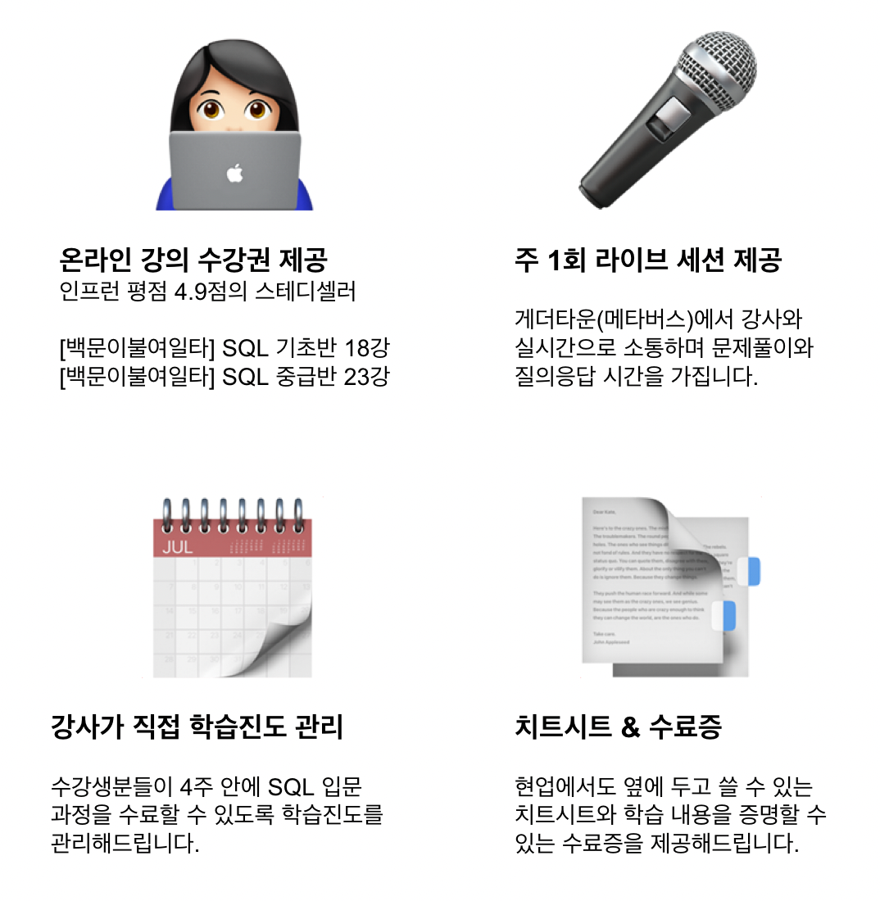
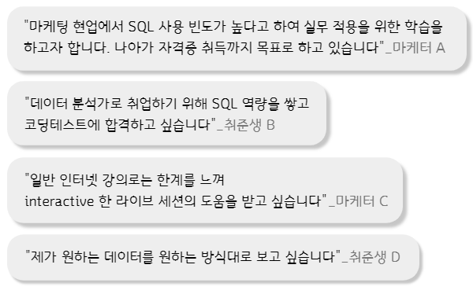
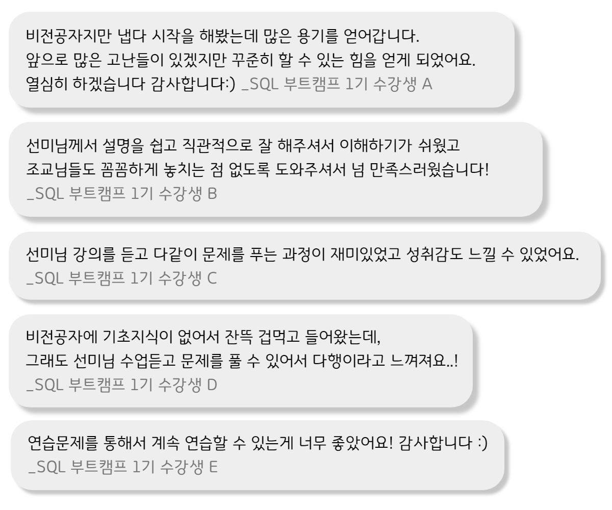
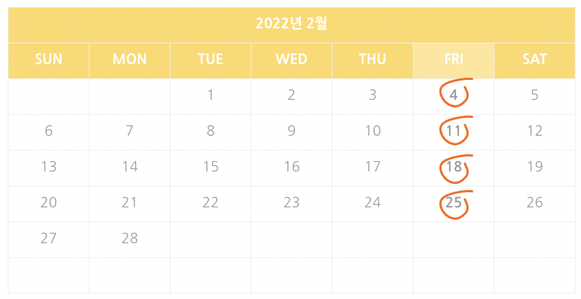
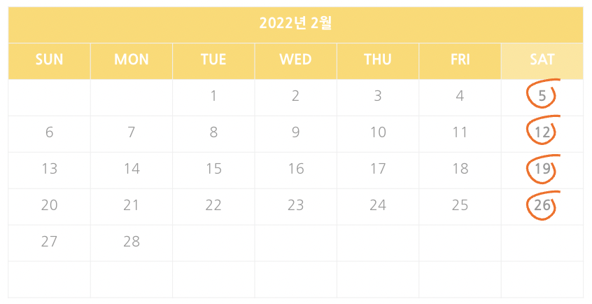

<!--post 베이스로 레이아웃 새로 만들기-->
<iframe width="100%" height="400" src="https://www.youtube.com/embed/l4_axJ8KKos?autoplay=1&mute=1" title="YouTube video player" frameborder="0" allow="accelerometer; autoplay; clipboard-write; encrypted-media; gyroscope; picture-in-picture" allowfullscreen></iframe>

 

<strong><a href="#intro" style="color:gray;">⛺ 캠프소개</a></strong>
 
<strong><a href="#teacher" style="color:gray;">🎤 강사소개</a></strong>
 
<strong><a href="#curriculum" style="color:gray;">📃 커리큘럼</a></strong>
 
<strong><a href="#review" style="color:gray;">📣 수강후기</a></strong>
 
<strong><a href="#apply" style="color:gray;">✅ 신청하기</a></strong> 

<!-- 버튼 -->
<!-- 

    <ul>
        <li class="skill_name">
            <a href="#intro" style="color:gray;">⛺ 캠프소개</a>
        </li>
         
        <li class="skill_name">
            <a href="#teacher" style="color:gray;">🎤 강사소개</a>
        </li>
         
        <li class="skill_name">
            <a href="#curriculum" style="color:gray;">📃 커리큘럼</a>
        </li>
         
        <li class="skill_name">
            <a href="#review" style="color:gray;">📣 수강후기</a>
        </li>
             
        <li class="skill_name">
            <a href="#apply" style="color:gray;">✅ 신청하기</a>
        </li>
    </ul>

 -->

<h2 id="intro">지금 등록하시면 </h2>

 
## 이번 달에 시작하면 4주 뒤엔 아래 질문에 답할 수 있어요

<ol style="color:gray;font-size:16px;padding-left:25px">
<li>"1월 7일부터 14일까지 신규 가입자 수 추출해주세요"</li>
<li>"이번 달에 가장 많이 판매된 카테고리 순서대로 뽑아주세요"</li>
<li>"이번달 객단가 얼마나 되나요?"</li>
</ol>

 
 
## 사전지식 필요없는, 입문자를 위한 4주간의 SQL 트레이닝

<h4>입문반 강의 목표: SQL Lv.0 에서 Lv.2 로 성장하기</h4>
<ol style="color:gray;font-size:16px;padding-left:25px">
<li>SQL을 이용해 간단한 데이터를 추출하고 분석할 수 있음</li>
<li>HackerRank, Leetcode, 프로그래머스 등 다양한 코딩 플랫폼에 익숙해짐</li>
<li>중급 난이도의 SQL 코딩테스트를 통과할 수 있음</li>
<li>남이 작성한 SQL 쿼리들을 읽고 이해하며 수정할 수 있음</li>
<li>데이터 추출하고, 분석하는데 아주 핵심적으로 필요한 기능들은 아래와 같다고 보는데요. 입문반에서는 JOIN(테이블간의 관계)까지 배웁니다.</li>
</ol>

 
## 이런 분들이 지금 SQL 캠프를 듣고 있어요

 
## 4주동안 뭐하는지 자세하게 알려드릴게요✨

<ol style="color:gray;font-size:16px;padding-left:25px">
    <li>주 1회 2시간, 4번의 라이브 세션에서 이론과 문제풀이를 배웁니다.   <blockquote> <strong>라이브 세션 피드백 중</strong>  "선미님 강의를 듣고 다 같이 문제를 푸는 과정이 재미있고 성취감도 느낄 수 있었어요"</blockquote></li>
    <li>4회의 라이브 세션마다 <a href="https://solvesql.com" target="_blank" style="color:gray;">solvesql.com</a> 💎 문제 쿠폰 💎 을 드립니다.</li>
    <li>현업에서 자주 사용하는 SQL 데이터 추출 패턴만 집중해서 배웁니다. RFM 분석 실습으로 실전 분석 맛보기까지!</li>
    <li>인프런 <a href="https://www.inflearn.com/course/백문이불여일타-데이터-분석-기초-sql?inst=9de5abd9" target="_blank" style="color:gray;">[백문이불여일타] 데이터 분석을 위한 기초</a>, <a href="https://www.inflearn.com/course/데이터-분석-중급-sql?inst=2fb58a97" target="_blank" style="color:gray;">중급 SQL</a> 온라인 강의 수강권(3개월 무제한 수강)을 드리고, 반드시 완강하실 수 있도록 조교가 진도 관리를 합니다. 인프런 내 데이터리안 강의 누적 수강생 수는 7,000명, 누적 평점 평균 4.9점!</li>
    <li>캠프 신청자만 들어올 수 있는 비공개 슬랙 채널 #입문반-질문답변 에서 강사와 조교가 빠르게 답변을 드립니다.</li>
    <li>학습 내용을 증명할 수 있는 수료증을 발급해드립니다.</li>    
</ol>

 
<h2 id="teacher">강사 소개</h2>

### 윤선미

#### 데이터 분석 교육 강사

데이터 분석 교육기관 '데이터리안' 강사 (2020~)
 
과학기술정보통신부, 한국정보화진흥원 주관 데이터분석가 양성 교육과정 데잇걸즈 강사 (2018~)
 
엘리스 AI 트랙 1기 특강 (2021)
 
엘리스 2020 AI College 프로젝트 멘토 (2020)
 
DS스쿨 데이터 사이언스 입문반 강사 (2019~2020)

#### 데이터 분석가

하이퍼커넥트 프로덕트 데이터 분석가 (Product Data Analyst)
 
쿠팡 비즈니스 분석가 (Business Analyst)
 
카카오 데이터 분석가 (Data Analyst)

 
<h2 id="curriculum">커리큘럼</h2>

<!-- 

<strong>1주차</strong>
<ol style="font-size:14px;padding-left:25px;">
    <li><strong>오리엔테이션</strong></li>
    <li><strong>보고싶은 데이터 꺼내오기</strong>
        
SELECT / FROM / LIMIT

    </li>
    <li><strong>조건에 맞는 데이터 검색하기</strong>
        
비교연산자와 논리연산자
             
            LIKE, IN, BETWEEN, IS NULL
             
            WHERE 절 요약

    </li>
</ol>

<strong>2주차</strong>
<ol style="font-size:14px;padding-left:25px;">
    <li><strong>데이터 순서 정렬하기</strong>
        
ORDER BY
             
            문자열을 자르는 SUBSTR() 함수
             
            소수점처리 ROUND() 함수

    </li>
    <li><strong>보고싶은 데이터 요약하기</strong>
        
COUNT, SUM, AVG, MIN/MAX
                 
                GROUP BY & HAVING

    </li>
</ol>

<strong>3주차</strong>
<ol style="font-size:14px;padding-left:25px;">
    <li><strong>조건문</strong>
        
CASE
                 
                IF

    </li>
    <li><strong>테이블 피봇</strong></li>
</ol>

<strong>4주차</strong>
<ol style="font-size:14px;padding-left:25px;">
    <li><strong>두 개 이상 테이블 결합하기</strong>
        
INNER JOIN
                 
                OUTER JOIN (LEFT, RIGHT)
                 
                Self JOIN 
                 
                날짜 데이터 더하고 빼기

    </li>
    <li><strong>위 아래로 데이터 이어붙이기</strong>
        
UNION, UNION ALL

    </li>
    <li><strong>마무리</strong></li>
</ol>

 -->

<table width="100%" style="font-size:14px;">
    <tr>
        <td><strong>1주차</strong></td>
        <td><strong>2주차</strong></td>  
    </tr>
    <tr>
        <td style="padding-left:15px">
            <ol>
                <li><strong>오리엔테이션</strong></li>
                <li><strong>보고싶은 데이터 꺼내오기</strong>
                    
SELECT FROM LIMIT

                </li>
                <li><strong>조건에 맞는 데이터 검색하기</strong>
                    
비교연산자 논리연산자
                         
                        WHERE

                </li>
            </ol>
        </td>
        <td style="padding-left:15px">
            <ol>
                <li><strong>데이터 순서 정렬하기</strong>
                    
ORDER BY
                         
                        SUBSTR()
                         
                        ROUND()

                </li>
                <li><strong>보고싶은 데이터 요약하기</strong>
                    
집계함수
                             
                            GROUP BY HAVING

                </li>
            </ol>
        </td>
    </tr>
    <tr><td></td></tr>
    <tr>
        <td><strong>3주차</strong></td>
        <td><strong>4주차</strong></td>  
    </tr>
    <tr>
        <td style="padding-left:15px">    
            <ol>
                <li><strong>조건문</strong>
                    
CASE
                             
                            IF

                </li>
                <li><strong>테이블 피봇</strong></li>
                <li><strong>RFM 분석</strong>
                    
Recency, Frequency, Monetary 고객 세분화를 SQL로 한 번에 추출하기

                </li>
            </ol>
        </td>
        <td style="padding-left:15px">
            <ol>
                <li><strong>테이블 결합하기</strong>
                    
INNER JOIN
                             
                            OUTER JOIN
                             
                            Self JOIN 

                </li>
                <li><strong>데이터 이어붙이기</strong>
                    
UNION UNION ALL

                </li>
                <li><strong>마무리</strong></li>
            </ol>
        </td>
    </tr>
</table>

 

입문반에서 다루고 있는 내용을 충분히 숙지하고 계신 분들께는 SQL 고급 문법과 Google Analytics 데이터를 활용한 실전 프로젝트가 제공되는 <a href="/bootcamp/sql_advanced"><strong>심화반</strong></a>을 추천합니다.

<h4><a href="/bootcamp/sql_advanced" class="button" style="color:rgb(237, 78, 20)">👉 [백문이불여일타 SQL 심화반] 자세히 알아보기</a></h4>

 
<h2 id="review">수강생 후기</h2>

    
<strong>더 많은 후기는 여기에서 확인하세요</strong>

    <iframe src="https://www.inflearn.com/users/@datarian/reviews" title="백문이불여일타 강의 수강평" width="100%"  height=500></iframe>

 
<h2 id="apply">수강료 및 캠프 일정</h2>

#### 백문이불여일타 SQL 캠프 입문반 + 심화반 패키지

    ✅ 백문이불여일타 SQL 기초반 온라인 강의 수강권
     
    ✅ 백문이불여일타 SQL 중급반 온라인 강의 수강권
     
    ✅ 백문이불여일타 SQL 고급반 온라인 강의 수강권
     
    ✅ 입문반 전용 연습문제 세트 제공
     
    ✅ 심화반 전용 연습문제 세트 제공
     
    ✅ 라이브 세션 8회 수강권
     
    ✅ Google Analytics 데이터를 활용한 실무에 가까운 실전 프로젝트 제공 (포트폴리오로 활용가능)
     
    ✅ 혼자서도 복습 가능한 치트시트 제공

#### <strong>~~858,000원~~  → 596,000원</strong> (패키지 30% 할인)

#### <a href="https://forms.gle/Rd3dDs6kjn4XhgQN7" class="package-form-button" target="_blank" style="color:rgb(237, 78, 20)">👉 [입문반 + 심화반] 패키지 신청하기</a>

 
#### 백문이불여일타 SQL 캠프 입문반 정규과정

    ✅ 백문이불여일타 SQL 기초반 온라인 강의 수강권
     
    ✅ 백문이불여일타 SQL 중급반 온라인 강의 수강권
     
    ✅ 입문반 전용 연습문제 세트 제공
     
    ✅ 라이브 세션 4회 수강권
     
    ✅ 혼자서도 복습 가능한 치트시트 제공

#### <strong>~~398,000원~~  → 298,000원</strong> (얼리버드 25% 할인)

#### <a href="https://forms.gle/ZVtSLY4334KhiaA49" class="basic-form-button" target="_blank" style="color:rgb(237, 78, 20)">👉 입문반 정규과정 신청하기</a>

 
#### 백문이불여일타 SQL 캠프 입문반 1 Day 수강권

    ✅ 백문이불여일타 SQL 기초반 온라인 강의 수강권
     
    ✅ 입문반 1 Day 수강권 전용 연습문제 세트 제공
     
    ✅ 라이브 세션 1회 수강권
     
    ✅ 혼자서도 복습 가능한 치트시트 제공

#### <strong>93,500원</strong>

#### <a href="https://forms.gle/YVSuxT9sgRNn8Z5X7" class="basic-1-day-form-button" target="_blank" style="color:rgb(237, 78, 20)">👉 입문반 1 Day 수강권 구매하기</a>

 
#### 🙋🏻‍♀️ **입문반 2기 (2월 금요일반)**

<strong>라이브 세션</strong>: 2/4, 2/11, 2/18, 2/25 (총 4회)  <strong>매주 금요일</strong> 19:30 ~ 21:30 (2시간)
 
* 선착순 30명
 
* 기수별 최소인원(10명)이 충족되지 않을 경우 오픈이 취소될 수 있습니다.

#### <a href="https://forms.gle/ZVtSLY4334KhiaA49" class="basic-form-button" target="_blank" style="color:rgb(237, 78, 20)">👉 입문반 정규과정 신청하기</a>

 
#### 🙋🏻‍♀️ **입문반 3기 (2월 토요일반)**

<strong>라이브 세션</strong>: 2/5, 2/12, 2/19, 2/26 (총 4회)  <strong>매주 토요일</strong> 13:30 ~ 15:30 (2시간)
 
* 선착순 30명
 
* 기수별 최소인원(10명)이 충족되지 않을 경우 오픈이 취소될 수 있습니다.

#### <a href="https://forms.gle/ZVtSLY4334KhiaA49" class="basic-form-button" target="_blank" style="color:rgb(237, 78, 20)">👉 입문반 정규과정 신청하기</a>

 
## FAQ | 자주 묻는 질문

    
<strong>코딩 경험이 없는 비전공자인데 들어도 되나요?</strong>

    
네 가능합니다. 
    백문이불여일타 SQL 캠프 입문반은 코딩경험이 없는 비전공자 분들도 기초부터 차근차근 배우실 수 있도록 구성되어 있습니다. 온라인 강의로 이론을 듣고 라이브 세션을 통해 문제풀이와 질의응답을 하면서 효과적으로 학습하실 수 있는 프로그램입니다.

     

    
<strong>라이브 세션은 어떻게 진행되나요?</strong>

    
메타버스 플랫폼인 <a href="https://gather.town/" target="_blank" style="color:gray;">게더타운</a>에 접속해 수강생 분들과 강사님이 함께 라이브 세션을 진행합니다. 원활한 세션 진행을 위해 되도록 조용한 환경에서 접속해주시기를 권장드립니다. 라이브 세션은 체크인, 실시간 강의, 문제풀이, 질의응답, 체크아웃으로 구성됩니다.

     

    

    
<strong>일주일에 몇 시간이나 써야할까요?</strong>

    
코딩경험이 없고 SQL을 처음 접하는 비전공자라고 하더라도 주 1회 라이브 세션 2시간 외에 온라인 강의 시청 약 1시간 반 연습문제 풀이 1시간으로 주 4시간 반 정도 투자하시면 따라올 수 있도록 구성되어 있습니다.

     

    

    
<strong>현재 오픈 예정인 캠프 이외의 캠프도 오픈되나요?</strong>

    

    현재 예정이 없는 요일이더라도 오픈 요청이 10건 이상이 되는 경우에는 오픈될 수 있습니다. 원하시는 요일과 성함을 <a href = "mailto: datarian2020@gmail.com" style="color:gray;">datarian2020@gmail.com</a> 으로 남겨주시면 해당 강의 오픈시 별도로 안내 메일을 보내드립니다.

     

    
<strong>온라인 강의는 언제부터 들을 수 있나요?</strong>

    
캠프 시작일(첫번째 라이브 세션 시작일)부터 강의를 수강하실 수 있도록 운영팀에서 인프런 강의 수강권을 등록해드립니다. 자세한 강의 수강 방법은 추후 이메일로 안내드릴 예정입니다.

     

    
<strong>이미 결제한 인프런 강의가 있는데 정가로 결제해야하나요?</strong>

    
인프런 강의 결제 내역을 캡쳐하여 성함과 함께 <a href = "mailto: datarian2020@gmail.com" style="color:gray;">datarian2020@gmail.com</a> 으로 보내주세요. 인프런 강의 결제 내역은 인프런 웹사이트 우측 상단의 <strong>프로필 클릭 > 더보기 > 구매 내역</strong> 에서 확인하실 수 있습니다. 캡쳐화면에는 주문 날짜와 상태, 주문명, 금액이 모두 나와야 합니다. 확인 후, 해당 가격을 제한 금액을 결제하실 수 있는 방법을 이메일로 안내드릴 예정입니다. 얼리버드 기간에 이메일을 보내주셨다면, 얼리버드 가격에서 제한 금액으로 결제하실 수 있습니다.

     

    

    
<strong>환불 / 세션 시간 변경을 하고 싶어요.</strong>

    
세션 시간 변경을 원하시는 경우 결제 내역과 변경을 희망하는 기수를 <a href = "mailto: datarian2020@gmail.com" style="color:gray;">datarian2020@gmail.com</a> 으로 보내주세요.
    환불을 원하시는 경우 아래의 환불 규정을 참고해주세요.
    

    <!-- divider -->
    

    

    < 환불 규정 >
     
    1. 수강생이 부득이한 사정으로 수강을 취소하는 경우, 이메일로 환불 의사와 함께 결제 내역과 통장 사본을 제출해야 합니다.
     
    2. 개강 전에 한하여 100% 환불되며 개강 이후는 아래의 환불 기준이 적용됩니다.
     
    3. 환불은 환불 관련 서류제출일 (영업일)기준으로 정산됩니다.
     
    4. 운영사 사정으로 프로그램 폐강 시, 전액 환불 혹은 타 프로그램으로 변경해드립니다.
     
     
    < 환불 기준 >
     
    소비자보상기준(체육시설업 및 레저용업, 학원운영업 및 평생교육시설운영업) 의거
     
       ▷ 개강 전 : 수강료 100% 환급
     
       ▷ 개강 후 - 50% 경과 전 : 수강료 - [세션 경과 횟수 * (수강료 / 총 세션 횟수)]
     
       ▷ 개강 후 - 50% 경과 후 : 미환급
     
    * 개강 후 수강료 중 온라인 강의 수강에 대한 금액(55,000원)은 환불 불가합니다.

     

    

- 기타 문의는 <a href = "mailto: datarian2020@gmail.com">datarian2020@gmail.com</a> 으로 남겨주세요.

 
 