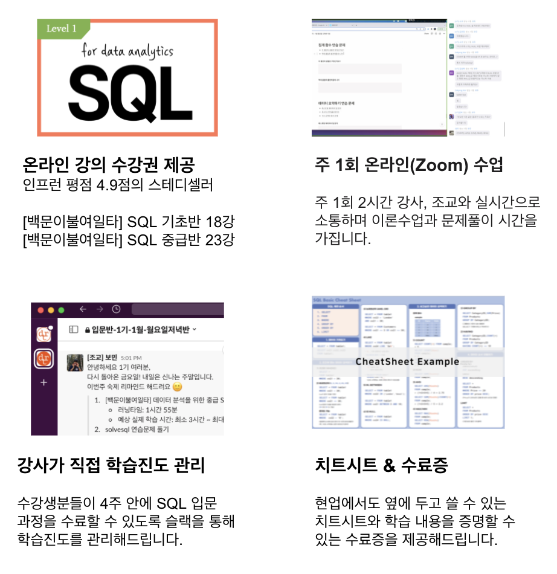

<!--post 베이스로 레이아웃 새로 만들기-->

<strong><a href="#intro" style="color:gray;">⛺ 캠프소개</a></strong>
 
<strong><a href="#teacher" style="color:gray;">🎤 강사소개</a></strong>
 
<strong><a href="#curriculum" style="color:gray;">📃 커리큘럼</a></strong>
 
<strong><a href="#review" style="color:gray;">📣 수강후기</a></strong>
 
<strong><a href="#apply" style="color:gray;">✅ 신청하기</a></strong> 

<h2 id="intro">지금 등록하시면 </h2>

    
👨‍💻 <strong>라이브 세션 강의실 미리보기</strong>

    <iframe src="https://www.youtube-nocookie.com/embed/yY_VXswaMB0?controls=0" title="백문이불여일타 SQL 캠프 라이브 세션 강의실 미리보기" width="100%" height=400></iframe>

 
## 사전지식 필요없는, 입문자를 위한 4주간의 SQL 트레이닝

백문이불여일타 SQL 캠프 입문반은 누적 수강생수 7,000명 평점 4.9점의 스테디셀러 온라인 강의 백문이불여일타 기초, 중급 과정에 라이브 세션을 더해 4주 안에 입문 과정을 수료할 수 있도록 구성한 프로그램입니다. <strong>캠프 참가시 제공되는 온라인 강의 수강권으로 각자 강의를 듣고 일주일에 한 번 온라인 라이브 세션을 진행합니다.</strong> 라이브 세션에서는 강사와 실시간으로 소통하며 강의 내용에 대한 질의응답과 연습문제 풀이를 제공합니다.

<strong>사전지식이 없는 분들도</strong> 현업에서 원하는 쿼리를 작성해 데이터를 추출하고 분석해볼 수 있도록 SQL 입문 ~ 중급 과정까지 다룹니다. 온라인 강의와 라이브 세션으로 구성되어 현업, 학업과 병행이 가능합니다. <strong>비전공자도 기초부터 차근차근</strong> SQL 쿼리 작성방법을 배우고 문제풀이를 통해 익숙해질 수 있도록 프로그램을 구성했습니다.

 
## 이런 분들께 추천합니다

## 왜 백문이불여일타일까요?

<ol style="color:gray;font-size:16px;padding-left:25px">
    <li>인프런 <strong>평점 4.9점</strong>의 스테디셀러 강의 [백문이불여일타] 시리즈 강사가 직접 기초부터 차근차근 가르쳐드립니다.</li>
    <li>연습문제를 같이 풀어봄으로써 이론만 배우고 끝나는게 아니라 <strong>현업에서 바로 활용할 수 있는 수준</strong>으로 배울 수 있습니다.</li>
    <li>혼자 들으면 흐지부지되기 쉬운 온라인 강의, 강사가 진도체크를 해주며 끝까지 완주할 수 있게 도와드립니다.</li>
    <li>온라인 강의를 통한 자율학습 + 주 1회 2시간 라이브 세션으로 <strong>따로 또 함께</strong> 진도를 나가며 효과적으로 학습합니다. 일주일에 4.5시간 정도만 투자하시면 충분히 따라올 수 있는 과정이기 때문에 <strong>현업/학업과 병행</strong>할 수 있습니다.</li>
    <li>캠프 전과정 수료시 실무에서 옆에 두고 사용할 수 있는 <strong>치트시트</strong>와 학습 내용을 증명할 수 있는 <strong>수료증</strong>을 발급해드립니다.</li>
</ol>

 
<h2 id="teacher">강사 소개</h2>

### 윤선미

#### 데이터 분석 교육 강사

데이터 분석 교육기관 '데이터리안' 강사 (2020~)
 
과학기술정보통신부, 한국정보화진흥원 주관 데이터분석가 양성 교육과정 데잇걸즈 강사 (2018~)
 
엘리스 AI 트랙 1기 특강 (2021)
 
엘리스 2020 AI College 프로젝트 멘토 (2020)
 
DS스쿨 데이터 사이언스 입문반 강사 (2019~2020)

#### 데이터 분석가

하이퍼커넥트 프로덕트 데이터 분석가 (Product Data Analyst)
 
쿠팡 비즈니스 분석가 (Business Analyst)
 
카카오 데이터 분석가 (Data Analyst)

 
<h2 id="curriculum">커리큘럼</h2>

<!-- 

<strong>1주차</strong>
<ol style="font-size:14px;padding-left:25px;">
    <li><strong>오리엔테이션</strong></li>
    <li><strong>보고싶은 데이터 꺼내오기</strong>
        
SELECT / FROM / LIMIT

    </li>
    <li><strong>조건에 맞는 데이터 검색하기</strong>
        
비교연산자와 논리연산자
             
            LIKE, IN, BETWEEN, IS NULL
             
            WHERE 절 요약

    </li>
</ol>

<strong>2주차</strong>
<ol style="font-size:14px;padding-left:25px;">
    <li><strong>데이터 순서 정렬하기</strong>
        
ORDER BY
             
            문자열을 자르는 SUBSTR() 함수
             
            소수점처리 ROUND() 함수

    </li>
    <li><strong>보고싶은 데이터 요약하기</strong>
        
COUNT, SUM, AVG, MIN/MAX
                 
                GROUP BY & HAVING

    </li>
</ol>

<strong>3주차</strong>
<ol style="font-size:14px;padding-left:25px;">
    <li><strong>조건문</strong>
        
CASE
                 
                IF

    </li>
    <li><strong>테이블 피봇</strong></li>
</ol>

<strong>4주차</strong>
<ol style="font-size:14px;padding-left:25px;">
    <li><strong>두 개 이상 테이블 결합하기</strong>
        
INNER JOIN
                 
                OUTER JOIN (LEFT, RIGHT)
                 
                Self JOIN 
                 
                날짜 데이터 더하고 빼기

    </li>
    <li><strong>위 아래로 데이터 이어붙이기</strong>
        
UNION, UNION ALL

    </li>
    <li><strong>마무리</strong></li>
</ol>

 -->

<table width="100%" style="font-size:14px;">
    <tr>
        <td><strong>1주차</strong></td>
        <td><strong>2주차</strong></td>  
    </tr>
    <tr>
        <td style="padding-left:15px">
            <ol>
                <li><strong>오리엔테이션</strong></li>
                <li><strong>보고싶은 데이터 꺼내오기</strong>
                    
SELECT / FROM / LIMIT

                </li>
                <li><strong>조건에 맞는 데이터 검색하기</strong>
                    
비교연산자와 논리연산자
                         
                        LIKE, IN, BETWEEN, IS NULL
                         
                        WHERE 절 요약

                </li>
            </ol>
        </td>
        <td style="padding-left:15px">
            <ol>
                <li><strong>데이터 순서 정렬하기</strong>
                    
ORDER BY
                         
                        문자열을 자르는 SUBSTR() 함수
                         
                        소수점처리 ROUND() 함수

                </li>
                <li><strong>보고싶은 데이터 요약하기</strong>
                    
COUNT, SUM, AVG, MIN/MAX
                             
                            GROUP BY & HAVING

                </li>
            </ol>
        </td>
    </tr>
    <tr><td></td></tr>
    <tr>
        <td><strong>3주차</strong></td>
        <td><strong>4주차</strong></td>  
    </tr>
    <tr>
        <td style="padding-left:15px">    
            <ol>
                <li><strong>조건문</strong>
                    
CASE
                             
                            IF

                </li>
                <li><strong>테이블 피봇</strong></li>
            </ol>
        </td>
        <td style="padding-left:15px">
            <ol>
                <li><strong>두 개 이상 테이블 결합하기</strong>
                    
INNER JOIN
                             
                            OUTER JOIN (LEFT, RIGHT)
                             
                            Self JOIN 
                             
                            날짜 데이터 더하고 빼기

                </li>
                <li><strong>위 아래로 데이터 이어붙이기</strong>
                    
UNION, UNION ALL

                </li>
                <li><strong>마무리</strong></li>
            </ol>
        </td>
    </tr>
</table>

 

입문반에서 다루고 있는 내용을 충분히 숙지하고 계신 분들께는 SQL 고급 문법과 Google Analytics 데이터를 활용한 실전 프로젝트가 제공되는 <a href="/bootcamp/sql_advanced"><strong>심화반</strong></a>을 추천합니다.

<h4><a href="/bootcamp/sql_advanced" class="button" style="color:rgb(237, 78, 20)">👉 [백문이불여일타 SQL 심화반] 자세히 알아보기</a></h4>

 
<h2 id="review">수강생 후기</h2>

    
<strong>더 많은 후기는 여기에서 확인하세요</strong>

    <iframe src="https://www.inflearn.com/users/@datarian/reviews" title="백문이불여일타 강의 수강평" width="100%"  height=500></iframe>

 
<h2 id="apply">수강료 및 캠프 일정</h2>

#### 백문이불여일타 SQL 캠프 입문반 + 심화반 패키지

    ✅ 백문이불여일타 SQL 기초반 온라인 강의 수강권 (3개월 무제한 수강)
     
    ✅ 백문이불여일타 SQL 중급반 온라인 강의 수강권 (3개월 무제한 수강)
     
    ✅ 백문이불여일타 SQL 고급반 온라인 강의 수강권 (평생 무제한 수강)
     
    ✅ 백문이불여일타 SQL 캠프 입문반 전용 연습문제 세트 제공
     
    ✅ 백문이불여일타 SQL 캠프 심화반 전용 연습문제 세트 제공
     
    ✅ 강사와 실시간 질의응답이 가능한 라이브 세션 4회 + 4회 수강권
     
    ✅ Google Analytics 데이터를 활용한 실무에 가까운 실전 프로젝트 제공 (포트폴리오로 활용가능)
     
    ✅ 혼자서도 복습 가능한 치트시트 제공

#### <strong>~~398,000원 + 460,000원 = 858,000원~~  → 596,000원</strong> (패키지 구매시 30% 할인)

#### <a href="https://forms.gle/Rd3dDs6kjn4XhgQN7" class="package-form-button" target="_blank" style="color:rgb(237, 78, 20)">👉 [입문반 + 심화반] 패키지 신청하기</a>

 
#### 백문이불여일타 SQL 캠프 입문반 정규과정

    ✅ 백문이불여일타 SQL 기초반 온라인 강의 수강권 (3개월 무제한 수강)
     
    ✅ 백문이불여일타 SQL 중급반 온라인 강의 수강권 (3개월 무제한 수강)
     
    ✅ 백문이불여일타 SQL 캠프 입문반 전용 연습문제 세트 제공
     
    ✅ 강사와 실시간 질의응답이 가능한 라이브 세션 4회 수강권
     
    ✅ 혼자서도 복습 가능한 치트시트 제공

#### <strong>~~398,000원~~  → 298,000원</strong> (얼리버드 구매시 25% 할인)

#### <a href="https://forms.gle/ZVtSLY4334KhiaA49" class="basic-form-button" target="_blank" style="color:rgb(237, 78, 20)">👉 입문반 정규과정 신청하기</a>

 
#### 백문이불여일타 SQL 캠프 입문반 1 Day 수강권

    ✅ 백문이불여일타 SQL 기초반 온라인 강의 수강권 (3개월 무제한 수강)
     
    ✅ 백문이불여일타 SQL 캠프 입문반 1 Day 수강권 전용 연습문제 세트 제공
     
    ✅ 강사와 실시간 질의응답이 가능한 라이브 세션 1회 수강권
     
    ✅ 혼자서도 복습 가능한 치트시트 제공

#### <strong>93,500원</strong>

#### <a href="https://forms.gle/YVSuxT9sgRNn8Z5X7" class="basic-1-day-form-button" target="_blank" style="color:rgb(237, 78, 20)">👉 입문반 1 Day 수강권 구매하기</a>

 
#### 🙋🏻‍♀️ **백문이불여일타 SQL 캠프 입문반 2기 (2월 금요일반)**

<strong>라이브 세션</strong>: 2022년 2/4, 2/11, 2/18, 2/25 (총 4회) 매주 금요일 19:30 ~ 21:30 (2시간)
 
* 선착순 30명
 
* 기수별 최소인원(10명)이 충족되지 않을 경우 오픈이 취소될 수 있습니다.

#### <a href="https://forms.gle/ZVtSLY4334KhiaA49" class="basic-form-button" target="_blank" style="color:rgb(237, 78, 20)">👉 입문반 정규과정 신청하기</a>

 
#### 🙋🏻‍♀️ **백문이불여일타 SQL 캠프 입문반 3기 (2월 토요일반)**

<strong>라이브 세션</strong>: 2022년 2/5, 2/12, 2/19, 2/26 (총 4회) 매주 토요일 13:30 ~ 15:30 (2시간)
 
* 선착순 30명
 
* 기수별 최소인원(10명)이 충족되지 않을 경우 오픈이 취소될 수 있습니다.

#### <a href="https://forms.gle/ZVtSLY4334KhiaA49" class="basic-form-button" target="_blank" style="color:rgb(237, 78, 20)">👉 입문반 정규과정 신청하기</a>

 
## FAQ | 자주 묻는 질문

    
<strong>코딩 경험이 없는 비전공자인데 들어도 되나요?</strong>

    
네 가능합니다. 
    백문이불여일타 SQL 캠프 입문반은 코딩경험이 없는 비전공자 분들도 기초부터 차근차근 배우실 수 있도록 구성되어 있습니다. 온라인 강의로 이론을 듣고 라이브 세션을 통해 문제풀이와 질의응답을 하면서 효과적으로 학습하실 수 있는 프로그램입니다.

     

    
<strong>라이브 세션은 어떻게 진행되나요?</strong>

    
메타버스 플랫폼인 <a href="https://gather.town/" target="_blank" style="color:gray;">게더타운</a>에 접속해 수강생 분들과 강사님이 함께 라이브 세션을 진행합니다. 원활한 세션 진행을 위해 되도록 조용한 환경에서 접속해주시기를 권장드립니다. 라이브 세션은 체크인, 실시간 강의, 문제풀이, 질의응답, 체크아웃으로 구성됩니다.

     

    

    
<strong>일주일에 몇 시간이나 써야할까요?</strong>

    
코딩경험이 없고 SQL을 처음 접하는 비전공자라고 하더라도 주 1회 라이브 세션 2시간 외에 온라인 강의 시청 약 1시간 반 연습문제 풀이 1시간으로 주 4시간 반 정도 투자하시면 따라올 수 있도록 구성되어 있습니다.

     

    

    
<strong>현재 오픈 예정인 캠프 이외의 캠프도 오픈되나요?</strong>

    
현재는 2월 금요일, 2월 토요일 반만 개설이 예정되어 있습니다.
     
     
    현재 예정이 없는 요일이더라도 오픈 요청이 10건 이상이 되는 경우에는 오픈될 수 있습니다. 원하시는 요일과 성함을 <a href = "mailto: datarian2020@gmail.com" style="color:gray;">datarian2020@gmail.com</a> 으로 남겨주시면 해당 강의 오픈시 별도로 안내 메일을 보내드립니다.

     

    
<strong>온라인 강의는 언제부터 들을 수 있나요?</strong>

    
캠프 시작일(첫번째 라이브 세션 시작일)부터 강의를 수강하실 수 있도록 운영팀에서 인프런 강의 수강권을 등록해드립니다. 자세한 강의 수강 방법은 추후 이메일로 안내드릴 예정입니다.

     

    
<strong>이미 결제한 인프런 강의가 있는데 정가로 결제해야하나요?</strong>

    
인프런 강의 결제 내역을 캡쳐하여 성함과 함께 <a href = "mailto: datarian2020@gmail.com" style="color:gray;">datarian2020@gmail.com</a> 으로 보내주세요. 인프런 강의 결제 내역은 인프런 웹사이트 우측 상단의 <strong>프로필 클릭 > 더보기 > 구매 내역</strong> 에서 확인하실 수 있습니다. 캡쳐화면에는 주문 날짜와 상태, 주문명, 금액이 모두 나와야 합니다. 확인 후, 해당 가격을 제한 금액을 결제하실 수 있는 방법을 이메일로 안내드릴 예정입니다. 얼리버드 기간에 이메일을 보내주셨다면, 얼리버드 가격에서 제한 금액으로 결제하실 수 있습니다.

     

    

    
<strong>환불 / 세션 시간 변경을 하고 싶어요.</strong>

    
세션 시간 변경을 원하시는 경우 결제 내역과 변경을 희망하는 기수를 <a href = "mailto: datarian2020@gmail.com" style="color:gray;">datarian2020@gmail.com</a> 으로 보내주세요.
    환불을 원하시는 경우 아래의 환불 규정을 참고해주세요.
    

    <!-- divider -->
    

    

    < 환불 규정 >
     
    1. 수강생이 부득이한 사정으로 수강을 취소하는 경우, 이메일로 환불 의사와 함께 결제 내역과 통장 사본을 제출해야 합니다.
     
    2. 개강 전에 한하여 100% 환불되며 개강 이후는 아래의 환불 기준이 적용됩니다.
     
    3. 환불은 환불 관련 서류제출일 (영업일)기준으로 정산됩니다.
     
    4. 운영사 사정으로 프로그램 폐강 시, 전액 환불 혹은 타 프로그램으로 변경해드립니다.
     
     
    < 환불 기준 >
     
    소비자보상기준(체육시설업 및 레저용업, 학원운영업 및 평생교육시설운영업) 의거
     
       ▷ 개강 전 : 수강료 100% 환급
     
       ▷ 개강 후 - 50% 경과 전 : 수강료 - [세션 경과 횟수 * (수강료 / 총 세션 횟수)]
     
       ▷ 개강 후 - 50% 경과 후 : 미환급
     
    * 개강 후 수강료 중 온라인 강의 수강에 대한 금액(55,000원)은 환불 불가합니다.

     

    

- 기타 문의는 <a href = "mailto: datarian2020@gmail.com">datarian2020@gmail.com</a> 으로 남겨주세요.

 
 