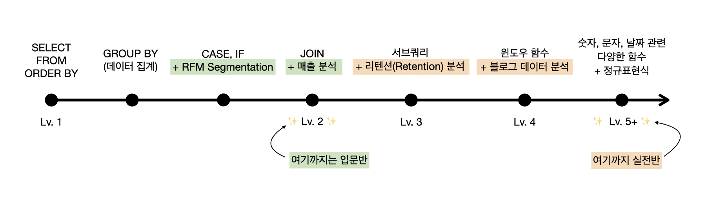
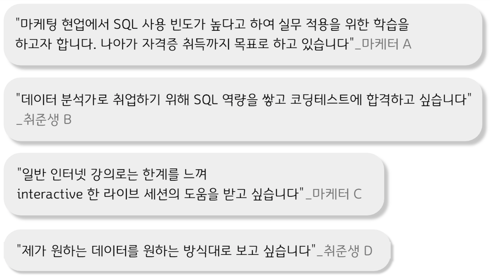

<!--post 베이스로 레이아웃 새로 만들기-->
<iframe width="100%" height="400" src="https://www.youtube.com/embed/l4_axJ8KKos?autoplay=1&mute=1" title="YouTube video player" frameborder="0" allow="accelerometer; autoplay; clipboard-write; encrypted-media; gyroscope; picture-in-picture" allowfullscreen></iframe>

백문이불여일타 SQL 캠프 입문반 오리엔테이션 중에서

 

<strong><a href="#intro" style="color:gray;">⛺ 캠프소개</a></strong>
 
<strong><a href="#teacher" style="color:gray;">🎤 강사소개</a></strong>
 
<strong><a href="#curriculum" style="color:gray;">📃 커리큘럼</a></strong>
 
<strong><a href="#review" style="color:gray;">📣 수강후기</a></strong>
 
<strong><a href="#apply" style="color:gray;">✅ 신청하기</a></strong> 

<!-- 버튼 -->
<!-- 

    <ul>
        <li class="skill_name">
            <a href="#intro" style="color:gray;">⛺ 캠프소개</a>
        </li>
         
        <li class="skill_name">
            <a href="#teacher" style="color:gray;">🎤 강사소개</a>
        </li>
         
        <li class="skill_name">
            <a href="#curriculum" style="color:gray;">📃 커리큘럼</a>
        </li>
         
        <li class="skill_name">
            <a href="#review" style="color:gray;">📣 수강후기</a>
        </li>
             
        <li class="skill_name">
            <a href="#apply" style="color:gray;">✅ 신청하기</a>
        </li>
    </ul>

 -->

<h2 id="intro">지금 등록하시면 </h2>

 
## 이번 달에 시작하면 4주 뒤엔 아래 질문에 답할 수 있어요

<ol style="color:gray;font-size:16px;padding-left:25px">
<li>"1월 7일부터 14일까지 신규 가입자 수 추출해주세요"</li>
<li>"이번 달에 가장 많이 판매된 카테고리 순서대로 뽑아주세요"</li>
<li>"이번달 객단가 얼마나 되나요?"</li>
</ol>

 
 
## 사전지식 필요없는, 입문자를 위한 4주간의 SQL 트레이닝

<h4>입문반 강의 목표: SQL Lv.0 에서 Lv.2 로 성장하기</h4>
<ol style="color:gray;font-size:16px;padding-left:25px">
<li>SQL을 이용해 간단한 데이터를 추출하고 분석할 수 있음</li>
<li>HackerRank, Leetcode, 프로그래머스 등 다양한 코딩 플랫폼에 익숙해짐</li>
<li>중급 난이도의 SQL 코딩테스트를 통과할 수 있음</li>
<li>남이 작성한 SQL 쿼리들을 읽고 이해하며 수정할 수 있음</li>
</ol>

 
## 이런 분들이 지금 SQL 캠프를 듣고 있어요

 

 
## 4주동안 뭐하는지 자세하게 알려드릴게요✨

<ol style="color:gray;font-size:16px;padding-left:25px">
    <li>주 1회 2시간, 4번의 온라인 세션에서 이론과 문제풀이를 배웁니다.   <blockquote> <strong>온라인 세션 피드백 중</strong>  "선미님 강의를 듣고 다 같이 문제를 푸는 과정이 재미있고 성취감도 느낄 수 있었어요"</blockquote></li>
    <li>4회의 온라인 세션마다 <a href="https://solvesql.com" target="_blank" style="color:gray;">solvesql.com</a> 💎 문제 쿠폰 💎 을 드립니다.</li>
    <li>현업에서 자주 사용하는 SQL 데이터 추출 패턴만 집중해서 배웁니다. RFM 분석 실습으로 실전 분석 맛보기까지!</li>
    <li>인프런 <a href="https://www.inflearn.com/course/백문이불여일타-데이터-분석-기초-sql?inst=9de5abd9" target="_blank" style="color:gray;">[백문이불여일타] 데이터 분석을 위한 기초</a>, <a href="https://www.inflearn.com/course/데이터-분석-중급-sql?inst=2fb58a97" target="_blank" style="color:gray;">중급 SQL</a> 동영상 강의 수강권(3개월 무제한 수강)을 드리고, 반드시 완강하실 수 있도록 조교가 진도 관리를 합니다. 인프런 내 데이터리안 강의 누적 수강생 수는 7,000명, 누적 평점 평균 4.9점!</li>
    <li>캠프 신청자만 들어올 수 있는 비공개 슬랙 채널 #입문반-질문답변 에서 강사와 조교가 빠르게 답변을 드립니다.</li>
    <li>학습 내용을 증명할 수 있는 수료증을 발급해드립니다.</li>    
</ol>

 
<h2 id="teacher">강사 소개</h2>

### 윤선미

#### 데이터 분석 교육 강사

데이터 분석 교육기관 '데이터리안' 강사 (2020~)
 
과학기술정보통신부, 한국정보화진흥원 주관 데이터분석가 양성 교육과정 데잇걸즈 강사 (2018~)
 
엘리스 AI 트랙 1기 특강 (2021)
 
엘리스 2020 AI College 프로젝트 멘토 (2020)
 
DS스쿨 데이터 사이언스 입문반 강사 (2019~2020)

#### 데이터 분석가

하이퍼커넥트 프로덕트 데이터 분석가 (Product Data Analyst)
 
쿠팡 비즈니스 분석가 (Business Analyst)
 
카카오 데이터 분석가 (Data Analyst)

 
<h2 id="curriculum">커리큘럼</h2>

<h4>1주차</h4>

💡데이터 분석을 위해 SQL을 배운다면 가장 중요한 건 실제 사용할 수 있느냐 하는 것이겠죠? 이론만 배우면 써먹을 수 없으니 입문반은 첫 시간부터 한번 무작정 SQL을 사용해서 데이터를 뽑아봅니다.  &nbsp;&nbsp;&nbsp;문법, 몰라도 괜찮아요. 강사님과 함께 차근차근 하다보면 어느새 SELECT, FROM이 익숙해질거에요.

 

<strong>👩‍🏫 온라인 세션</strong>

<ol style="font-size:14px">
    <li>오리엔테이션</li>
    <li>테이블 추출하기 SELECT, FROM, LIMIT</li>
    <li>데이터 정렬하기 ORDER BY</li>
</ol>
    

<strong>📔 동영상 학습과 과제</strong>

<ol style="font-size:14px">
    <li>[백문이불여일타] 기초 SQL 동영상 강의 완강</li>
    <li><a href="https://solvesql.com/problems/">solvesql</a> 연습문제 풀기 (3문항)</li>
</ol>
 

👇 누르면 상세 내용을 볼 수 있어요

    
<strong>2주차</strong>

    

    
💡1주차에는 SQL 맛보기를 했다면 이제 진짜 SQL을 본격적으로 공부해볼 시간입니다. 그래도 한번 봤다고 익숙해졌죠?  &nbsp;&nbsp;&nbsp;하지만 여전히 SQL 어디에 어떻게 쓸 수 있는지 감이 잘 안잡히시는 분들도 있을 거에요. 그래서 2주차에서는 간단하게 데이터베이스 이야기를 먼저 하고 SQL 문법이야기로 다시 넘어갑니다.

    

    

     
    
<strong>👩‍🏫 온라인 세션</strong>

    <ol style="font-size:14px;">
        <li>[Tip] 포트폴리오와 테크블로그</li>
        <li>[숙제검사] 랜덤 문제풀이</li>
        <li>데이터 베이스와 SQL</li>
        <li>데이터 집계하기 GROUP BY</li>
        <li>집계 데이터 필터링 HAVING</li>
    </ol>
     
    
<strong>📔 동영상 학습과 과제</strong>

    <ol style="font-size:14px">
        <li>[백문이불여일타] 중급 SQL 섹션 2.조건문까지</li>
        <li><a href="https://solvesql.com/problems/">solvesql</a> 연습문제 풀기 (3 ~ 6문항)</li>
    </ol>
     
    

    
<strong>3주차</strong>

    

    
💡입문반의 75%가 완성되었네요. 이제 SQL에 대해서 어느정도 아시는 상태가 되셨을거라고 생각합니다. 드디어 실무에서 매일같이 쓰이는 SQL 문법에 대해 알려드릴 수 있어요!  &nbsp;&nbsp;&nbsp;3주차 수업에서는 분석가 4명이 머리를 모아 만든 실무에 가까운 문제들을 풀어보며 SQL을 실제 어떻게 쓰는지 감을 잡으실 수 있을 거에요.

    

    

     
    
<strong>👩‍🏫 온라인 세션</strong>

    <ol style="font-size:14px;">
        <li>[숙제검사] 랜덤 문제풀이</li>
        <li>조건문</li>
        <li>RFM 고객 세분화 모델</li>
        <li>테이블 피봇</li>
    </ol>
     
    
<strong>📔 동영상 학습과 과제</strong>

    <ol style="font-size:14px;">
        <li>[백문이불여일타] 중급 SQL 완강</li>
        <li><a href="https://solvesql.com/problems/">solvesql</a> 연습문제 풀기 (3 ~ 7 문항)</li>
    </ol>
     
    

    
<strong>4주차</strong>

    

    
💡대망의 4주차 입니다! 여기까지 따라오시면 SQL을 이용하여 실제 데이터를 원하는 대로 가공하여 추출하기위한 기초적인 지식은 모두 습득하시게 될거에요.  &nbsp;&nbsp;&nbsp;특히 SQL의 꽃이라고 부를 수 있는 JOIN 을 마스터하면 여러 테이블을 연결하여 분석을 할 수 있게 됩니다.

    

    

     
    
<strong>👩‍🏫 온라인 세션</strong>

    <ol style="font-size:14px;">
        <li>[Tip] KPT 회고로 입문반 과정 돌아보기</li>
        <li>[숙제검사] 랜덤 문제풀이</li>
        <li>테이블간의 관계 이해하기 JOIN</li>
        <li>쇼핑몰 데이터로 매출(Revenue) 분석</li>
        <li>전체 프로그램 복습</li>
    </ol>
     
    

<!-- <table width="100%" style="font-size:14px;">
    <tr>
        <td><strong>1주차</strong></td>
        <td><strong>2주차</strong></td>  
    </tr>
    <tr>
        <td style="padding-left:15px">
            <ol>
                <li><strong>오리엔테이션</strong></li>
                <li><strong>보고싶은 데이터 꺼내오기</strong>
                    
SELECT FROM LIMIT

                </li>
                <li><strong>조건에 맞는 데이터 검색하기</strong>
                    
비교연산자 논리연산자
                         
                        WHERE

                </li>
            </ol>
        </td>
        <td style="padding-left:15px">
            <ol>
                <li><strong>데이터 순서 정렬하기</strong>
                    
ORDER BY
                         
                        SUBSTR()
                         
                        ROUND()

                </li>
                <li><strong>보고싶은 데이터 요약하기</strong>
                    
집계함수
                             
                            GROUP BY HAVING

                </li>
            </ol>
        </td>
    </tr>
    <tr><td></td></tr>
    <tr>
        <td><strong>3주차</strong></td>
        <td><strong>4주차</strong></td>  
    </tr>
    <tr>
        <td style="padding-left:15px">    
            <ol>
                <li><strong>조건문</strong>
                    
CASE
                             
                            IF

                </li>
                <li><strong>테이블 피봇</strong></li>
                <li><strong>RFM 분석</strong>
                    
Recency, Frequency, Monetary 고객 세분화를 SQL로 한 번에 추출하기

                </li>
            </ol>
        </td>
        <td style="padding-left:15px">
            <ol>
                <li><strong>테이블 결합하기</strong>
                    
INNER JOIN
                             
                            OUTER JOIN
                             
                            Self JOIN 

                </li>
                <li><strong>데이터 이어붙이기</strong>
                    
UNION UNION ALL

                </li>
                <li><strong>마무리</strong></li>
            </ol>
        </td>
    </tr>
</table> -->

 

입문반에서 다루고 있는 내용을 충분히 숙지하고 계신 분들께는 SQL 고급 문법과 Google Analytics 데이터를 활용한 실전 프로젝트가 제공되는 <a href="/bootcamp/sql_advanced"><strong>실전반</strong></a>을 추천합니다.

<h4><a href="/bootcamp/sql_advanced" class="button" style="color:rgb(237, 78, 20)">👉 [백문이불여일타 SQL 실전반] 자세히 알아보기</a></h4>

 

<h2 id="review">[수강생 인터뷰] 배달앱 2년차 데이터 분석가 J님</h2>

<!-- <h3>배달앱 2년차 데이터 분석가 J님</h3> -->

<h4>Q. 데이터 분석가를 준비하는 분들에게 해주고 싶은 말</h4>

이전 직장에서 다른 직무로 근무하면서 엑셀로 간단한 데이터 분석을 해보고 차트도 만들어보다가 데이터 분석에 흥미가 생겼어요. 더 공부해보려고 데이터 분석 관련한 강의를 여기저기서 많이 들었는데 현업 데이터를 쓸 기회가 없으니까 단순히 강의로 듣고 끝나는 수준이었어요. '이런 코드 쓰시면 돼요, 결과가 이렇게 나오죠?' 하고 알려주니까 강의 들으면서 따라칠 때는 되는데 막상 혼자하려면 아무것도 안 되더라구요. 그런 들으나 마나한 무의미한 강의를 여러번 듣고 나서 선미님의 SQL 강의를 듣게 되었습니다.  
<strong>생각해보면 데이터를 분석하는 툴은 도구일 뿐이고 어떻게 인사이트를 발견해내는지가 가장 중요해요.</strong> 데이터 사이언스 팀에서는 파이썬이나 고도화된 모델을 쓰겠지만 비즈니스 분석가의 경우 SQL 만 잘 써도 충분해요. 저는 처음부터 딱 그 수준의 데이터 분석가가 되고 싶었는데 이런 얘기를 해주는 사람이 없어서 어려운 논문 봐가면서 AI 나 머신러닝 공부하면서 시행착오를 많이 겪었어요.   
<strong>데이터 분석의 기본은 SQL 이라고 생각합니다.</strong> 현업에서 가장 많이 쓰고 피부로 와닿는 스킬인만큼 분석가로서 첫발을 내딛는 데 아주 좋은 시작이 될 것 같아요.

 

<h4>Q. 백문이불여일타 SQL 캠프 수강을 망설이는 분들에게</h4>

선미님이 업계 경력이 있으시다보니 실무에서 사용하는 것과 비슷한 프로젝트를 경험하게 해주셔서 현업에서 큰 도움이 되었습니다. 프로젝트를 해보면서 단순히 SQL 쿼리를 짜는데서 끝나는 게 아니라 인사이트를 뽑고 서비스에 어떻게 도움이 될지 고민해보는 경험이 현업에서 도움이 많이 되었어요.  
선미님의 SQL 강의가 저를 취업시켰다고 생각합니다. 이 이상의 SQL 강의는 필요하지 않았어요.

 

<!-- <h2 id="review">수강생 후기</h2> -->
<h2>수강생 후기</h2>

 

    
<strong>더 많은 후기는 여기에서 확인하세요</strong>

    <iframe src="https://www.inflearn.com/users/@datarian/reviews" title="백문이불여일타 강의 수강평" width="100%"  height=500></iframe>

 
<h2 id="apply">수강료 및 캠프 일정</h2>

#### 백문이불여일타 SQL 캠프 입문반 + 실전반 패키지

    ✅ 백문이불여일타 SQL 기초반 동영상 강의 수강권
     
    ✅ 백문이불여일타 SQL 중급반 동영상 강의 수강권
     
    ✅ 백문이불여일타 SQL 고급반 동영상 강의 수강권
     
    ✅ 입문반 전용 연습문제 세트 제공
     
    ✅ 실전반 전용 연습문제 세트 제공
     
    ✅ 온라인 세션 8회 수강권
     
    ✅ Google Analytics 데이터를 활용한 실무에 가까운 실전 프로젝트 제공 (포트폴리오로 활용가능)
     
    ✅ 혼자서도 복습 가능한 치트시트 제공

#### <strong>~~858,000원~~  → 596,000원</strong> (패키지 30% 할인)

#### <a href="https://forms.gle/Rd3dDs6kjn4XhgQN7" class="package-form-button" target="_blank" style="color:rgb(237, 78, 20)">👉 [입문반 + 실전반] 패키지 신청하기</a>

 
#### 백문이불여일타 SQL 캠프 입문반 정규과정

    ✅ 백문이불여일타 SQL 기초반 동영상 강의 수강권
     
    ✅ 백문이불여일타 SQL 중급반 동영상 강의 수강권
     
    ✅ 입문반 전용 연습문제 세트 제공
     
    ✅ 온라인 세션 4회 수강권
     
    ✅ 혼자서도 복습 가능한 치트시트 제공

#### <strong>~~398,000원~~  → 298,000원</strong> (얼리버드 할인 ~1/28)

#### <a href="https://forms.gle/ZVtSLY4334KhiaA49" class="basic-form-button" target="_blank" style="color:rgb(237, 78, 20)">👉 입문반 정규과정 신청하기</a>

 
#### 백문이불여일타 SQL 캠프 입문반 1 Day 수강권

    ✅ 백문이불여일타 SQL 기초반 동영상 강의 수강권
     
    ✅ 입문반 1 Day 수강권 전용 연습문제 세트 제공
     
    ✅ 온라인 세션 1회 수강권
     
    ✅ 혼자서도 복습 가능한 치트시트 제공

#### <strong>93,500원</strong>

#### <a href="https://forms.gle/YVSuxT9sgRNn8Z5X7" class="basic-1-day-form-button" target="_blank" style="color:rgb(237, 78, 20)">👉 입문반 1 Day 수강권 구매하기</a>

 
#### 🙋🏻‍♀️ **입문반 2기 (2월 금요일반)**

<strong>온라인 세션</strong>: 2/4, 2/11, 2/18, 2/25 (총 4회)  <strong>매주 금요일</strong> 19:30 ~ 21:30 (2시간)
 
* 선착순 30명
 
* 기수별 최소인원(10명)이 충족되지 않을 경우 오픈이 취소될 수 있습니다.

#### <a href="https://forms.gle/ZVtSLY4334KhiaA49" class="basic-form-button" target="_blank" style="color:rgb(237, 78, 20)">👉 입문반 정규과정 신청하기</a>

 
## FAQ | 자주 묻는 질문

    
<strong>코딩 경험이 없는 비전공자인데 들어도 되나요?</strong>

    
네 가능합니다. 
    백문이불여일타 SQL 캠프 입문반은 코딩경험이 없는 비전공자 분들도 기초부터 차근차근 배우실 수 있도록 구성되어 있습니다. 동영상 강의로 이론을 듣고 온라인 세션을 통해 문제풀이와 질의응답을 하면서 효과적으로 학습하실 수 있는 프로그램입니다.

     

    
<strong>온라인 세션은 어떻게 진행되나요?</strong>

    
메타버스 플랫폼인 <a href="https://gather.town/" target="_blank" style="color:gray;">게더타운</a>에 접속해 수강생 분들과 강사님이 함께 온라인 세션을 진행합니다. 원활한 세션 진행을 위해 되도록 조용한 환경에서 접속해주시기를 권장드립니다. 온라인 세션은 체크인, 실시간 강의, 문제풀이, 질의응답, 체크아웃으로 구성됩니다.

     

    

    
<strong>일주일에 몇 시간이나 써야할까요?</strong>

    
코딩경험이 없고 SQL을 처음 접하는 비전공자라고 하더라도 주 1회 온라인 세션 2시간 외에 동영상 강의 시청 약 1시간 반 연습문제 풀이 1시간으로 주 4시간 반 정도 투자하시면 따라올 수 있도록 구성되어 있습니다.

     

    

    
<strong>현재 오픈 예정인 캠프 이외의 캠프도 오픈되나요?</strong>

    

    현재 예정이 없는 요일이더라도 오픈 요청이 10건 이상이 되는 경우에는 오픈될 수 있습니다. 원하시는 요일과 성함을 <a href = "mailto: datarian2020@gmail.com" style="color:gray;">datarian2020@gmail.com</a> 으로 남겨주시면 해당 강의 오픈시 별도로 안내 메일을 보내드립니다.

     

    
<strong>동영상 강의는 언제부터 들을 수 있나요?</strong>

    
캠프 시작일(첫번째 온라인 세션 시작일)부터 강의를 수강하실 수 있도록 운영팀에서 인프런 강의 수강권을 등록해드립니다. 자세한 강의 수강 방법은 추후 이메일로 안내드릴 예정입니다.

     

    
<strong>이미 결제한 인프런 강의가 있는데 정가로 결제해야하나요?</strong>

    
인프런 강의 결제 내역을 캡쳐하여 성함과 함께 <a href = "mailto: datarian2020@gmail.com" style="color:gray;">datarian2020@gmail.com</a> 으로 보내주세요. 인프런 강의 결제 내역은 인프런 웹사이트 우측 상단의 <strong>프로필 클릭 > 더보기 > 구매 내역</strong> 에서 확인하실 수 있습니다. 캡쳐화면에는 주문 날짜와 상태, 주문명, 금액이 모두 나와야 합니다. 확인 후, 해당 가격을 제한 금액을 결제하실 수 있는 방법을 이메일로 안내드릴 예정입니다. 얼리버드 기간에 이메일을 보내주셨다면, 얼리버드 가격에서 제한 금액으로 결제하실 수 있습니다.

     

    

    
<strong>환불 / 세션 시간 변경을 하고 싶어요.</strong>

    
세션 시간 변경을 원하시는 경우 결제 내역과 변경을 희망하는 기수를 <a href = "mailto: datarian2020@gmail.com" style="color:gray;">datarian2020@gmail.com</a> 으로 보내주세요.
    환불을 원하시는 경우 아래의 환불 규정을 참고해주세요.
    

    <!-- divider -->
    

    

    < 환불 규정 >
     
    1. 수강생이 부득이한 사정으로 수강을 취소하는 경우, 이메일로 환불 의사와 함께 결제 내역과 통장 사본을 제출해야 합니다.
     
    2. 개강 전에 한하여 100% 환불되며 개강 이후는 아래의 환불 기준이 적용됩니다.
     
    3. 환불은 환불 관련 서류제출일 (영업일)기준으로 정산됩니다.
     
    4. 운영사 사정으로 프로그램 폐강 시, 전액 환불 혹은 타 프로그램으로 변경해드립니다.
     
     
    < 환불 기준 >
     
    소비자보상기준(체육시설업 및 레저용업, 학원운영업 및 평생교육시설운영업) 의거
     
       ▷ 개강 전 : 수강료 100% 환급
     
       ▷ 개강 후 - 50% 경과 전 : 수강료 - [세션 경과 횟수 * (수강료 / 총 세션 횟수)]
     
       ▷ 개강 후 - 50% 경과 후 : 미환급
     
    * 개강 후 수강료 중 동영상 강의 수강에 대한 금액(55,000원)은 환불 불가합니다.

     

    

- 기타 문의는 <a href = "mailto: datarian2020@gmail.com">datarian2020@gmail.com</a> 으로 남겨주세요.

 
 